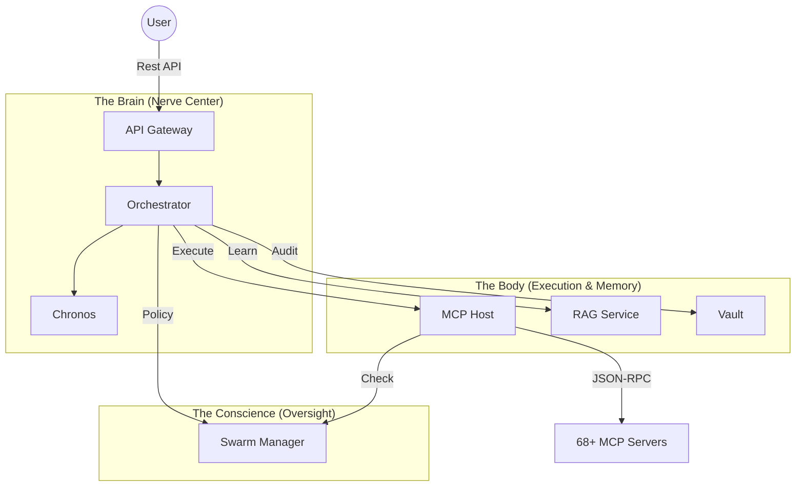

# 🦜 Kea: Distributed Autonomous Research Engine (DARE)

> **"Not just a Chatbot. A Research Factory."**

Kea is a high-fidelity, microservice-based autonomous research engine designed to handle complex, open-ended investigations. It breaks the "Linear RAG" mold by implementing a **Recursive Cognitive Pipeline** (LangGraph) that mimics human research behavior: formulating hypotheses, gathering data, verifying evidence, and pivoting when results are suboptimal.

Built on the **Fractal Corp** architecture, Kea treats agents as specialized corporate personas—Planner, Researcher, Critic, Judge—orchestrated by a unified state machine and powered by 68+ specialized MCP tool servers.

---

## 📐 Architecture (Fractal Corp)

Kea divides cognition into 7 specialized microservices, ensuring fault isolation, scalability, and "Split-Brain" governance (Reasoning vs. Execution).

### 🗼 The Core Substrate



### 🧠 The Research Path
When a query enters Kea, it doesn't just "Search." It selects a cognitive path:
- **Path A: Memory Fork**: Utilizes the Vault to skip research for facts already known.
- **Path B: Shadow Lab**: Autonomously writes Python code to test hypotheses in a sandbox.
- **Path C: Grand Synthesis**: Merges multiple research trajectories into a consensus report.
- **Path D: Deep Research**: The full "OODA Loop" for exploring unknown territory.

---

## 📁 Codebase Structure & Documentation

The Kea ecosystem is modular and self-documenting. Use the links below for deep dives into specific components.

### 🏙️ Services ("The Fractal Nodes")
| Service | Persona | Role | Documentation |
|:--------|:--------|:-----|:--------------|
| **Gateway** | The Mouth | Security, Auth, & Routing | [📖 View Doc](services/api_gateway/README.md) |
| **Orchestrator** | The Brain | LangGraph State & Reasoning | [📖 View Doc](services/orchestrator/README.md) |
| **MCP Host** | The Hands | Tool Execution & JIT Spawning | [📖 View Doc](services/mcp_host/README.md) |
| **RAG Service** | The Library| Knowledge & Dataset Ingestion | [📖 View Doc](services/rag_service/README.md) |
| **Vault** | The Memory | Immutability & Persistence | [📖 View Doc](services/vault/README.md) |
| **Swarm/Manager**| The Conscience| Governance & Compliance | [📖 View Doc](services/swarm_manager/README.md) |
| **Chronos** | The Clock | Scheduling & Future Tasks | [📖 View Doc](services/chronos/README.md) |

### 🛠️ Tooling & Utilities
- **[🔌 MCP Servers](mcp_servers/README.md)**: Catalog of 68+ specialized tools (Finance, Web3, Academic).
- **[⚙️ Workers](workers/README.md)**: Background processors for high-throughput research swarms.
- **[📚 Shared Libs](shared/README.md)**: Foundation for hardware-awareness, schemas, and logging.

---

## 🧠 Deep Dive: The Kea Advantage

### 1. Pure MCP & JIT Spawning
Kea implements a "Zero-Dependency" tool architecture. Using the **Model Context Protocol (MCP)** and `uv`, the system spawns tool servers in isolated, ephemeral environments *Just-In-Time*. The "Brain" has zero knowledge of the "Hands" until runtime, allowing for infinite tool scalability.

### 2. Genetic Prompting
Agent personalities are decoupled from code. The `configs/prompts.yaml` library defines the expertise of the Analyst, Judge, and Critic, which can be hot-reloaded to adapt the system's "IQ" and tone without restarting services.

### 3. Hardware-Aware Adaptation
Whether running on a $2/mo VPS or a $30k H100 cluster, Kea adapts. The `shared/hardware` layer profiles the host machine and automatically adjusts batch sizes and concurrency to maximize throughput without triggering OOM errors.

---

## 🚀 Quick Start

### 🏁 1. Prerequisites
- **Python 3.10+** (Recommended: 3.11 with `uv`)
- **Docker** (For full service orchestration)
- **PostgreSQL** (With `pgvector` extension)

### 🛠️ 2. One-Command Setup
The easiest way to see the architecture in action is to run the **Stress Test**, which self-boots the core servers.

```bash
# Set your LLM provider Key
export OPENROUTER_API_KEY="your-api-key"

# Run the system validator
python -m pytest tests/stress/stress_test.py --query="Analyze Tesla's 2024 VPP strategy" -v -s
```

### 🧪 3. Developer Onboarding
Check the **[Playbook](examples/README.md)** for a guided walkthrough of building your first custom research workflow using the Kea SDK.

---

## 🧪 Quality & Verification
Kea implements a **Pyramid Testing Strategy** to ensure reliability in non-deterministic AI environments:
- **Unit**: Fast, mocked validation of core logic.
- **Integration**: Verifying the service mesh (8000 -> 8006).
- **Stress**: 50+ agent simulations designed to break the JIT loader and hardware governor.
- **[📖 View Test Documentation](tests/README.md)**
