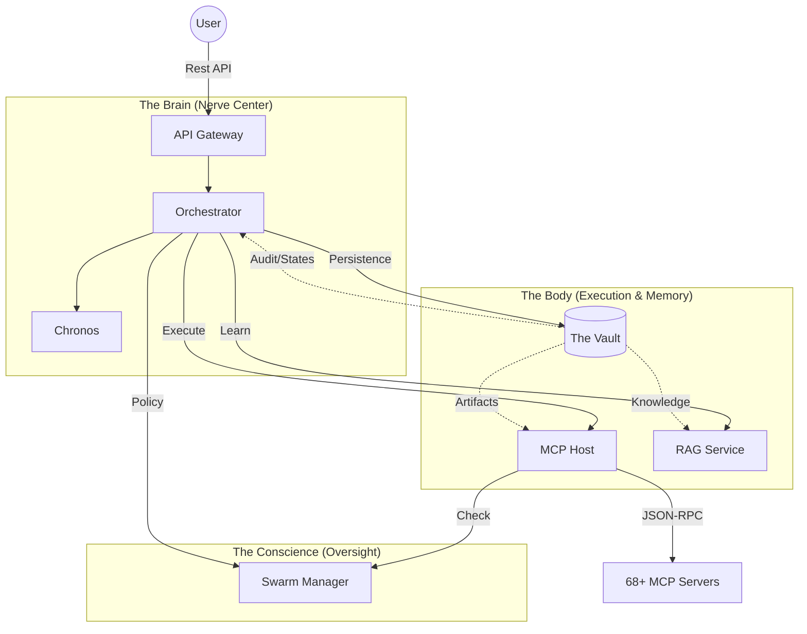

# 🦜 Project Kea v4.0: Autonomous Enterprise Operating System

> **"Not just a Chatbot. A Research Factory."**

Kea v4.0 represents the evolution from a "Distributed Autonomous Research Engine" (DARE) to a **Generative ERP (Enterprise Resource Planning)** system. It simulates a **100,000+ Employee Corporation** where the "Employees" are silicon, the "Departments" are microservices, and the "Workflows" are generated Just-In-Time.

Instead of writing linear "To-Do Lists," Kea architects and executes **Directed Acyclic Graphs (DAGs)**, enabling complex, non-linear problem solving at an enterprise scale.

---

## 🏗️ The Paradigm Shift

| Feature | Legacy Agents (v3) | Kea v4.0 (Enterprise OS) |
|:--------|:-------------------|:--------------------------|
| **Structure** | Single Loop ("Thought -> Act") | **Fractal DAGs** (Main Graph spawns Sub-Graphs) |
| **Tools** | Static list of Python functions | **"Departments"** (Isolated Microservices) |
| **Data Flow** | Text in a chat window | **Artifact Bus** (Postgres/S3 via Vault API) |
| **Planning** | Linear Steps (1, 2, 3...) | **Topological Sort** (Parallel execution paths) |
| **Storage** | Local Directories / Temp Files | **The Vault** (Research Persistence & Context Engine) |
| **Role** | Research Assistant | **Autonomous CIO** (Architects the solution) |

---

## 📐 Architecture ("The Fractal Corp")

Kea divides cognition into 7 specialized microservices, ensuring fault isolation and "Split-Brain" governance (Reasoning vs. Execution).



### 🏙️ Services ("The Fractal Nodes")

Each service acts as a distinct corporate persona with a specific mandate.

| Service | Persona | Role | Documentation |
|:--------|:--------|:-----|:--------------|
| **Gateway** | The Mouth | Security, Auth, & Routing | [📖 View Doc](services/api_gateway/README.md) |
| **Orchestrator** | The Brain | LangGraph State & Reasoning | [📖 View Doc](services/orchestrator/README.md) |
| **MCP Host** | The Hands | Tool Execution & JIT Spawning | [📖 View Doc](services/mcp_host/README.md) |
| **RAG Service** | The Librarian| Multi-Source Knowledge Controller | [📖 View Doc](services/rag_service/README.md) |
| **Vault** | The Vault | Research Persistence & Context Engine | [📖 View Doc](services/vault/README.md) |
| **Swarm Manager**| The Conscience| Governance & Compliance | [📖 View Doc](services/swarm_manager/README.md) |
| **Chronos** | The Clock | Scheduling & Future Tasks | [📖 View Doc](services/chronos/README.md) |

---

## 🧠 The "Kea Advantage"

### 1. The Departmental Model (MCP Servers)
Instead of a mess of Python functions, specialized "Departments" handle domain logic.
-   **Finance Dept:** `yfinance_server`, `finta_server`
-   **IT Dept:** `duckdb_server`, `web3_server`
-   **Legal Dept:** `pdfplumber_server`, `regulatory_server`
-   **Operations:** `filesystem_server`, `browser_server`

### 2. Zero-Trust Hardware Adaptation
Whether running on a $2/mo VPS or a $30k H100 cluster, the `shared/hardware` layer profiles the host machine. It automatically adjusts swarm concurrency, batch sizes, and memory limits to maximize throughput without crashing the host.

### 3. The Artifact Bus (Vault-Centric Execution)
In a true microservices architecture, services do not share a common filesystem. Kea solves this via the **Vault & Artifact Bus**.
- **Research Persistence Engine**: The Vault stores everything related to the *active work*: multi-user conversational data, job checkpoints, tasks (audit logs), and performance-critical research artifacts.
- **Embedded Artifacts**: When data is collected (webscrapes, PDFs, etc.), it flows through the Artifact Bus into the Vault, where it is vectorized and indexed for JIT context retrieval during the research project.
- **Zero Disk Dependency**: Services are stateless; they pull what they need from the Vault over the network (API), enabling Kea to scale across clusters.

### 4. Multi-Source RAG Controller (Reference Intelligence)
The **RAG Service** acts as the system's global "Reference Library," separate from the Vault's active research storage.
- **Federated Knowledge**: It orchestrates access to massive, external, or multiple distinct RAG servers via API requests.
- **Context Synthesis**: It filters and synthesizes the most relevant knowledge from these global sources before passing it to the Orchestrator, ensuring high-density, low-noise prompts.

---

## 🛣️ Roadmap: The Journey to "Node Assembly"

We are currently transitioning from **Level 2 (Linear DAGs)** to **Level 3 (Recursive Sub-Graphing)**.

1.  **The "Blueprint" Schema**: Moving the Planner from outputting text listicles to strict JSON Topology definitions.
2.  **The Assembler Engine**: A core service that performs Just-In-Time compilation of these Blueprints into executable LangGraph code.
3.  **The Sub-Orchestrator**: Enabling any node to recursively spawn its own Orchestrator instance to handle sub-problems (Scale = ∞).

---

## 🚀 Quick Start

### 🏁 1. Prerequisites
- **Python 3.10+** (Recommended: 3.11 with `uv`)
- **Docker** (For full service orchestration)
- **PostgreSQL** (With `pgvector` extension)

### 🛠️ 2. One-Command Setup
The easiest way to see the architecture in action is to run the **Stress Test**, which self-boots the core servers.

```bash
# Set your LLM provider Key
export OPENROUTER_API_KEY="your-api-key"

# Run the system validator
uv run pytest tests/stress/stress_test.py --query="Analyze Tesla's 2024 VPP strategy" -v -s
```

### 🧪 3. Quality Assurance
Kea implements a **Pyramid Testing Strategy** (Unit, Integration, Stress) to ensure reliability in non-deterministic environments. See **[tests/README.md](tests/README.md)** for details.
