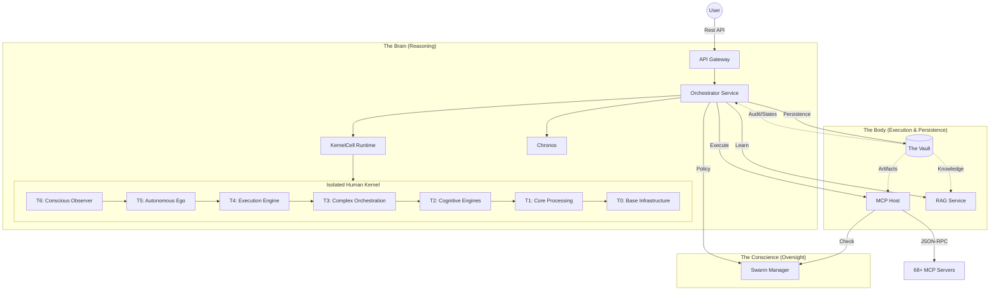

# 🦜 Kea v0.4.0: Autonomous Enterprise Operating System

> **"Not just a Chatbot. A Processing Factory."**

Kea v0.4.0 represents the evolution from a "Distributed Autonomous Research Engine" (DARE) to a **Generative ERP (Enterprise Resource Planning)** system. It simulates a **100,000+ Employee Corporation** where the "Employees" are silicon, the "Departments" are microservices, and the "Workflows" are generated Just-In-Time.

Instead of writing linear "To-Do Lists," Kea architects and executes **Directed Acyclic Graphs (DAGs)**, enabling complex, non-linear problem solving at an enterprise scale.

---

## 🏗️ The Paradigm Shift

| Feature | Legacy Agents (v0.3.x) | Kea v0.4.0 (Enterprise OS) |
|:--------|:-------------------|:--------------------------|
| **Structure** | Single Loop ("Thought -> Act") | **Fractal DAGs** (Main Graph spawns Sub-Graphs) |
| **Tools** | Static list of Python functions | **"Departments"** (Isolated Microservices) |
| **Data Flow** | Text in a chat window | **Artifact Bus** (Postgres/S3 via Vault API) |
| **Planning** | Linear Steps (1, 2, 3...) | **Topological Sort** (Parallel execution paths) |
| **Storage** | Local Directories / Temp Files | **The Vault** (System Persistence & Context Engine) |
| **Role** | Assistant | **Autonomous CIO** (Architects the solution) |

---

## 📐 Architecture ("The Fractal Corp")

Kea divides cognition into 7 specialized microservices, centered around the **Human Kernel**—a pure logic recursive processing unit built as a 6-Tier Pyramid. This ensures strict fault isolation, predictable behavior boundaries, and "Brain vs Body" governance.



### 🧠 The Human Kernel Tiers
At the center of Kea sits the **Human Kernel** (`kernel/`), a standardized 6-Tier cognitive loop that powers every agent from an Intern to the CEO.

| Tier | Area | Component Scope | Description |
| :--- | :--- | :--- | :--- |
| **Tier 6** | **Conscious Observer** | Monitors & Routing | Hallucination tracking, cognitive load anomalies, activation routing, self-model calibration. |
| **Tier 5** | **The Autonomous Ego** | Lifecycle Controller | Governs single-agent lifecycle, identity constraints, interrupts, and high-level goal persistence. |
| **Tier 4** | **Execution Engine** | The OODA Loop | Manages rapid Observe-Orient-Decide-Act cycles, async multitasking, and memory caching. |
| **Tier 3** | **Complex Orchestration** | Planner & Guardrails | Graph/Workflow building, node assembly, and consensus reflection. |
| **Tier 2** | **Cognitive Engines** | Scenarios & Curiosity | Task decomposition, what-if consequence scenarios, and information gap exploration. |
| **Tier 1** | **Core Processing** | Primitives | Classification, entity recognition, modality ingestion, and semantic semantic scoring. |
| **Tier 0** | **Base Foundation** | `shared/` API | The bedrock. I/O schemas, LLM/Embedding InferenceKit, and telemetry standards. |

### 🏙️ Services ("The Fractal Nodes")

Each service acts as a distinct corporate persona with a specific mandate.

| Service | Persona | Role | Documentation |
|:--------|:--------|:-----|:--------------|
| **Kernel** | The Brain | Isolated Core Reasoning Engine | [🧠 View Doc](kernel/README.md) |
| **Gateway** | The Front Door | Security, Auth, & Routing | [📖 View Doc](services/api_gateway/README.md) |
| **Orchestrator** | The Nervous System | Kernel Wrapper & State Machine | [📖 View Doc](services/orchestrator/README.md) |
| **MCP Host** | The Hands | Tool Execution & JIT Spawning | [📖 View Doc](services/mcp_host/README.md) |
| **RAG Service** | The Library | Multi-Source Knowledge Controller | [📖 View Doc](services/rag_service/README.md) |
| **Vault** | The Memory | System Persistence & Context Engine | [📖 View Doc](services/vault/README.md) |
| **Swarm Manager**| The Conscience | Governance & Compliance | [📖 View Doc](services/swarm_manager/README.md) |
| **Chronos** | The Clock | Scheduling & Future Tasks | [📖 View Doc](services/chronos/README.md) |

---

## 🧠 The "Kea Advantage"

### 1. The Departmental Model (MCP Servers)
Instead of a mess of Python functions, specialized "Departments" handle domain logic.
-   **Finance Dept:** `yfinance_server`, `finta_server`
-   **IT Dept:** `duckdb_server`, `web3_server`
-   **Legal Dept:** `pdfplumber_server`, `regulatory_server`
-   **Operations:** `filesystem_server`, `browser_server`

### 2. Zero-Trust Hardware Adaptation
Whether running on a $2/mo VPS or a $30k H100 cluster, the `shared/hardware` layer profiles the host machine. It automatically adjusts swarm concurrency, batch sizes, and memory limits to maximize throughput without crashing the host.

### 3. The Artifact Bus (Vault-Centric Execution)
In a true microservices architecture, services do not share a common filesystem. Kea solves this via the **Vault & Artifact Bus**.
- **System Persistence Engine**: The Vault stores everything related to the *active work*: multi-user conversational data, job checkpoints, tasks (audit logs), and performance-critical system artifacts.
- **Embedded Artifacts**: When data is collected (webscrapes, PDFs, etc.), it flows through the Artifact Bus into the Vault, where it is vectorized and indexed for JIT context retrieval during the system workflows.
- **Zero Disk Dependency**: Services are stateless; they pull what they need from the Vault over the network (API), enabling Kea to scale across clusters.

### 4. Multi-Source RAG Controller (Reference Intelligence)
The **RAG Service** acts as the system's global "Reference Library," separate from the Vault's active storage.
- **Federated Knowledge**: It orchestrates access to massive, external, or multiple distinct RAG servers via API requests.
- **Context Synthesis**: It filters and synthesizes the most relevant knowledge from these global sources before passing it to the Orchestrator, ensuring high-density, low-noise prompts.

---

## ⚡ Example: Kea in Action

**The Query:**  
> *"Analyze Tesla's 2024 VPP (Virtual Power Plant) strategy. Compare it to their 2023 performance and estimate the revenue impact."*

**How Kea Executes It:**
Instead of trying to answer the query in one shot, the Kea Kernel decomposes the work and assigns it across the fractal corporation:

1. **Tier 1 & 2 (Decomposition)**: The kernel parses the intent and decomposes the query into sub-goals:
   - *Task A*: Fetch 2023 vs 2024 VPP deployment data.
   - *Task B*: Retrieve Tesla's energy generation revenue statements.
   - *Task C*: Produce the comparative revenue estimate.
2. **Tier 3 (Complex Orchestration)**: The Planner builds a **DAG (Directed Acyclic Graph)**. It maps *Task A* and *Task B* to run in parallel, while *Task C* waits for their outputs.
3. **Tier 4 (Execution Engine)**: The OODA loop executes the graph by hitting the MCP Host:
   - The *Operations Dept* (`web_search_server`) gathers recent 2024 VPP announcements.
   - The *Finance Dept* (`yfinance_server`) fetches 2023 energy revenue metrics.
4. **Tier 6 (Conscious Observer)**: The Hallucination Monitor verifies the incoming financial numbers against the retrieved evidence, ensuring zero data fabrication.
5. **Completion**: The graph resolves, and the blueprint translates into a final artifact.

**Expected Output:**
A structured, highly-accurate intelligence report containing precise financial metrics, perfectly cited sources from the tool calls, and a logical revenue projection—saved directly to the **Artifact Bus / Vault** for permanent multi-agent memory.

---

## 🛣️ Current Status & Roadmap

We have successfully rebuilt the **Human Kernel**, integrating 26 autonomous logic modules across a 6-Tier Pyramid Architecture. This includes 100% structural test coverage and a unified `InferenceKit` for adaptive LLM/Embedding fallback capabilities.

**Next Steps**:
1.  **The Sub-Orchestrator**: Enabling any graph node to recursively spawn its own Orchestrator instance to handle sub-problems (Scale = ∞).
2.  **Corporate Kernel Transitions**: Shifting the single-agent state into multi-agent DAGs using Tier 7 components.
3.  **Service Integration**: Wiring the newly-completed `kernel/` back into the fastAPI `orchestrator` service.

---

## 🚀 Quick Start

### 🏁 1. Prerequisites
- **Python 3.12** (Recommended: 3.12 with `uv`)
- **Docker** (For full service orchestration)
- **PostgreSQL** (With `pgvector` extension)

### 🛠️ 2. One-Command Setup
The easiest way to see the architecture in action is to run the **Stress Test**, which self-boots the core servers.

```bash
# Set your LLM provider Key
export OPENROUTER_API_KEY="your-api-key"

# Run the system validator
uv run pytest tests/stress/stress_test.py --query="Analyze Tesla's 2024 VPP strategy" -v -s
```

### 🧪 3. Quality Assurance
Kea implements a **Pyramid Testing Strategy** (Unit, Integration, Stress) to ensure reliability in non-deterministic environments. See **[tests/README.md](tests/README.md)** for details.
