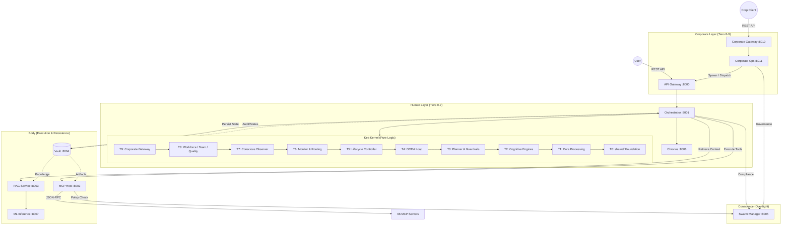

# 🦜 Kea v0.4.0: Autonomous Enterprise Operating System

> **"Not just a Chatbot. A Processing Factory."**

Kea v0.4.0 is a **Generative ERP (Enterprise Resource Planning)** system that simulates a **100,000+ Employee Corporation** where "Employees" are silicon (AI agents), "Departments" are microservices, and "Workflows" are generated Just-In-Time.

Instead of writing linear "To-Do Lists," Kea architects and executes **Directed Acyclic Graphs (DAGs)**, enabling complex, non-linear problem solving at enterprise scale.

---

## 🏗️ The Paradigm Shift

| Feature | Legacy Agents (v0.3.x) | Kea v0.4.0 (Enterprise OS) |
|:--------|:-------------------|:--------------------------|
| **Structure** | Single Loop ("Thought → Act") | **Fractal DAGs** (Main Graph spawns Sub-Graphs) |
| **Tools** | Static list of Python functions | **"Departments"** (66+ Isolated MCP Servers) |
| **Data Flow** | Text in a chat window | **Artifact Bus** (Postgres/S3 via Vault API) |
| **Planning** | Linear Steps (1, 2, 3...) | **Topological Sort** (Parallel execution paths) |
| **Storage** | Local Directories / Temp Files | **The Vault** (System Persistence & Context Engine) |
| **Role** | Assistant | **Autonomous CIO** (Architects the solution) |
| **Corp. Scale** | Single agent | **Corporate Kernel** (Multi-agent workforce, Tiers 8-9) |

---

## 📐 Architecture ("The Fractal Corp")

Kea divides cognition into **10 specialized microservices** organized across two layers: the **Human Layer** (Tiers 0-7) for individual agent reasoning, and the **Corporate Layer** (Tiers 8-9) for multi-agent workforce governance.


```mermaid
graph TD
    User((User)) -->|REST API| Gateway[API Gateway :8000]
    CorpUser((Corp Client)) -->|REST API| CorpGateway[Corporate Gateway :8010]

    subgraph "Corporate Layer (Tiers 8-9)"
        CorpGateway --> CorpOps[Corporate Ops :8011]
        CorpOps -->|Spawn / Dispatch| Gateway
    end

    subgraph "Human Layer (Tiers 0-7)"
        Gateway --> Orchestrator[Orchestrator :8001]
        subgraph Kernel ["Kea Kernel (Pure Logic)"]
            T9[T9: Corporate Gateway] --> T8[T8: Workforce / Team / Quality]
            T8 --> T7[T7: Conscious Observer]
            T7 --> T6[T6: Monitor & Routing]
            T6 --> T5[T5: Lifecycle Controller]
            T5 --> T4[T4: OODA Loop]
            T4 --> T3[T3: Planner & Guardrails]
            T3 --> T2[T2: Cognitive Engines]
            T2 --> T1[T1: Core Processing]
            T1 --> T0[T0: shared/ Foundation]
        end
        Orchestrator --> Kernel
        Orchestrator --> Chronos[Chronos :8006]
    end

    subgraph "Body (Execution & Persistence)"
        Orchestrator -->|Execute Tools| Host[MCP Host :8002]
        Orchestrator -->|Retrieve Context| RAG[RAG Service :8003]
        Orchestrator -->|Persist State| Vault[(Vault :8004)]
        RAG --> ML[ML Inference :8007]
    end

    subgraph "Conscience (Oversight)"
        Host -->|Policy Check| Manager[Swarm Manager :8005]
        Orchestrator -->|Compliance| Manager
        CorpOps -->|Governance| Manager
    end

    Vault -.->|Audit/States| Orchestrator
    Vault -.->|Artifacts| Host
    Vault -.->|Knowledge| RAG

    Host -->|JSON-RPC| Tools[66 MCP Servers]
```

---

## 🧠 The Human Kernel — Tier Architecture

At the center of every agent sits the **Kea Kernel** (`kernel/`): 31 pure-logic modules organized into a 9-Tier Pyramid. The same kernel code runs identically at every level — from an Intern agent to the CEO.

| Tier | Area | Modules | Description |
| :--- | :--- | :--- | :--- |
| **Tier 9** | **Corporate Gateway** | `corporate_gateway` | Entry point for the Corporate Layer. Routes corporate-level directives to Tier 8. |
| **Tier 8** | **Corporation Kernel** | `workforce_manager`, `team_orchestrator`, `quality_resolver` | Multi-agent workforce governance: skill matching, sprint planning, DAG orchestration, quality consensus, and conflict resolution. |
| **Tier 7** | **Conscious Observer** | `conscious_observer` | The Human Kernel entry point. Agent identity, goal persistence, and RAG bridge for live knowledge injection. |
| **Tier 6** | **Monitor & Routing** | `hallucination_monitor`, `cognitive_load_monitor`, `confidence_calibrator`, `activation_router`, `noise_gate`, `self_model` | Hallucination tracking, cognitive load anomalies, activation routing, self-model calibration. |
| **Tier 5** | **Lifecycle Controller** | `lifecycle_controller`, `energy_and_interrupts` | Single-agent lifecycle, identity constraints, interrupt handling, and high-level goal persistence. |
| **Tier 4** | **Execution Engine** | `ooda_loop`, `async_multitasking`, `short_term_memory` | Rapid Observe-Orient-Decide-Act cycles, async task management, and memory caching. |
| **Tier 3** | **Complex Orchestration** | `graph_synthesizer`, `node_assembler`, `advanced_planning`, `reflection_and_guardrails` | JIT DAG compilation, node assembly, hypothesis generation, and conscience gates. |
| **Tier 2** | **Cognitive Engines** | `task_decomposition`, `curiosity_engine`, `what_if_scenario`, `attention_and_plausibility` | Goal decomposition, knowledge-gap exploration, counterfactual simulation, and attention filtering. |
| **Tier 1** | **Core Processing** | `classification`, `intent_sentiment_urgency`, `entity_recognition`, `validation`, `scoring`, `modality`, `location_and_time` | Signal classification, entity extraction, omni-modal ingestion, 4-gate validation — **no LLM calls**. |
| **Tier 0** | **Base Foundation** | `shared/` | I/O schemas (Pydantic), `InferenceKit` (LLM/Embedding), config, logging, hardware detection, telemetry. |

---

## 🏙️ Services ("The Fractal Nodes")

Each service is an independently deployable container with a specific corporate mandate. Services communicate **only** via HTTP/REST APIs.

| Service | Port | Persona | Role | Documentation |
|:--------|:-----|:--------|:-----|:--------------|
| **API Gateway** | 8000 | The Front Door | Security, Auth, & Routing | [📖 View Doc](services/api_gateway/README.md) |
| **Orchestrator** | 8001 | The Nervous System | Kernel Wrapper & LangGraph State Machine | [📖 View Doc](services/orchestrator/README.md) |
| **MCP Host** | 8002 | The Hands | Tool Execution & JIT Server Spawning | [📖 View Doc](services/mcp_host/README.md) |
| **RAG Service** | 8003 | The Library | Multi-Source Knowledge Controller | [📖 View Doc](services/rag_service/README.md) |
| **Vault** | 8004 | The Memory | System Persistence & Context Engine | [📖 View Doc](services/vault/README.md) |
| **Swarm Manager** | 8005 | The Conscience | Governance & Compliance | [📖 View Doc](services/swarm_manager/README.md) |
| **Chronos** | 8006 | The Clock | Scheduling & Future Tasks | [📖 View Doc](services/chronos/README.md) |
| **ML Inference** | 8007 | The Cortex | Universal Model Serving (Embed / Rerank) | [📖 View Doc](services/ml_inference/README.md) |
| **Corporate Gateway** | 8010 | The Boardroom Door | Corporate-level API routing & auth | — |
| **Corporate Ops** | 8011 | The C-Suite | Multi-agent workforce orchestration (Tier 8) | — |
| **SDK** | — | The Client | Programmatic Python client & CLI for the system | [📖 View Doc](services/sdk/README.md) |

---

## 🧠 The "Kea Advantage"

### 1. Fractal, Two-Layer Corporation

Kea operates at two distinct levels simultaneously:

- **Human Layer** (Tiers 0-7): Each agent is a fully autonomous `ConsciousObserver` executing the standard Cognitive Cycle (Perceive → Frame → Plan → Execute → Monitor → Package).
- **Corporate Layer** (Tiers 8-9): The `Corporate Ops` service manages an entire **workforce** of Human Kernels — matching skills to tasks, building multi-agent DAGs, and evaluating quality across parallel agent outputs.

Every agent from an Intern to the CEO runs the **exact same kernel code**. Behavior is purely config-driven through Cognitive Profiles in `knowledge/`.

### 2. The Departmental Model (66 MCP Servers)

Instead of a flat list of Python functions, specialized "Departments" are isolated MCP servers:

| Department | Servers |
|:-----------|:--------|
| **Finance** | `yfinance_server`, `finta_server`, `finviz_server`, `ccxt_server`, `portfolio_server`, `quantstats_server`, `pandas_ta_server`, `tradingview_server`, `mibian_server`, `pdr_server` |
| **Research** | `ddg_search_server`, `google_search_server`, `search_server`, `academic_server`, `newspaper_server`, `sec_edgar_server`, `python_edgar_server`, `wbgapi_server`, `crawler_server` |
| **Data** | `duckdb_server`, `pandas_server`, `numpy_server`, `scipy_server`, `statsmodels_server`, `xgboost_server`, `sklearn_server` |
| **Documents** | `pdfplumber_server`, `docx_server`, `openpyxl_server`, `document_server`, `tesseract_server` |
| **Visualization** | `plotly_server`, `matplotlib_server`, `seaborn_server`, `visualization_server` |
| **Web & Browser** | `playwright_server`, `bs4_server`, `scraper_server`, `browser_agent_server`, `html5lib_server`, `lxml_server` |
| **ML & AI** | `ml_server`, `deep_learning_server`, `vision_server`, `spacy_server`, `textblob_server`, `analysis_server`, `qualitative_server` |
| **Operations** | `filesystem_server`, `python_server`, `shutil_server`, `hashlib_server`, `zipfile_server`, `ffmpeg_server` |
| **Utilities** | `geopy_server`, `networkx_server`, `xmltodict_server`, `rapidfuzz_server`, `analytics_server`, `data_sources_server`, `web3_server`, `security_server`, `yahooquery_server`, `ytdlp_server`, `tool_discovery_server` |

### 3. Zero-Trust Hardware Adaptation

Whether running on a $2/mo VPS or an H100 cluster, the `shared/hardware` layer profiles the host machine and automatically adjusts swarm concurrency, batch sizes, and memory limits — **no code changes required**.

### 4. The Artifact Bus (Vault-Centric Execution)

Services share zero filesystem state. All persistent data flows through the **Vault & Artifact Bus**:
- **Active work**: Conversations, job checkpoints, agent states, and performance artifacts.
- **Embedded Artifacts**: Ingested data (web scrapes, PDFs) is vectorized and indexed for JIT context retrieval.
- **Zero Disk Dependency**: Stateless services pull context from the Vault over HTTP, enabling horizontal scaling across clusters.

### 5. Multi-Source RAG Controller

The **RAG Service** acts as the system's global "Reference Library," separate from the Vault's active storage:
- Orchestrates access to external and multiple RAG sources via HTTP.
- Synthesizes high-density, low-noise context before injection into agent reasoning.
- The `ML Inference` service (`ml-inference:8007`) provides dedicated embedding and reranking, decoupled from LLM providers.

### 6. Config-First, Knowledge-Driven Intelligence

- All system parameters live in `shared/config.py` — zero magic numbers in logic.
- All agent behaviors (roles, rules, skills, procedures) live in `knowledge/` — cognitive profiles, not hardcoded logic.
- All LLM calls go through `KnowledgeEnhancedInference` — automatically injects Role, Knowledge, and Quality Bar constraints.

---

## ⚡ Example: Kea in Action

**Query:**
> *"Analyze Tesla's 2024 VPP (Virtual Power Plant) strategy. Compare it to their 2023 performance and estimate the revenue impact."*

**How Kea Executes It:**

1. **Tier 1 & 2 (Decomposition)**: The kernel parses intent and decomposes the query into parallel sub-goals:
   - *Task A*: Fetch 2023 vs 2024 VPP deployment data.
   - *Task B*: Retrieve Tesla energy generation revenue statements.
   - *Task C*: Produce the comparative revenue estimate.
2. **Tier 3 (Orchestration)**: `graph_synthesizer` compiles a DAG — Tasks A and B run in parallel; Task C waits on both.
3. **Tier 4 (Execution Engine)**: The OODA loop dispatches to the MCP Host:
   - `search_server` / `crawler_server` gather 2024 VPP announcements.
   - `yfinance_server` fetches 2023 energy revenue metrics.
4. **Tier 6 (Conscious Observer)**: `hallucination_monitor` verifies financial numbers against retrieved evidence — zero data fabrication.
5. **Completion**: The resolved graph emits a structured artifact, persisted to the **Vault** for permanent multi-agent memory.

---

## 🛣️ Current Status & Roadmap

### ✅ Completed

| Component | Status |
|:----------|:-------|
| **Kea Base Kernel (Tiers 0-6)** | ✅ 31 logic modules implemented across a 9-Tier Pyramid |
| **Conscious Observer (Tier 7)** | ✅ Human Kernel entry point with RAG bridge |
| **Corporation Kernel (Tier 8)** | ✅ `workforce_manager`, `team_orchestrator`, `quality_resolver` — pure logic layer |
| **Corporate Microservices (Tier 9)** | ✅ `corporate-ops:8011` and `corporate-gateway:8010` deployed as independent services |
| **All 8 Human-Layer Microservices** | ✅ Gateway, Orchestrator, MCP Host, RAG, Vault, Swarm Manager, Chronos, ML Inference |
| **66 MCP Servers** | ✅ Full departmental toolset covering Finance, Research, Data, Documents, ML, Web |
| **InferenceKit** | ✅ Unified LLM/Embedding adaptive fallback with OpenRouter |
| **Observability Stack** | ✅ Prometheus + Grafana + AlertManager + OpenTelemetry |

### 🚧 In Progress / Next Steps

1. **Sub-Orchestrator**: Enabling any graph node to recursively spawn its own Orchestrator instance — unbounded fractal depth (Scale = ∞).
2. **Corporate → Human Kernel Wiring**: Tightening the HTTP contract between `corporate-ops` and the Orchestrator's agent lifecycle endpoints.
3. **RAG Knowledge Indexing**: Populating the RAG service with the full `knowledge/` library via `knowledge/index_knowledge.py`.
4. **End-to-End Flow Validation**: Running full pipeline traces from corporate-level queries through the Human Kernel to final Vault artifacts.

---

## 🚀 Quick Start

### 🏁 Prerequisites

- **Python 3.12+** (package management via `uv`)
- **Docker & Docker Compose** (for full service orchestration)
- **PostgreSQL 16** with `pgvector` extension (included in Compose stack)
- **OpenRouter API Key** (or compatible LLM provider key)

### 🛠️ One-Command Stack Launch

```bash
# Copy and configure environment variables
cp .env.example .env
# Set your LLM provider key
export OPENROUTER_API_KEY="your-api-key"

# Start the full stack (all 10 services + Postgres + observability)
docker-compose up --build
```

**Service endpoints after startup:**

| Service | URL |
|:--------|:----|
| API Gateway | http://localhost:8000 |
| Orchestrator | http://localhost:8001 |
| MCP Host | http://localhost:8002 |
| RAG Service | http://localhost:8003 |
| Vault | http://localhost:8004 |
| Swarm Manager | http://localhost:8005 |
| Chronos | http://localhost:8006 |
| ML Inference | http://localhost:8007 |
| Corporate Gateway | http://localhost:8010 |
| Corporate Ops | http://localhost:8011 |
| Grafana | http://localhost:3000 |
| Prometheus | http://localhost:9090 |

### 🧪 SDK Client Usage

The `services/sdk/` provides a Python client and CLI for interacting with the running stack:

```bash
# Submit a job via CLI
python services/sdk/cli.py --query "Analyze Tesla's financial health" --env dev

# Verbose mode
python services/sdk/cli.py --query "Analyze the impact of AI on healthcare" --verbose
```

```python
import asyncio
from services.sdk.api import AutonomousClient
from services.sdk.runner import JobRunner
from services.sdk.metrics import MetricsCollector

async def main():
    client = AutonomousClient(base_url="http://localhost:8000")
    await client.initialize()
    runner = JobRunner(client, MetricsCollector())
    job = await runner.execute_task("Analyze the latest EV battery trends")
    if job.success:
        print(f"Done in {job.duration_ms / 1000:.1f}s | Efficiency: {job.efficiency_ratio:.2f}")
    await client.close()

asyncio.run(main())
```

---

## 📁 Project Structure

```
Kea/
├── services/           # HTTP microservices (FastAPI + Uvicorn)
│   ├── api_gateway/    # :8000 — Security, Auth, Routing
│   ├── orchestrator/   # :8001 — LangGraph State Machine
│   ├── mcp_host/       # :8002 — Tool execution & JIT MCP spawning
│   ├── rag_service/    # :8003 — Multi-source knowledge controller
│   ├── vault/          # :8004 — Persistence & context engine
│   ├── swarm_manager/  # :8005 — Governance & compliance
│   ├── chronos/        # :8006 — Scheduling & future tasks
│   ├── ml_inference/   # :8007 — Embedding & reranking models
│   ├── corporate_gateway/ # :8010 — Corporate API routing
│   ├── corporate_ops/  # :8011 — Multi-agent workforce orchestration
│   └── sdk/            # Python client & CLI
├── kernel/             # Pure logic modules (no HTTP, no I/O)
│   ├── conscious_observer/     # Tier 7: Human Kernel entry point
│   ├── workforce_manager/      # Tier 8: Skill matching & scaling
│   ├── team_orchestrator/      # Tier 8: Sprint planning & DAGs
│   ├── quality_resolver/       # Tier 8: Consensus & conflict resolution
│   ├── corporate_gateway/      # Tier 9: Corporate directive routing
│   ├── [hallucination_monitor, ...] # Tier 6: Monitor & Routing (6 modules)
│   ├── [lifecycle_controller, ...]  # Tier 5: Lifecycle (2 modules)
│   ├── [ooda_loop, ...]             # Tier 4: Execution (3 modules)
│   ├── [graph_synthesizer, ...]     # Tier 3: Orchestration (4 modules)
│   ├── [task_decomposition, ...]    # Tier 2: Cognitive Engines (4 modules)
│   └── [classification, ...]        # Tier 1: Core Processing (7 modules)
├── shared/             # Cross-service foundation (Tier 0)
│   ├── config.py       # Centralized settings (all parameters live here)
│   ├── schemas.py      # Pydantic models for all API I/O
│   ├── inference_kit.py # Unified LLM/Embedding with adaptive fallback
│   ├── hardware/       # Host profiling & dynamic resource scaling
│   └── logging/        # Structlog primitives with trace_id propagation
├── mcp_servers/        # 66 independent MCP tool servers
├── knowledge/          # Cognitive profiles, rules, skills, procedures
├── configs/            # Prometheus, Grafana, AlertManager configs
├── migrations/         # Alembic database migrations
├── k8s/                # Kubernetes manifests
└── redesign/           # Tier 8-9 architecture specifications
```

---

## 🛠️ Technology Stack

| Layer | Technology |
|:------|:-----------|
| **Language** | Python 3.12+ |
| **Package Manager** | `uv` |
| **Web Framework** | FastAPI + Uvicorn |
| **Agentic Framework** | LangGraph + LangChain |
| **Tool Protocol** | MCP (Model Context Protocol) |
| **Database** | PostgreSQL 16 + pgvector |
| **ORM** | SQLAlchemy (async) / asyncpg |
| **Migrations** | Alembic |
| **Containerization** | Docker & Docker Compose |
| **Orchestration** | Kubernetes |
| **Logging** | Structlog + structlog context binding |
| **Observability** | OpenTelemetry + Prometheus + Grafana |
| **Resiliency** | Tenacity (exponential backoff, circuit breakers) |
| **LLM Provider** | OpenRouter (OpenAI-compatible) |
