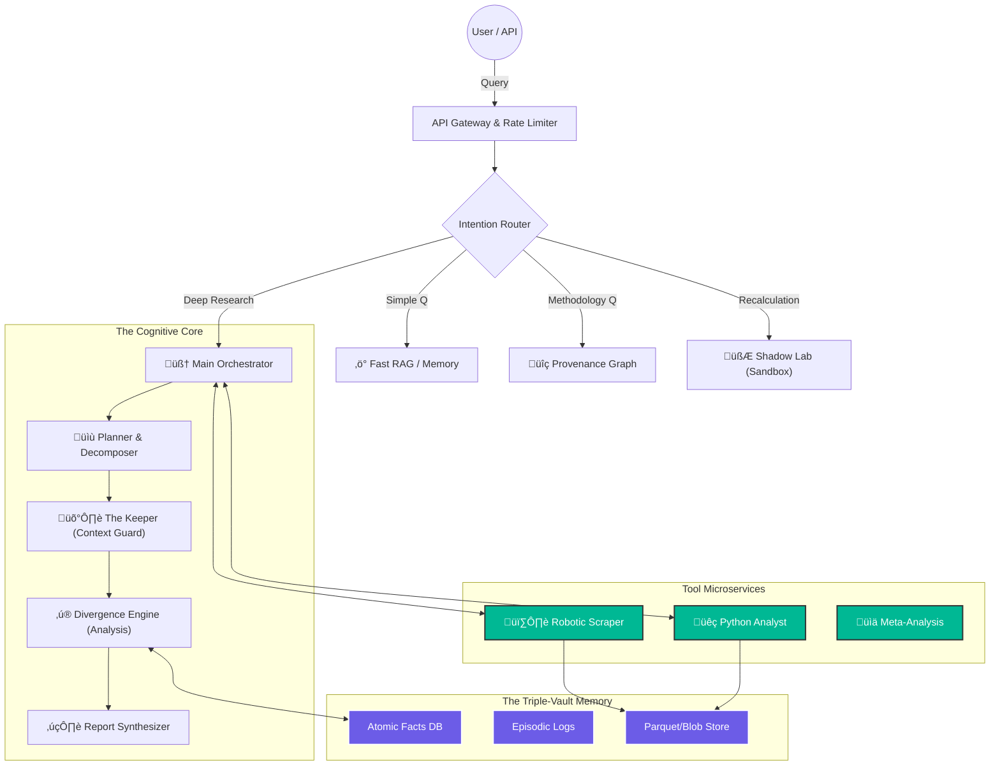
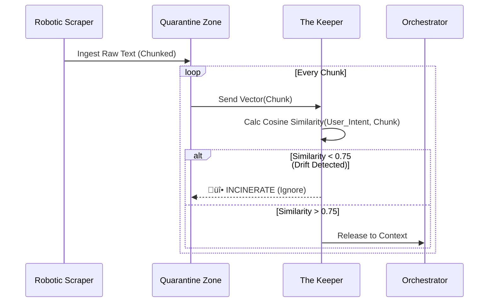

This is the best way to handle documentation for a system this complex. We will structure the `README.md` as a **Master Architecture Document**.

Here is **Part 1: The General Architecture & Core Philosophy**. This section establishes the high-level map and the "Router" logic that governs the entire system.

You can create a file named `ARCHITECTURE.md` or put this at the top of your `README.md`.

***

# 🦜 Kea: Distributed Autonomous Research Engine (DARE)

> **"Not just a Chatbot. A Research Factory."**

**Kea** is a microservice-based, recursive AI architecture designed for open-ended domain investigation. Unlike linear RAG systems, Kea utilizes a **Cyclic State Graph** to mimic human research behavior: formulating hypotheses, gathering data, verifying consistency, and autonomously reformulating strategies when results are suboptimal.

It separates **Reasoning** (The Brain/LLM) from **Execution** (The Muscle/Python), ensuring mathematical precision and hallucination-proof results.

---

## 🗺️ 1. The General Architecture (High-Level Map)

The system follows a **Hub-and-Spoke Microservices Pattern**. The central Orchestrator manages the lifecycle of a request, delegating work to specialized, isolated services via gRPC/REST.

---

## 🚦 2. Pipeline Routing Logic

Kea does not treat every query the same. It uses an **Intention Router** to determine the most efficient execution path.

### Path A: The "Memory Fork" (Incremental Research)
*   **Trigger:** User asks a question partially covered by previous research.
*   **Logic:**
    1.  **Introspection:** The Planner decomposes the query into atomic facts ($A, B, C$).
    2.  **Vector Lookup:** Checks `Atomic Facts DB` for $A, B, C$.
    3.  **Gap Analysis:**
        *   Found $A$ (Confidence > 0.9).
        *   Missing $B, C$.
    4.  **Delta Plan:** The system generates a research task *only* for $B$ and $C$, ignoring $A$.
*   **Outcome:** 50-80% reduction in API costs and latency.

### Path B: The "Shadow Lab" (Re-Calculation)
*   **Trigger:** User asks to modify a parameter of a previous result (e.g., "What if growth is 10% instead of 5%?").
*   **Logic:**
    1.  **Artifact Retrieval:** The system retrieves the clean `data.parquet` file from the `Artifacts Store` (S3/HuggingFace).
    2.  **Code Injection:** The system sends the data + the new parameter to the **Python Sandbox**.
    3.  **Execution:** Python recalculates the specific formula.
*   **Outcome:** Instant answer with zero new web scraping.

### Path C: The "Grand Synthesis" (Meta-Analysis)
*   **Trigger:** User asks to combine multiple research jobs (e.g., "Combine the Market Study and the Regulatory Study").
*   **Logic:**
    1.  **Librarian Fetch:** Retrieves `Job_ID_1` and `Job_ID_2` from the Manifest.
    2.  **Schema Alignment:** The **Analyst Agent** writes Python code to normalize columns (e.g., mapping `revenue_usd` to `rev_global`).
    3.  **Fusion:** Executes a `pd.concat` or merge operation.
    4.  **Conflict Check:** The **Divergence Engine** highlights where Job 1 contradicts Job 2.

---

## 🧬 3. Sub-Architectures (The "How-To")

### A. The "Keeper" Protocol (Context Immune System)
*Goal: To prevent the "Rabbit Hole" effect and hallucinations.*

### B. The "Divergence Engine" (Abductive Reasoning)
*Goal: To investigate why data doesn't match expectations.*

---

## 🛠️ Technology Stack

| Component | Tech | Role |
| :--- | :--- | :--- |
| **Orchestrator** | **Python / LangGraph** | Cyclic state management and consensus loops. |
| **API Interface** | **FastAPI** | Asynchronous microservice communication. |
| **Analysis** | **Pandas / DuckDB** | In-memory SQL/Dataframe manipulation for "Shadow Lab". |
| **Memory** | **Qdrant + GraphRAG** | Storage of atomic facts and their relationships. |
| **Storage** | **Parquet / S3** | Efficient storage of "Artifacts" (Raw DataFrames). |
| **Isolation** | **Docker / E2B** | Sandboxed code execution environment. |
| **Browser** | **Playwright** | Headless, stealthy web scraping with vision capabilities. |

---

**[End of Part 1]**

*Do you want me to proceed to **Part 2: The Workflow Details**, where we detail the exact prompt engineering logic for the "System Prompt Definer" and the "Consensus Loop"?*
