This is the best way to handle documentation for a system this complex. We will structure the `README.md` as a **Master Architecture Document**.

Here is **Part 1: The General Architecture & Core Philosophy**. This section establishes the high-level map and the "Router" logic that governs the entire system.

You can create a file named `ARCHITECTURE.md` or put this at the top of your `README.md`.

***

# 🦜 Kea: Distributed Autonomous Research Engine (DARE)

> **"Not just a Chatbot. A Research Factory."**

**Kea** is a microservice-based, recursive AI architecture designed for open-ended domain investigation. Unlike linear RAG systems, Kea utilizes a **Cyclic State Graph** to mimic human research behavior: formulating hypotheses, gathering data, verifying consistency, and autonomously reformulating strategies when results are suboptimal.

It separates **Reasoning** (The Brain/LLM) from **Execution** (The Muscle/Python), ensuring mathematical precision and hallucination-proof results.

---

## 🗺️ 1. The General Architecture (High-Level Map)

The system follows a **Hub-and-Spoke Microservices Pattern**. The central Orchestrator manages the lifecycle of a request, delegating work to specialized, isolated services via gRPC/REST.


---

## 🚦 2. Pipeline Routing Logic

Kea does not treat every query the same. It uses an **Intention Router** to determine the most efficient execution path.

### Path A: The "Memory Fork" (Incremental Research)
*   **Trigger:** User asks a question partially covered by previous research.
*   **Logic:**
    1.  **Introspection:** The Planner decomposes the query into atomic facts ($A, B, C$).
    2.  **Vector Lookup:** Checks `Atomic Facts DB` for $A, B, C$.
    3.  **Gap Analysis:**
        *   Found $A$ (Confidence > 0.9).
        *   Missing $B, C$.
    4.  **Delta Plan:** The system generates a research task *only* for $B$ and $C$, ignoring $A$.
*   **Outcome:** 50-80% reduction in API costs and latency.

### Path B: The "Shadow Lab" (Re-Calculation)
*   **Trigger:** User asks to modify a parameter of a previous result (e.g., "What if growth is 10% instead of 5%?").
*   **Logic:**
    1.  **Artifact Retrieval:** The system retrieves the clean `data.parquet` file from the `Artifacts Store` (S3/HuggingFace).
    2.  **Code Injection:** The system sends the data + the new parameter to the **Python Sandbox**.
    3.  **Execution:** Python recalculates the specific formula.
*   **Outcome:** Instant answer with zero new web scraping.

### Path C: The "Grand Synthesis" (Meta-Analysis)
*   **Trigger:** User asks to combine multiple research jobs (e.g., "Combine the Market Study and the Regulatory Study").
*   **Logic:**
    1.  **Librarian Fetch:** Retrieves `Job_ID_1` and `Job_ID_2` from the Manifest.
    2.  **Schema Alignment:** The **Analyst Agent** writes Python code to normalize columns (e.g., mapping `revenue_usd` to `rev_global`).
    3.  **Fusion:** Executes a `pd.concat` or merge operation.
    4.  **Conflict Check:** The **Divergence Engine** highlights where Job 1 contradicts Job 2.

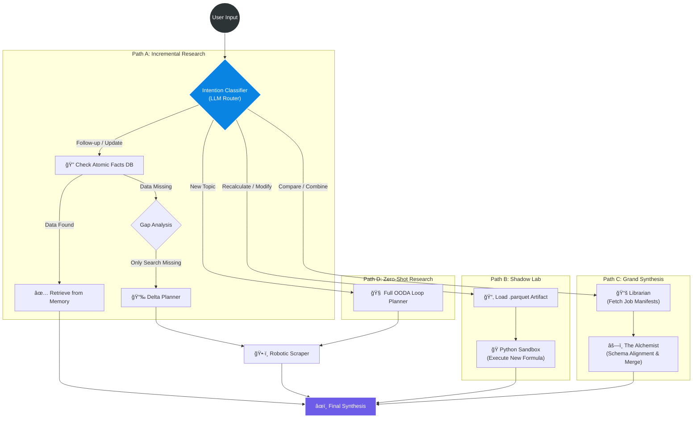

---

## 🧬 3. Sub-Architectures (The "How-To")

### A. The "Keeper" Protocol (Context Immune System)
*Goal: To prevent the "Rabbit Hole" effect and hallucinations.*

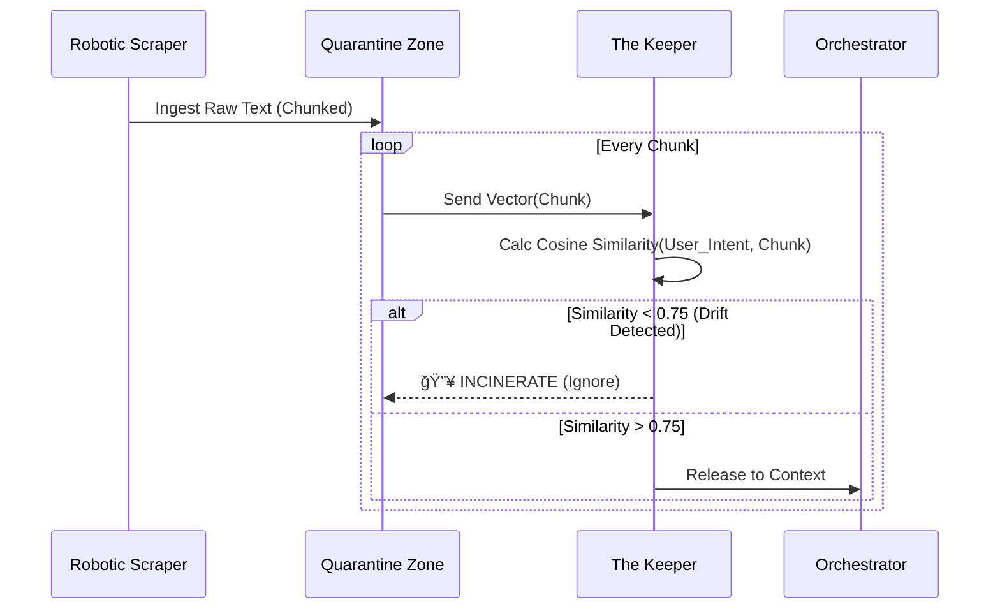

### B. The "Divergence Engine" (Abductive Reasoning)
*Goal: To investigate why data doesn't match expectations.*


---

## 🛠️ Technology Stack

| Component | Tech | Role |
| :--- | :--- | :--- |
| **Orchestrator** | **Python / LangGraph** | Cyclic state management and consensus loops. |
| **API Interface** | **FastAPI** | Asynchronous microservice communication. |
| **Analysis** | **Pandas / DuckDB** | In-memory SQL/Dataframe manipulation for "Shadow Lab". |
| **Memory** | **Qdrant + GraphRAG** | Storage of atomic facts and their relationships. |
| **Storage** | **Parquet / S3** | Efficient storage of "Artifacts" (Raw DataFrames). |
| **Isolation** | **Docker / E2B** | Sandboxed code execution environment. |
| **Browser** | **Playwright** | Headless, stealthy web scraping with vision capabilities. |

---

## 🧠 4. The Cognitive Core & Workflow Logic

Kea differs from standard agents by implementing a **"Meta-Cognitive" Layer**. It does not simply execute a prompt; it *designs* the prompt required to execute the task, then critiques the result.

### 4.1. The "Meta-Prompt" Layer (System Prompt Definer)

To optimize for **cost** and **accuracy**, Kea uses a hierarchical model strategy. A cheaper "Architect Model" defines the persona for the "Worker Model."

**The Logic:**
1.  **Task Analysis:** The Planner receives a sub-task (e.g., "Extract financial ratios for Adaro 2024").
2.  **Persona Injection:** The Architect generates a specific System Prompt.
    *   *Input:* "Task: Finance extraction. Domain: Mining."
    *   *Generated Prompt:* "You are a Forensic Accountant. You ignore marketing fluff. You only output JSON. You prioritize tables over text."
3.  **Execution:** The Worker Model runs with this strict persona, reducing hallucinations.

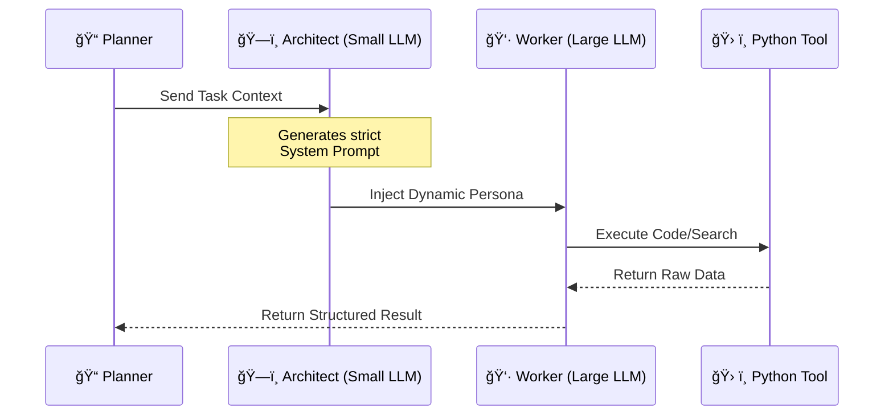

---

### 4.2. The Consensus Engine (Adversarial Collaboration)

To prevent the "Yes-Man" problem (where AI blindly agrees with the first search result), Kea implements an **Adversarial Feedback Loop**. This simulates a boardroom meeting between three distinct personas.

**The Roles:**
1.  **The Generator (Optimist):** Gathers data and proposes an answer.
2.  **The Critic (Pessimist):** Scans the answer for logical fallacies, missing dates, or weak sources.
3.  **The Judge (Synthesizer):** Decides if the answer is "Market Ready" or needs "Revision."

**The Workflow:**

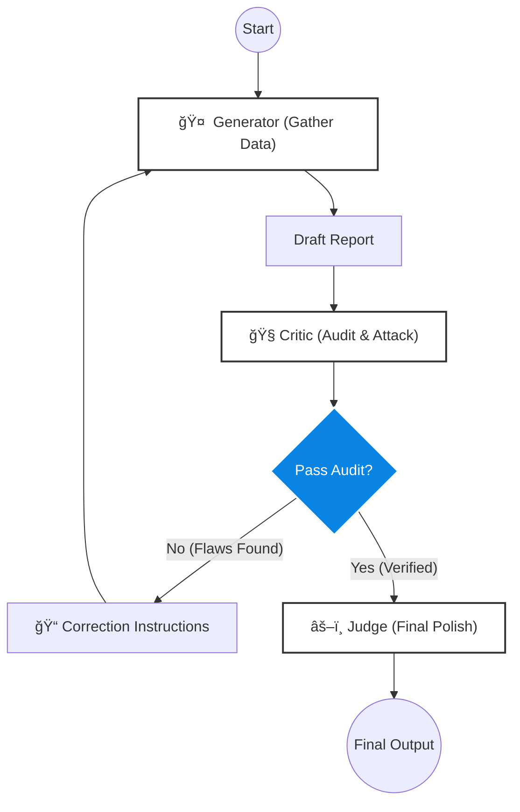

---

### 4.3. The OODA Loop (Recursive Planning)

Kea operates on the military **OODA Loop** (Observe, Orient, Decide, Act) to handle "Unknown Unknowns." The plan is not static; it evolves as data is discovered.

*   **Observe:** The system ingests raw data from the web.
*   **Orient:** The **Keeper** compares this data against the user's intent vector.
*   **Decide:** The **Divergence Engine** determines if the hypothesis holds.
    *   *If Hypothesis Fails:* The system triggers a **"Pivot"**.
*   **Act:** The system spawns new sub-agents based on the *new* hypothesis.

**Example Scenario:**
1.  *Hypothesis:* "Nickel prices are up, so Mine Revenue should be up."
2.  *Observation:* "Mine Revenue is down."
3.  *Orientation:* Divergence Detected.
4.  *Decision (Pivot):* "Investigate 'Production Volume' and 'Weather Events'."
5.  *Act:* Spawn `Weather_Agent` and `Production_Agent`.

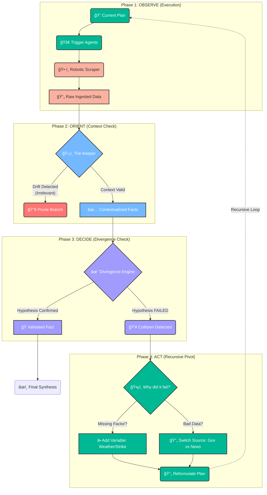
---

## 💾 5. Memory & Data Structures

To support **"Jarvis-like" Recall** and **Meta-Analysis**, Kea utilizes specific data schemas. We do not just store text; we store **Structured Artifacts**.

### 5.1. The "Atomic Fact" Schema (Vector DB)
Used for **Incremental Research** (The "Memory Fork"). This allows the system to recall specific numbers without reading full reports.

```json
{
  "fact_id": "uuid_v4",
  "entity": "Adaro Energy",
  "attribute": "Revenue",
  "value": "6.5 Billion",
  "unit": "USD",
  "period": "FY2024",
  "source_url": "https://adaro.com/report.pdf",
  "confidence_score": 0.98,
  "vector_embedding": [0.12, -0.88, 0.45, ...]
}
```
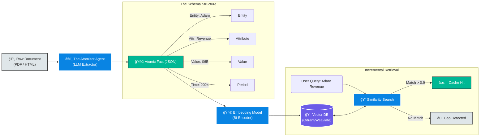

### 5.2. The "Conversation Project" Schema (JSON)
Used for **Grand Synthesis** and **Systematic Reviews**. This tracks the *provenance* of every job in a session.

```json
{
  "session_id": "sess_99",
  "topic": "Nickel Market Analysis",
  "jobs": [
    {
      "job_id": "job_01",
      "type": "market_research",
      "status": "completed",
      "artifacts": {
        "raw_data": "s3://bucket/sess_99/job_01_data.parquet",
        "report": "s3://bucket/sess_99/job_01_report.md",
        "code_snippets": ["s3://.../calc_cagr.py"]
      }
    },
    {
      "job_id": "job_02",
      "type": "regulatory_check",
      "status": "completed",
      "artifacts": {
        "raw_data": "s3://bucket/sess_99/job_02_data.parquet"
      }
    }
  ]
}
```
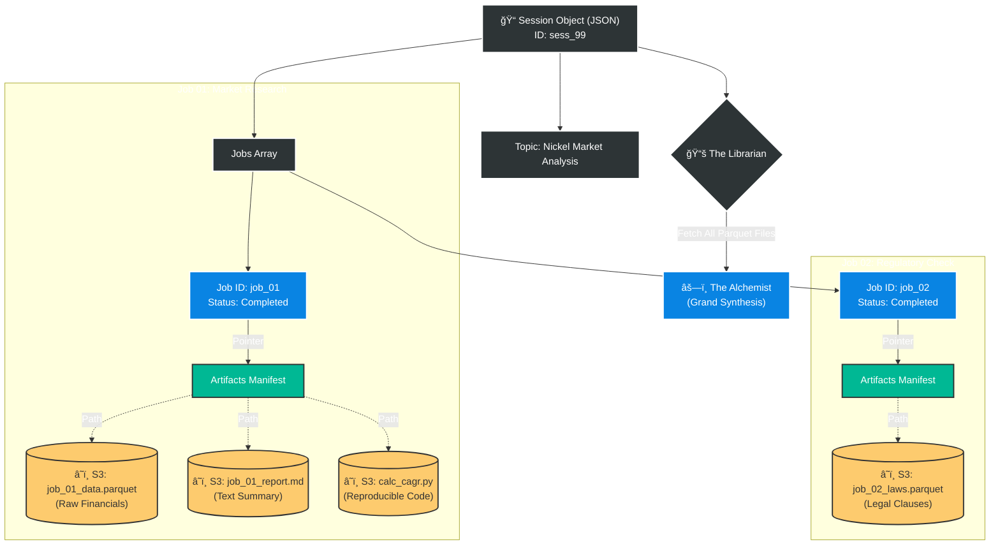
### 5.3. The "Shadow Lab" Workflow (Re-Calculation)
This architecture allows users to ask "What if?" questions without triggering new web searches.

1.  **User Request:** "Recalculate Job 1 assuming 10% inflation."
2.  **Loader:** Pulls `job_01_data.parquet` from S3.
3.  **Sandbox:** Loads Parquet into Pandas DataFrame.
4.  **Execution:** Runs `df['adjusted_revenue'] = df['revenue'] * 1.10`.
5.  **Output:** Returns table immediately. **Zero Web Requests.**

---
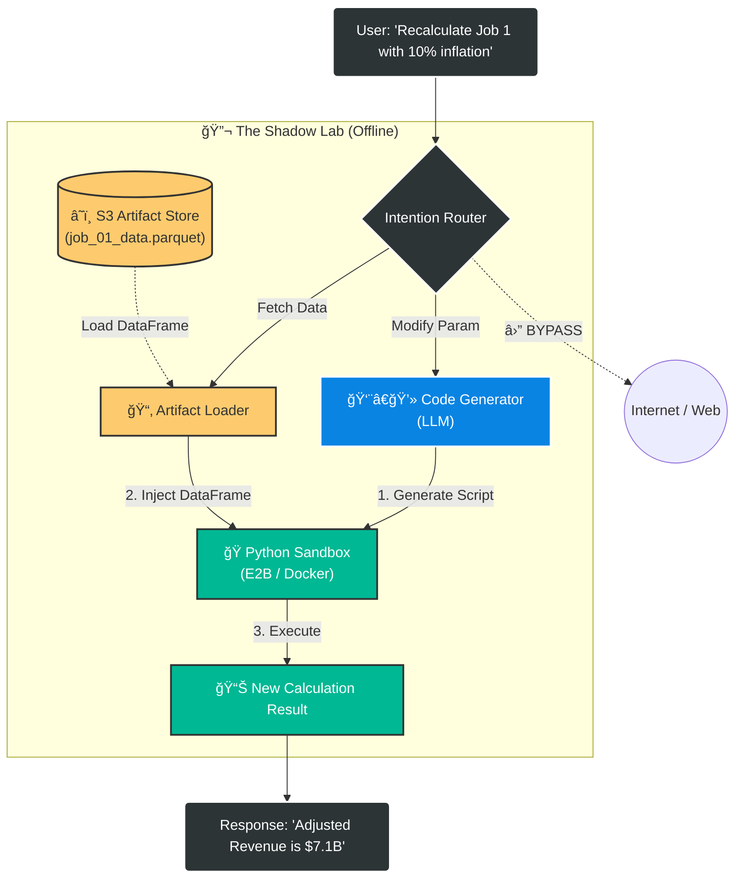

## 🤖 6. The Robotic Infrastructure (The "Hands")

To function as a true Deep Research Engine, Kea must navigate the modern, hostile web. It uses a **Stealth Robotic Fleet** to handle scraping, avoiding bans, and reading complex UIs.

### 6.1. The Headless Browser Fleet
Instead of simple HTTP requests (which get blocked), Kea controls a cluster of headless browsers.

*   **Technology:** Playwright (Python) + `stealth` plugins.
*   **Rotation Logic:**
    *   **User-Agent Rotation:** Mimics different devices (iPhone, Mac, Windows) per request.
    *   **IP Rotation:** Routes traffic through residential proxies if a 403 Forbidden is detected.
*   **Visual Scraping Protocol:**
    *   If `HTML Parsing` fails (due to dynamic JS or obfuscation), the system triggers **Vision Mode**.
    *   **Snapshot:** Takes a screenshot of the viewport.
    *   **Vision Model:** Sends image to GPT-4o-Vision/Gemini-Pro-Vision with prompt: *"Extract the table data from this image into JSON."*

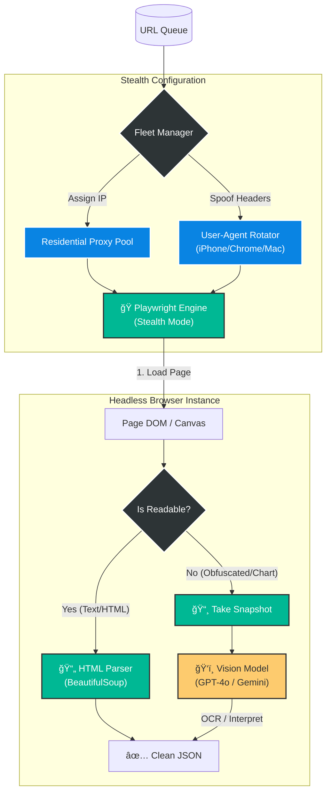

### 6.2. Politeness & Rate Limiting
To ensure long-term stability and ethical scraping, Kea implements **Domain-Level Throttling**.


---

## ⏳ 7. Asynchronous Task Management

Deep research takes time (minutes to hours). A standard HTTP request will timeout. Kea uses an **Event-Driven Architecture**.

### 7.1. The "Fire-and-Forget" Pattern
1.  **Client:** POST `/api/research/start`
2.  **API:** Returns `202 Accepted` + `job_id`.
3.  **Queue:** Pushes job to **Redis**.
4.  **Worker:** Picks up job, runs for 45 minutes, updates **PostgreSQL** state.
5.  **Client:** Polls `/api/research/status/{job_id}` or receives Webhook.

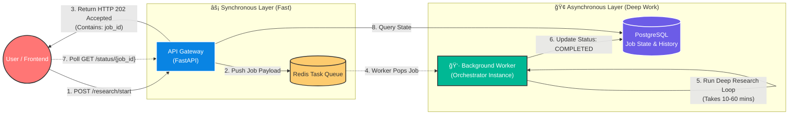
### 7.2. Distributed State Machine
Since the process is long, the state must be persisted. We use **LangGraph Checkpointing**.
*   **Benefit:** If the server crashes at *Step 4 (Analysis)*, it restarts exactly at Step 4, not Step 1.
*   **Pause/Resume:** The system can pause to ask the user for confirmation ("I found a conflict, continue?") and resume days later.

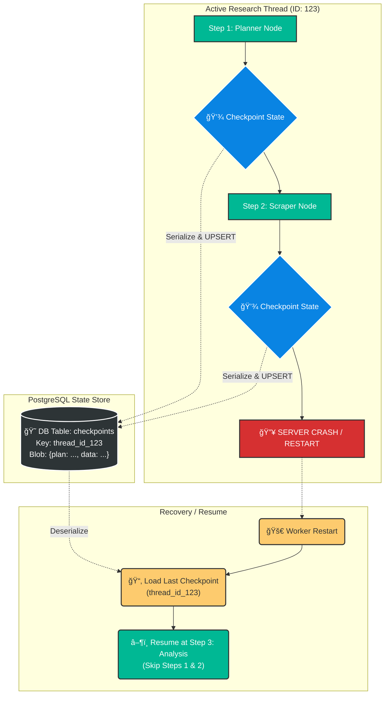

---

## 🚢 8. Deployment Strategy

Kea is designed to be **Infrastructure Agnostic**. It runs on a laptop (Colab/Docker) or a cluster (Kubernetes) using the same code base, controlled by Environment Variables.

### 8.1. The Config Switch
We use a centralized configuration loader that detects the environment.

| Feature | Local / Colab Mode | Production / VPS Mode |
| :--- | :--- | :--- |
| **Database** | SQLite (File) | PostgreSQL (Server) |
| **Queue** | Python `threading` | Redis |
| **Vector DB** | Chroma (Local File) | Qdrant / Weaviate (Server) |
| **Browser** | Local Playwright | Browserless / ScrapingBee |

### 8.2. Production Docker Compose
The system is deployed as a mesh of services.

```yaml
version: '3.8'
services:
  # The Brain
  orchestrator:
    image: kea/orchestrator
    environment:
      - MODE=production
    depends_on: [redis, db]
  
  # The Hands (Isolated for security)
  tool-runner:
    image: kea/sandbox
    command: python -m tools.server
    
  # The State
  redis: {image: "redis:alpine"}
  db: {image: "postgres:15"}
  qdrant: {image: "qdrant/qdrant"}
```

---

## 🔌 9. API Interface (The User Layer)

Kea exposes a RESTful API for integration with frontends, dashboards, or other agents.

### Core Endpoints

#### A. Trigger Research
`POST /v1/research`
```json
{
  "query": "Future of Nickel Mining",
  "depth": "deep",
  "config": {
    "use_memory": true,   // Check Atomic DB first
    "allow_web": true     // Scrape new data
  }
}
```

#### B. The Grand Synthesis (Meta-Analysis)
`POST /v1/synthesis`
```json
{
  "project_id": "session_99",
  "job_ids": ["job_a", "job_b"], // Merge these two
  "mode": "systematic_review"    // or "quantitative_merge"
}
```

#### C. The Shadow Lab (Recalculate)
`POST /v1/tools/recalc`
```json
{
  "artifact_id": "data_job_a.parquet",
  "instruction": "Filter for rows where year > 2023 and recalculate mean revenue."
}
```

---

## 🛡️ 10. Roadmap & Future Proofing

### Phase 1: Foundation (Current)
*   [x] Microservice Architecture.
*   [x] Cyclic Research Graph (OODA Loop).
*   [x] Atomic Fact Memory.

### Phase 2: Perception (Next)
*   [ ] **Multimodal Input:** Allow users to upload a PDF/Image as the start of research.
*   [ ] **Audio Output:** Generate an "Executive Podcast" summary of the research.

### Phase 3: Collaboration (Long Term)
*   [ ] **Swarm Protocol:** Allow multiple "Kea" instances to talk to each other across different servers (e.g., a Finance Kea talking to a Legal Kea).
*   [ ] **Human-in-the-Loop UI:** A dashboard to visualize the "Thought Graph" and manually prune branches.

---

