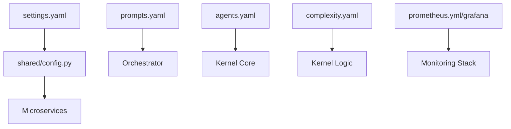

# ⚙️ Configuration Library ("The Instructions")

The `configs/` directory is the centralized repository for the "Brains" and "Tunables" of the Kea system. It decouples the core logic from specific prompts, settings, and monitoring thresholds.

## ✨ Features

- **Decoupled Prompts**: All agent personalities and core reasoning instructions are stored in YAML files, allowing for behavioral updates without code changes.
- **Centralized Settings**: `settings.yaml` provides a single source of truth for API keys, database URLs, and environment-wide defaults.
- **Tool Governance**: `tool_registry.yaml` and `tools.yaml` manage the discovery, dependencies, and availability of the 500+ tools in the MCP library.
- **Hierarchy & Agent Logic**: `agents.yaml` and `roles.yaml` define the corporate structure and specialized personas.
- **Complexity-Aware Tuning**: `complexity.yaml` defines the resource limits and execution tiers based on task difficulty.

---

## 📐 Architecture

Kea treats configuration as dynamic data that fuels the static microservices.

### 🗼 The Configuration Hierarchy

---

## 📁 Codebase Structure

### Core Execution
- **`settings.yaml`**: Main environment configuration (Services, DBs, Auth).
- **`kernel.yaml`**: Global settings for the `KernelCell` and `CognitiveCycle`.
- **`complexity.yaml`**: Mapping of complexity tiers (Trivial to Extreme) to resource limits.

### Intelligence & Prompts
- **`agents.yaml`**: Detailed definitions of specialized agent personas (The Manager, The Quant, The Auditor).
- **`prompts.yaml`**: Base system prompts and reasoning frameworks.
- **`code_prompts.yaml`**: Specialized instruction sets for the `CodeGeneratorAgent`.
- **`roles.yaml`**: Definitions of corporate roles and their associated capabilities.

### Tools & Registry
- **`tool_registry.yaml`**: The "Inventory" of every tool Kea can execute.
- **`tools.yaml`**: Configuration for JIT tool loading and isolated environment settings.

### Monitoring & Infrastructure
- **`prometheus.yml`**: Scrape targets and metric collection frequencies.
- **`grafana/`**: Pre-built dashboard JSONs for system health.
- **`alerting/`**: YAML definitions for automated health alerts.

### Domain Knowledge
- **`knowledge/`**: Domain-specific YAML files defining specialized `procedures`, `rules`, and `skills` for sectors like Finance, Legal, and Medical.
- **`vocab/`**: Specialized vocabulary and taxonomy mappings for different research domains.

---

## 🧠 Deep Dive

### 1. Domain-Specific Intelligence (`knowledge/`)
Kea uses "Multi-Persona Research." When a job is tagged as `finance`, the system pulls from `configs/knowledge/finance.yaml`, which provides specific **Standard Operating Procedures (SOPs)** and **Rules** for financial analysis.

### 2. High-Fidelity Alerting
The configuration includes "Resource Pressure" alerts. If the `Vault` service detects that the PostgreSQL connection pool is 90% saturated, or the `MCP Host` sees VRAM pressure exceeding 90%, it can trigger an early rejection of new jobs to prevent a system-wide crash.

### 3. Tool Discovery Logic
The `tool_registry.yaml` acts as a proxy. Instead of the LLM knowing about 68 servers, it queries the `Tool Discovery Server`, which uses the registry to find the exact server needed for a specific mathematical task.

---

## 📚 Reference

### Key Configuration Files

| File | Purpose | Priority Override |
| :--- | :--- | :--- |
| `settings.yaml` | Service Ports, URLs, Keys | Environment Variables (.env) |
| `agents.yaml` | Persona Definitions | `InferenceContext` |
| `complexity.yaml`| Performance Tiers | Hardware Probes |
| `prompts.yaml` | Reasoning Frameworks | Request Parameters |
| `tools.yaml` | JIT Tool Dependencies | `uv` Manifests |

---
*The Configuration Library ensures that Kea's behavior is flexible, domain-aware, and strictly governed.*
