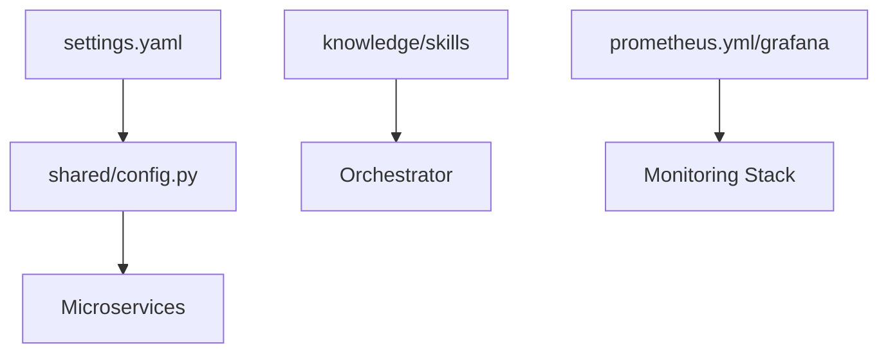

# ⚙️ Configuration Library ("The Instructions")

The `configs/` directory is the centralized repository for the "Body" and "Intelligence" tunables of the Kea system. It decouples the core infrastructure from domain-specific prompts, tool management, and monitoring thresholds.

## ✨ Features

- **Centralized Settings**: `settings.yaml` provides a single source of truth for API keys, database URLs, and environment-wide defaults.
- **Monitoring**: Integration with Prometheus, Alertmanager, and Grafana for system observability.
- **Microservice Isolation**: Each configuration block is designed to be consumed by specific services without creating tight coupling.

---

## 📐 Architecture

Project treats configuration as dynamic data that fuels the static microservices.

### 🗼 The Configuration Hierarchy

---

## 📁 Codebase Structure

### Core Execution
- **`settings.yaml`**: Main environment configuration (Services, DBs, Auth).

### Monitoring & Infrastructure
- **`prometheus.yml`**: Scrape targets and metric collection frequencies.
- **`grafana/`**: Pre-built dashboard JSONs for system health.
- **`alerting/`**: YAML definitions for automated health alerts.

### Domain Vocabulary
- **`vocab/`**: Specialized vocabulary and taxonomy mappings for standardized research terminology (e.g., Compliance).

---

## 📚 Reference

| File | Purpose | Priority Override |
| :--- | :--- | :--- |
| `settings.yaml` | Service Ports, URLs, Keys | Environment Variables (.env) |

---
*The Configuration Library ensures that Kea's behavior is flexible, domain-aware, and strictly governed. Intelligence (Roles, Reasoning, Skills) and Execution Metadata (Tool Schemas, JIT dependencies) are handled autonomously by the /knowledge layer and the MCP Host respectively.*
