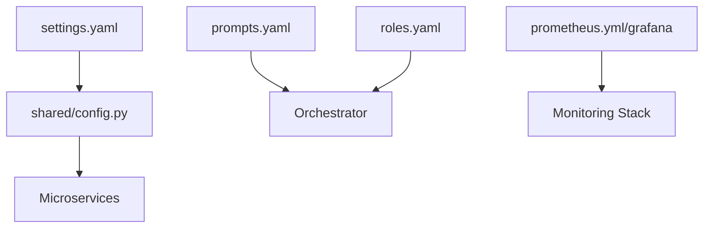

# ⚙️ Configuration Library ("The Instructions")

The `configs/` directory is the centralized repository for the "Body" and "Intelligence" tunables of the Kea system. It decouples the core infrastructure from domain-specific prompts, tool management, and monitoring thresholds.

## ✨ Features

- **Centralized Settings**: `settings.yaml` provides a single source of truth for API keys, database URLs, and environment-wide defaults.
- **Tool Governance**: `tool_registry.yaml` and `tools.yaml` manage the discovery, dependencies, and availability of tools in the MCP library.
- **Domain Experts**: `prompts.yaml` and `roles.yaml` define the corporate structure and high-level behavioral frameworks.
- **Microservice Isolation**: Each configuration block is designed to be consumed by specific services without creating tight coupling.

---

## 📐 Architecture

Project treats configuration as dynamic data that fuels the static microservices.

### 🗼 The Configuration Hierarchy

---

## 📁 Codebase Structure

### Core Execution
- **`settings.yaml`**: Main environment configuration (Services, DBs, Auth).
- **`code_prompts.yaml`**: Specialized instruction sets for the code generation and sandbox layer.

### Intelligence & Roles
- **`prompts.yaml`**: Base system prompts and reasoning frameworks for domain experts.
- **`roles.yaml`**: Definitions of corporate roles and their associated capabilities (The Financial Analyst, The Strategist).

### Tools & Registry
- **`tool_registry.yaml`**: The semantic inventory of every tool Kea can execute.
- **`tools.yaml`**: Configuration for JIT tool loading and isolated environment settings.

### Monitoring & Infrastructure
- **`prometheus.yml`**: Scrape targets and metric collection frequencies.
- **`grafana/`**: Pre-built dashboard JSONs for system health.
- **`alerting/`**: YAML definitions for automated health alerts.

### Domain Vocabulary
- **`vocab/`**: Specialized vocabulary and taxonomy mappings for standardized research terminology (e.g., Compliance, Domains).

---

## 📚 Reference

| File | Purpose | Priority Override |
| :--- | :--- | :--- |
| `settings.yaml` | Service Ports, URLs, Keys | Environment Variables (.env) |
| `prompts.yaml` | Reasoning Frameworks | Request Parameters |
| `roles.yaml` | Corporate Personas | Orchestrator Logic |
| `tools.yaml` | JIT Tool Dependencies | `uv` Manifests |
| `tool_registry.yaml`| Tool Selection | Local Registry Discovery |

---
*The Configuration Library ensures that Kea's behavior is flexible, domain-aware, and strictly governed. Content-heavy intelligence (Procedures, Rules, Skills) is maintained in the root `/knowledge` directory in Markdown format for optimal context engineering.*
