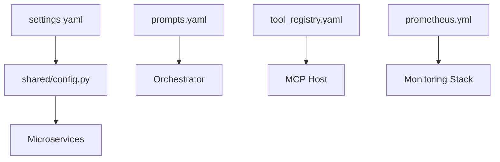

# ⚙️ Configuration Library ("The Instructions")

The `configs/` directory is the centralized repository for the "Brains" and "Tunables" of the Kea system. It decouples the core logic from specific prompts, settings, and monitoring thresholds.

## ✨ Features

- **Decoupled Prompts**: All agent personalities (Researcher, Financial Analyst, Legal Expert) are stored in `prompts.yaml`, allowing for system-wide behavioral updates without code changes.
- **Centralized Settings**: `settings.yaml` provides a single source of truth for API keys, database URLs, and JIT spawning controls.
- **Tool Governance**: `tool_registry.yaml` manages the discovery and availability status of the 500+ tools in the MCP library.
- **Full-Stack Monitoring**: Includes production-ready configurations for Prometheus, Grafana, and automated alerting.

---

## 📐 Architecture

Kea treats configuration as dynamic data that fuels the static microservices.

### 🗼 The Configuration Hierarchy

---

## 📁 Codebase Structure

- **`prompts.yaml`**: Specialized instruction sets for different research domains (Finance, Medical, Legal, Engineering, etc.) and task types (Synthesis, Verification, Forecasting).
- **`settings.yaml`**: Main environment configuration.
- **`tool_registry.yaml`**: The "Inventory" of every tool Kea can execute.
- **`prometheus.yml`**: Scrape targets and metric collection frequencies.
- **`alerting/`**: YAML definitions for Slack/Email alerts triggered by resource pressure or job failures.
- **`grafana/`**: Pre-built dashboard JSONs for system health and research job latency.

---

## 🧠 Deep Dive

### 1. Domain-Specific Intelligence (`prompts.yaml`)
Kea uses "Multi-Persona Research." When a job is tagged as `finance`, the Orchestrator pulls the `finance` domain prompt, which instructs the agent to focus on `GAAP metrics`, `risk assessment`, and `corporate filings`. This ensures that a medical query results in scientific citations (PubMed) while a legal query produces jurisdictional case law.

### 2. High-Fidelity Alerting
The configuration includes "Resource Pressure" alerts. If the `Vault` service detects that the PostgreSQL connection pool is 90% saturated, or the `MCP Host` sees VRAM pressure exceeding 90%, it can trigger an early rejection of new jobs to prevent a system-wide crash.

### 3. Tool Discovery Logic
The `tool_registry.yaml` acts as a proxy. Instead of the LLM knowing about 68 servers, it queries the `Tool Discovery Server`, which uses the registry to find the exact server (e.g., `mibian_server`) needed for a specific mathematical task (e.g., `calculate_greeks`).

---

## 📚 Reference

### Key Configuration Files

| File | Purpose | Priority Override |
|:-----|:--------|:------------------|
| `settings.yaml` | Service Ports, URLs, Keys | Environment Variables (.env) |
| `prompts.yaml` | LLM System Messages | API Request Parameters |
| `tool_registry.yaml` | Tool Schemas & IDs | JIT Auto-Discovery |
| `prometheus.yml` | Metrics Collection | Runtime `--config` flag |
