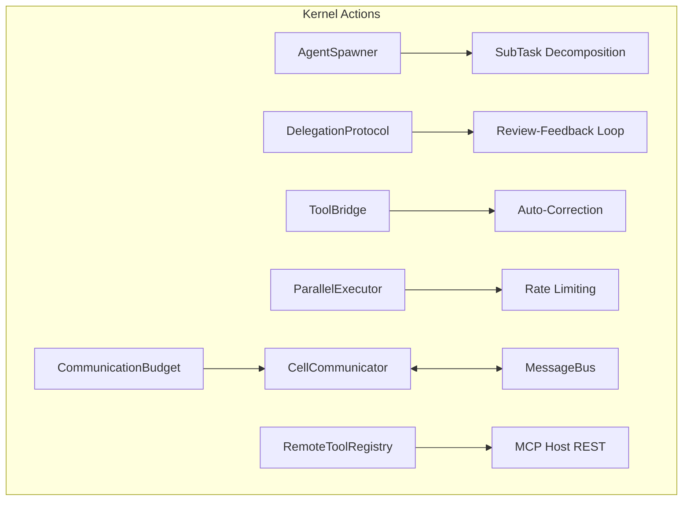

# 🧠 Kernel Actions (Motor Control)

The **Kernel Actions** subsystem translates cognitive decisions into physical operations. It manages tool execution, child agent spawning, and formal protocols for delegation and peer-to-peer communication.

## 📐 Architecture

Actions act as the "Hands" of the kernel, providing a unified interface to the external world through MCP (Model Context Protocol) and internal recursive scaling.

### Component Overview

| Component | Responsibility | Key File |
| :--- | :--- | :--- |
| **Agent Spawner** | The "Scaler". Decomposes complex tasks into subtasks and manages JIT child cell creation. | `agent_spawner.py` |
| **Delegation Protocol** | The "Contract". Manages iterative feedback-based reviews between parent and child. | `delegation_protocol.py` |
| **Cell Communicator** | The "Messaging Hub". Bridges Cognitive Cycle to the MessageBus for P2P and Escalations. | `cell_communicator.py` |
| **Tool Bridge** | The "Interface". Bridges internal tool calls to external services with auto-correction. | `tool_bridge.py` |
| **Remote Registry** | The "Tool Finder". Connects to MCP Host via REST for JIT tool discovery and execution. | `remote_tool_registry.py` |
| **Parallel Executor** | The "High-Volume Runner". Manages concurrent tool/agent execution with rate limiting. | `parallel_executor.py` |

---

## ✨ Key Features

### 1. Just-In-Time (JIT) Agent Spawning (`AgentSpawner`)
The `AgentSpawner` allows the kernel to dynamically scale its reasoning power. It uses a `TaskDecomposer` to split a query (e.g., "Analyze 10-K for AAPL, MSFT, and GOOGL") into independent subtasks, which are then executed in parallel by specialized child cells.

### 2. Feedback-Driven Delegation (`DelegationProtocol`)
Unlike simple "fire-and-forget" delegation, Kea uses a multi-round state machine:
- **Phase 1**: Parent delegates tasks to children.
- **Phase 2**: Parent reviews child outputs against quality criteria.
- **Phase 3**: Parent provides iterative feedback and requests revisions until the output passes the quality gate.

### 3. Hierarchical & P2P Communication (`CellCommunicator`)
The `CellCommunicator` provides a clean API for cells to talk in multiple directions:
- **Upward**: `ask_parent` (Clarify), `escalate` (Help), `report_progress`.
- **Lateral**: `consult_peer` (Expert advice), `share_with_peers` (Insight propagation).
- **Control**: `CommunicationBudget` ensures cells don't exhaust task tokens on excessive messaging.

### 4. Self-Correcting Tool Execution (`ToolBridge`)
The `ToolBridge` encapsulates the logic for retrying failed tool calls. If an LLM-generated tool call has minor syntax errors or missing arguments, the bridge uses a mini-inference round to fix the arguments before retrying, increasing system robustness.

---

## 📁 Component Details

### `agent_spawner.py`
Determines if a task should be handled by an "Intern" (Solo) or a "Manager" (Delegated). It handles the instantiation of child `KernelCell` objects and their initial enrollment in the `MessageBus`.

### `cell_communicator.py`
Integrated with `WorkingMemory`. When a cell receives a response from a peer or parent, the communicator automatically stores the insight as a `FocusItem`, allowing the cognitive cycle to "notice" the new information.

### `delegation_protocol.py`
The "Project Manager" logic. It tracks the `DelegationState` for every child, managing the transition from `PENDING` to `REVIEW` to `COMPLETED`.

### `tool_bridge.py` & `remote_tool_registry.py`
Implement the microservices bridge. `RemoteToolRegistry` handles the HTTP discovery of tools from the **MCP Host**, while `ToolBridge` provides the execution runtime with telemetry and error handling.

### `parallel_executor.py`
Provides `BatchRunner`, which manages `asyncio.gather` rounds with semaphore-based concurrency control to respect hardware limits.

---
*Actions in Kea ensure that reasoning is transformed into reliable, parallelized, and accountable physical work.*

