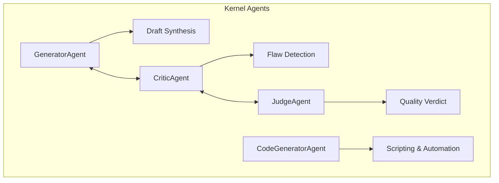

# 🧠 Kernel Agents (Specialized Personas)

The **Kernel Agents** subsystem provides a collection of specialized "Cognitive Personas". Unlike the universal `KernelCell`, which provides the infrastructure for thought, these agents provide the specific **Skills** and **Reasoning Styles** required for high-fidelity work.

## 📐 Architecture

Agents are designed for **Adversarial Collaboration**. They are typically used within a `ConsensusEngine` or a `LangGraph` node to provide a specific "voice" in the thinking process.

### Component Overview

| Persona | Role | Primary Function |
| :--- | :--- | :--- |
| **Generator** | The Optimist | Synthesizes facts into a comprehensive first draft. |
| **Critic** | The Pessimist | Identifies gaps, logical fallacies, and missing evidence. |
| **Judge** | The Rationalist | Weighs Generator vs. Critic and issues a final quality verdict. |
| **Code Generator** | The Engineer | Specialized in Python scripting, data processing, and tool automation. |

---

## ✨ Key Features

### 1. Adversarial Triad (Generator-Critic-Judge)
By splitting reasoning into Optimist, Pessimist, and Rationalist roles, Kea avoids the "Default Acceptance" bias common in monolithic LLM chains.
- **The Generator** focuses on creative synthesis and finding "The Best Path."
- **The Critic** is incentivized to find "The Hidden Risk" and "The Unsupported Claim."
- **The Judge** ensures the final output meets the "Quality Bar" defined in the cognitive profile.

### 2. Knowledge-Enhanced Personas
Every agent leverages the `KnowledgeEnhancedInference` (KEI) engine. This ensures that:
- **CodeGeneratorAgent** receives `shared/knowledge/python_best_practices.md`.
- **GeneratorAgent** receives `shared/knowledge/report_standards.json`.
- **JudgeAgent** receives the specific `Governance Policy` from the Swarm Manager.

### 3. High-Fidelity Citation Grounding
The `GeneratorAgent` is strictly instructed to use only provided facts. It parses `AtomicFact` structures, including tool citations and source URLs, ensuring that every claim in a Kea-generated report is traceable back to a specific tool execution or document snippet.

### 4. Specialization: Digital Engineering (`CodeGenerator`)
The `CodeGeneratorAgent` is more than a text writer; it is an automated developer. It owns the logic for:
- **Tool Chaining**: Sequences multiple MCP calls in Python scripts.
- **Data Transformation**: Using `pandas` or `numpy` for calculative research.
- **Auto-Correction**: Fixing its own code when it encounters runtime errors.

---

## 📁 Component Details

### `generator.py`
The "Draftsman". Implements the complex logic of assembling facts into a coherent narrative while respecting source citations and formatting rules.

### `critic.py`
The "Auditor". Scans for hallucinations, unsupported claims, and tone inconsistencies. It provides structured feedback that the Generator uses for revisions.

### `judge.py`
The "Authority". Evaluates the interaction between Generator and Critic. It produces the `ScoreCard` that determines if a task is "Completed" or "FAILED - Needs Re-planning".

### `code_generator.py`
The "Workhorse". Specializes in generating and executing secure Python code blocks to bridge gaps where standard tools are unavailable or insufficient.

---
*Agents in Kea are not general-purpose chatbots; they are precision tools designed for a specific stage of the cognitive cycle.*

