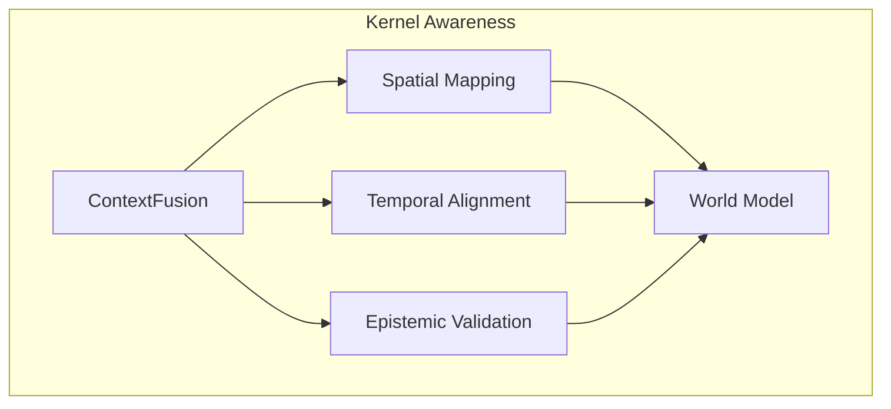

# 🧠 Kernel Awareness (Sensory Integration)

The **Kernel Awareness** subsystem manages the high-level integration of multi-modal context and environmental signals. It provides the "Sensory Fusion" layer that allows a `KernelCell` to understand its position in time, space, and epistemic certainty.

## 📐 Architecture

Awareness is designed as a **Multidimensional Context Layer** that informs the `CognitiveCycle`. It processes incoming signals to build a coherent world model for the current task.

### Component Overview

| Component | Responsibility | Key File |
| :--- | :--- | :--- |
| **Context Fusion** | The "Integrator". Merges disparate sensory signals (Text, Image, PDF) into a unified inference context. | `context_fusion.py` |
| **Epistemic Logic** | The "Confidence Meter". Analyzes the certainty and reliability of gathered facts and sources. | `epistemic.py` |
| **Temporal Logic** | The "Chronometer". Manages time-series data, period-over-period comparisons, and event sequencing. | `temporal.py` |
| **Spatial Logic** | The "Navigator". Handles geographical context, organizational distance, and relational mapping. | `spatial.py` |

---

## ✨ Key Features

### 1. Multi-Signal Context Fusion
Instead of treating inputs as flat strings, `ContextFusion` creates a rich topology of information. It links visual evidence (from `Qwen2-VL`) with textual findings, ensuring the LLM "sees" the same relationship between a chart and its accompanying text.

### 2. Epistemic Uncertainty Handling
Kea doesn't just "know" things; it understands how well it knows them. The `epistemic.py` module tracks:
- **Source Reliability**: Weighted scores for different knowledge origins.
- **Evidence Density**: How many independent tools/sources confirm a fact.
- **Ambiguity Detection**: Identifying when gathered data is contradictory or vague.

### 3. Chronological Intelligence (`TemporalLogic`)
Critical for financial and legal research, the temporal module ensures that "Current" data is distinguished from "Historical" data. It enables complex queries like "What has changed since the last annual filing?" by aligning data points on a global timeline.

### 4. Relational & Spatial Mapping
The `spatial.py` module manages the "Topology of Knowledge." It understands the hierarchical relationship between corporate entities, jurisdictional boundaries, and the "Mental Distance" between different research topics.

---

## 📁 Component Details

### `context_fusion.py`
The primary entry point for sensory data. It uses the `ModalityEngine` from `shared/io` to normalize inputs before performing semantic merging.

### `epistemic.py`
Provides the `CertaintyScore` used by the **Judge Agent**. It implements algorithms to detect "Hallucination Risk" by comparing LLM outputs against the `FactStore`.

### `temporal.py` & `spatial.py`
Provide the coordinate systems for the kernel's world model. They inject specific metadata into the `InferenceContext` to help the LLM navigate complex data dimensions.

---
*Awareness in Kea ensures that intelligence is not just reactive, but grounded in a structured understanding of its environment.*
