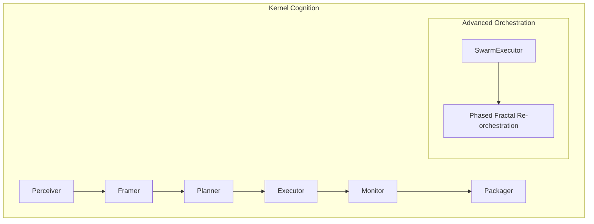

# 🧠 Kernel Cognition (Thinking Engine)

The **Kernel Cognition** subsystem contains the functional units that drive the `CognitiveCycle`. It implements the specialized "Mental Faculties" required for autonomous reasoning, planning, and self-monitoring.

## 📐 Architecture

Cognition is organized as a pipeline of functional nodes that collaborate to transform a raw query into a structured conclusion.

### Component Overview

| Component | Responsibility | Key File |
| :--- | :--- | :--- |
| **Perceiver** | The "Input Interpreter". Extracts core intent and implicit requirements from messages. | `perceiver.py` |
| **Framer** | The "Boundary Setter". Defines the scope, constraints, and success criteria for a task. | `framer.py` |
| **Planner** | The "Architect". Generates the step-by-step DAG for execution. | `planner.py` |
| **Executor** | The "Operator". Manages the actual tool calls and sub-task coordination. | `executor.py` |
| **Monitor** | The "Evaluator". Real-time check of progress against the original frame. | `monitor.py` |
| **Packager** | The "Assembler". Converts raw findings into the final structured output. | `packager.py` |
| **Swarm Executor** | The "Massive Parallelizer". Manages deep fractal swarms and result harvesting. | `swarm_executor.py` |

---

## ✨ Key Features

### 1. The 8-Phase Cognitive Cycle
Implemented primarily in `cycle.py`, this engine replaces standard ReAct loops with a more rigorous biological model:
1.  **Perceive**: Instruction parsing.
2.  **Explore**: Tool discovery.
3.  **Frame**: Scope/Gap definition.
4.  **Plan**: Step generation.
5.  **Execute**: Action run.
6.  **Monitor**: Self-assessment.
7.  **Adapt**: Correction.
8.  **Package**: Alignment.

### 2. Phased Fractal Swarming (`SwarmExecutor`)
For tasks that require massive parallel research (e.g., "Analyze the Top 50 semi-conductor companies"), the `SwarmExecutor` triggers a fractal expansion. It splits the task into layers, harvesting results at each phase to inform the next, while managing error filtering and result deduplication.

### 3. Drift Monitoring (`Monitor`)
While a task is running, the `Monitor` node continuously compares the `WorkingMemory` state against the `Framer`'s original goals. If the research drifts into irrelevant topics, it triggers an `ADAPT` signal to re-frame the problem.

### 4. Structured Packaging (`Packager`)
The `Packager` ensures that every "thought" results in a valid Pydantic artifact. It maps internal "thoughts" to standard report sections, ensuring consistency across different hierarchy levels.

---

## 📁 Component Details

### `cycle.py`
The "Main Loop" of cognition. It manages the state transitions between the different cognitive phases and handles the passing of `ResearchState` between nodes.

### `swarm_executor.py`
The most powerful execution unit. It encapsulates the interaction with the `AgentSpawner` and `DAGExecutor`, providing a high-level API for running complex multi-agent missions.

### `framer.py` & `planner.py`
The "Strategy Team". `framer.py` ensures the agent knows "What" is being done, while `planner.py` decides "How" to do it.

---
*Cognition in Kea transforms raw information into actionable corporate intelligence through a rigorous, self-correcting reasoning process.*
