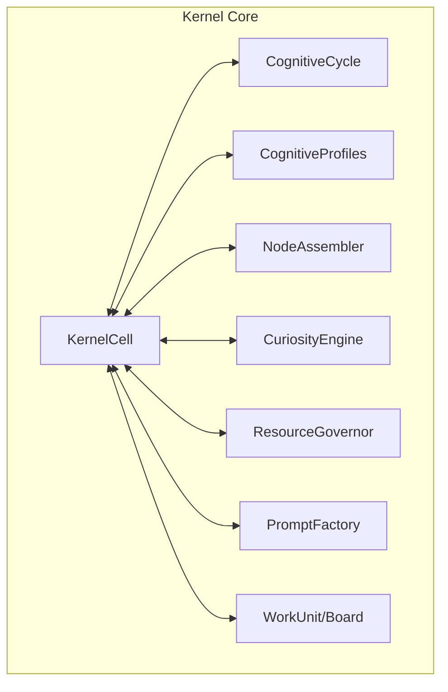

# 🧠 Kernel Core (The Cortex)

The **Kernel Core** is the primary reasoning engine of the Kea system. It implements the "Synthetic Organism" philosophy by providing a universal, recursive processing unit that can simulate any level of a corporate hierarchy.

## 📐 Architecture

The Core is designed as a **Recursive Cognitive Environment**. At its center is the `KernelCell`, which behaves as a self-contained biological unit. It utilizes the `CognitiveCycle` for internal reasoning and interacts with the `MessageBus` for external communication.

### Component Overview

| Component | Responsibility | Key File |
| :--- | :--- | :--- |
| **Kernel Cell** | The "Universal Employee". Recursive processing unit managing delegation, budgets, and state. | `kernel_cell.py` |
| **Cognitive Cycle** | Structural thinking loop. Implements Perception, Framing, Planning, Execution, Monitoring, and Adaptation. | `cognitive_cycle.py` |
| **Node Assembler** | The "Wiring Engine". Resolves data dependencies (JSONPath) between nodes and manages sequences. | `assembler.py` |
| **Curiosity Engine** | The "Exploration Unit". Generates WHY, WHAT-IF, and anomaly detection questions from facts. | `curiosity.py` |
| **Resource Governor** | The "Internal Regulator". Monitors hardware (CPU/RAM/VRAM) and enforces token/budget constraints. | `resource_governor.py` |
| **Cognitive Profiles** | The "Identity Layer". Defines reasoning styles (Direct vs. Strategic) for different hierarchy levels. | `cognitive_profiles.py` |
| **Prompt Factory** | The "Context Generator". Dynamically crafts domain-specific prompts with knowledge injection. | `prompt_factory.py` |
| **Work Architecture** | The "Task Board". Implements Kanban-style tracking and dependency resolution for agent jobs. | `work_unit.py` |

---

## ✨ Key Features

### 1. Universal Recursive Unit (`KernelCell`)
Every node in the thinking process—from a high-level strategic "CEO" to a task-oriented "Intern"—runs the exact same `KernelCell` logic. Behavior is modulated strictly via **Cognitive Profiles**, ensuring a predictable and scalable reasoning architecture that can handle infinite recursion (bounded by `TokenBudget`).

### 2. Biological Cognitive Cycle (`CognitiveCycle`)
Replaces simple ReAct loops with a multi-phase cognitive process:
- **Perceive/Explore**: Discovery of tools, prior findings, and implicit expectations.
- **Frame**: Definition of scope, constraints, and identified information gaps.
- **Plan**: Strategy generation using DAG-based workflows.
- **Execute/Monitor**: Managed execution with real-time drift detection.
- **Adapt/Heal**: Recursive course correction and self-healing for plan failures.

### 3. Artifact-Based Data Flow (`NodeAssembler`)
Implements an n8n-style node wiring system. Nodes pass data via `Artifacts`, and the Assembler resolves complex dependencies using JSONPath syntax (e.g., `{{step_id.artifacts.query}}`). This allows for dynamic "Just-In-Time" workflow generation.

### 4. Curiosity-Driven Research (`CuriosityEngine`)
The kernel doesn't just answer questions; it asks them. The `CuriosityEngine` analyzes gathered facts to generate:
- **Causal Why**: Identifying underlying reasons for data points.
- **Counterfactuals**: Exploring "What-if" scenarios.
- **Anomalies**: Finding inconsistencies in retrieved knowledge.

---

## 📁 Component Details

### `kernel_cell.py`
The fundamental unit of Kea. Handles recursive child spawning, token budget management, and multi-directional communication. It is the "host" for all other core components.

### `cognitive_cycle.py`
Manages the internal state transitions of a single "thought." It produces structured outputs for each phase, ensuring the LLM follows a rigorous logical progression.

### `assembler.py`
The engine behind DAG execution. It performs topological sorting of sub-tasks and extracts/injects data between steps using the `Artifact` system.

### `resource_governor.py`
Provides hardware-aware safety. It monitors system utilization and can trigger **Escalations** or **Throttling** to prevent system crashes or uncontrolled cost expansion.

### `prompt_factory.py`
Decouples logic from prompts. It uses domain templates and task modifiers to generate high-fidelity system prompts on-the-fly, injecting relevant corporate "Skills" and "Rules" from the knowledge base.

### `work_unit.py` & `organization.py`
Define the "Corporate Body." `WorkUnit` provides a ticket-style abstraction for tasks, while `Organization` manages the hierarchy of Departments, Teams, and Roles.

---
*The Kernel Core manages the transition from raw instruction to structured autonomous execution.*

