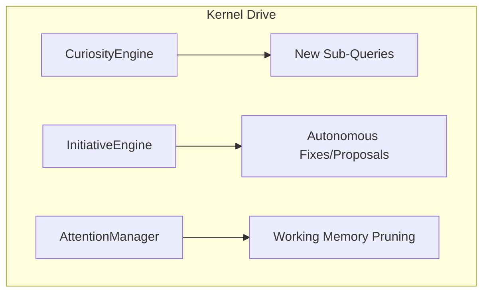

# 🧠 Kernel Drive (Motivation & Focus)

The **Kernel Drive** subsystem regulates the "Proactivity" and "Attention" of the Kea system. It provides the motivational layer that allows a `KernelCell` to exhibit curiosity, take initiative, and maintain focus on high-value goals.

## 📐 Architecture

Drive is designed as a **Regulatory Feedback System** that modulates the behavior of the `CognitiveCycle`.

### Component Overview

| Component | Responsibility | Key File |
| :--- | :--- | :--- |
| **Curiosity** | The "Explorer". Automatically identifies gaps and anomalies to generate follow-up questions. | `curiosity.py` |
| **Initiative** | The "Problem Solver". Determines when to take corrective action without explicit user instruction. | `initiative.py` |
| **Attention** | The "Filter". Prioritizes information in `WorkingMemory` to prevent context saturation. | `attention.py` |

---

## ✨ Key Features

### 1. Curiosity-Driven Deep Research
The `CuriosityEngine` analyzes gathered `AtomicFact` objects to detect:
- **Causal Gaps**: "We know the price went up, but we don't know *why*."
- **Contradictions**: "Source A and Source B disagree; let's find a tie-breaker."
- **Opportunities**: "This company mentioned a new product; let me explore its market impact."

### 2. Autonomous Initiative
Kea doesn't just wait for orders. The `InitiativeEngine` monitors for "Healing States." If a tool call fails because of a missing dependency, the engine takes the initiative to `escalate` or `auto-fix` the environment, reporting its actions back to the user.

### 3. Focus & Attention Management
Inspired by human focus limits, the `AttentionManager` ensures the LLM's context window contains only the most task-salient information. It performs:
- **Pruning**: Removing outdated or low-relevance facts from the active prompt.
- **Priority Boosting**: Ensuring that critical compliance warnings or error messages are never truncated.

---

## 📁 Component Details

### `curiosity.py`
Integrated with the `RAG Service`. It uses small LLM sub-calls to "look at the evidence" and generate a list of `CuriosityQuests` that the `Planner` can then incorporate into the research mission.

### `initiative.py`
Handles "Self-Healing" logic. It defines the thresholds for when an agent should pivot its strategy autonomously vs. when it must ask for permission.

### `attention.py`
The "Context Cleaner". It implements the scoring logic that decides which `FocusItem` objects in `WorkingMemory` stay in the prompt and which are archived to the `Vault`.

---
*Drive in Kea ensures that the system is not just a passive tool, but a proactive and focused silicon employee.*
