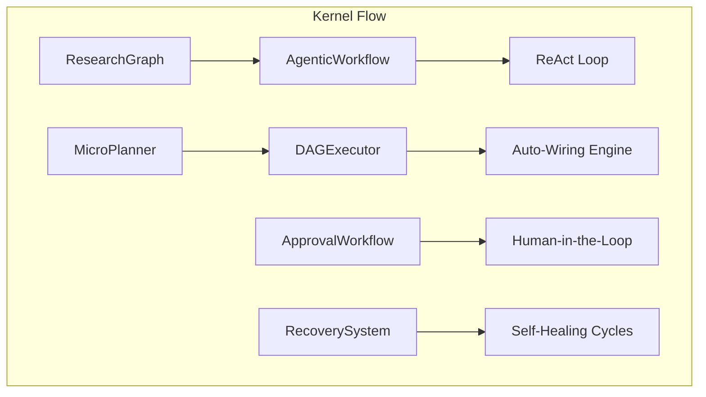

# 🧠 Kernel Flow (The Nervous System)

The **Kernel Flow** subsystem manages the logical sequencing and execution patterns of the Kea system. It provides both high-level state machine orchestration (via LangGraph) and low-level dependency-driven task execution (via DAGs).

## 📐 Architecture

Flow is divided into two primary execution layers:
1.  **Macro-Flow (Graphs)**: High-level state transitions and multi-agent loops.
2.  **Micro-Flow (DAGs)**: Granular, dependency-aware task execution.

### Component Overview

| Component | Responsibility | Key File |
| :--- | :--- | :--- |
| **Research Graph** | The "Master Graph". Implements high-level LangGraph phase transitions. | `graph.py` |
| **Agentic Workflow**| The "ReAct Engine". Implements the Thought-Action-Observation reasoning loop. | `agentic_workflow.py` |
| **DAG Executor** | The "Workhorse". Fires tasks in parallel based on artifact readiness. | `dag_executor.py` |
| **Approval Workflow**| The "Governor". Manages human-in-the-loop requests for high-stakes actions. | `approval_workflow.py` |
| **Microplanner** | The "Sub-Tasker". Breaks complex directives into execution-ready DAGs. | `microplanner.py` |
| **Recovery System** | The "Lifeline". Detects stalls or deadlocks and triggers recursive flow healing. | `recovery.py` |

---

## ✨ Key Features

### 1. Macro-Micro Hybrid Execution
Kea combines the predictability of **LangGraph** state machines (Macro) with the efficiency of **DAG** execution (Micro). The Macro-Flow handles agent-to-agent interaction, while the Micro-Flow ensures tool-level tasks are executed with maximum parallelism.

### 2. Autonomous Agentic Reasoning (`AgenticWorkflow`)
The `AgenticWorkflow` implements a true **ReAct** loop. A single node can cycle through multiple internal thoughts, tool calls, and observations before reporting back to the parent graph. This prevents "Graph Bloat" while allowing for complex, granular autonomy.

### 3. Human-in-the-Loop Governance (`ApprovalWorkflow`)
For enterprise-critical actions (e.g., executing a trade, changing security policies), the flow can pause and emit an `ApprovalRequest`. The `ApprovalWorkflow` manages categories (Cost, Compliance, Security) and role-based assignments, resuming the flow only after human verification.

### 4. Just-In-Time Auto-Wiring (`AutoWirer`)
Nodes in a Kea DAG don't need hardcoded input mappings. The `AutoWirer` uses metadata and artifact types to "wire" nodes together at runtime. If Node B needs a "Financial Statement," it automatically finds the artifact produced by Node A that matches that type.

---

## 📁 Component Details

### `graph.py`
The entry point for specialized multi-agent systems. It defines how the **Planner**, **Researcher**, and **Judge** interact over the long-term research mission.

### `agentic_workflow.py`
The core implementation of the reasoning chain. It handles the parsing of "Thoughts" and provides the state management for iterative tool use within a single node.

### `dag_executor.py`
A high-performance engine for non-linear execution. It uses a `Semaphore` to respect hardware limits while firing hundreds of dependent subtasks as soon as their inputs appear in the `ArtifactStore`.

### `approval_workflow.py`
Defines the `ApprovalRequest` and `ApprovalStatus` lifecycles. It integrates with the `Swarm Manager` for external notification and manages the `wait_for_approval` polling logic.

### `microplanner.py`
The bridge between high-level planning and low-level execution. It ensures that every `WorkflowNode` injected into the executor is valid and has reachable dependencies.

---
*Flow in Kea ensures that intelligence is not just linear, but a reactive and adaptive network of concurrent thoughts.*

