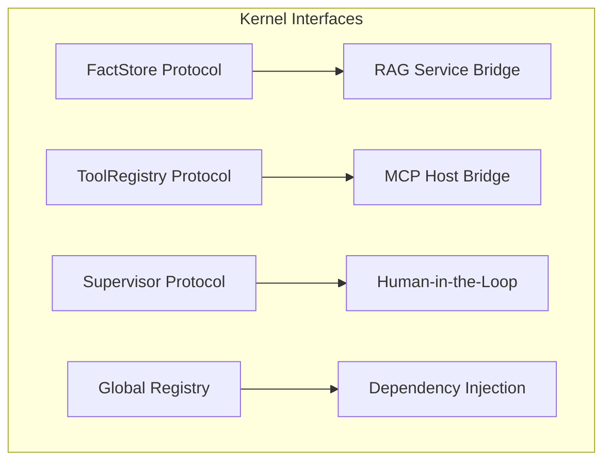

# 🧠 Kernel Interfaces (The Connective Tissue)

The **Kernel Interfaces** subsystem defines the formal contracts and protocols that allow the Kea Kernel to interact with external services and human supervisors without creating tight coupling.

## 📐 Architecture

Interfaces in Kea use Python's `Protocol` and `runtime_checkable` features to implement a **Pure Dependency Injection** model. The Kernel only ever speaks "Interface," and the microservices (Body) provide the "Implementation" at runtime.

### Component Overview

| Component | Responsibility | Key File |
| :--- | :--- | :--- |
| **Fact Store** | The knowledge gateway. Defines how to search and add atomic facts via RAG. | `fact_store.py` |
| **Tool Registry** | The capability gateway. Defines tool discovery and execution via MCP Host. | `tool_registry.py` |
| **Supervisor** | The governance gateway. Defines escalation paths and human-approval protocols. | `supervisor.py` |

---

## ✨ Key Features

### 1. Architectural Decoupling
The kernel has **zero** dependencies on specific database drivers or network libraries. By defining `Protocol` classes, the reasoning logic remains "Pure." This allows the kernel to be embedded in any environment (Local, Cloud, or Edge) as long as the host provides implementations for these interfaces.

### 2. Standardized Escalation (`Supervisor`)
The `Supervisor` interface provides a common language for identifying when a cell is "In Trouble." It supports multiple `EscalationType` values:
- **CLARIFICATION**: Asking the user for missing details.
- **APPROVAL**: Gating expensive or risky tool calls.
- **COMPLIANCE**: Reporting internal policy violations.
- **ERROR**: Handling unrecoverable logical failures.

### 3. Unified Discovery (`ToolRegistry`)
The `ToolRegistry` interface abstracts away the complexity of JIT tool loading. It provides a single point of truth for:
- **Schema Validation**: Ensuring arguments match expected JSON types.
- **RAG-based Search**: Finding the right tool for a specific query among thousands.
- **Execution Routing**: Directing the call to the appropriate microservice.

### 4. Global Implementation Registry
Each interface file provides a singleton-style registration pattern (`register_*` and `get_*`). This ensures that deep within the `KernelCell`’s cognitive cycle, it can always find the correct provider for its sensory and motor needs.

---

## 📁 Component Details

### `fact_store.py`
Defines the `AtomicFact` retrieval contract. It allows the `Kernel Logic` to ground its inferences in enterprise knowledge without knowing the underlying vector database implementation.

### `tool_registry.py`
The most frequently used interface. It defines the bridge to the **MCP (Model Context Protocol)** ecosystem, ensuring that `Actions` can execute physical work reliably.

### `supervisor.py`
The "Emergency Brake". It defines the `escalate_to_human` method, which is the primary bridge to the **Swarm Manager** for governance and human collaboration.

---
*Interfaces in Kea ensure that the "Brain" remains portable and untainted by the shifting infrastructure of the "Body".*

