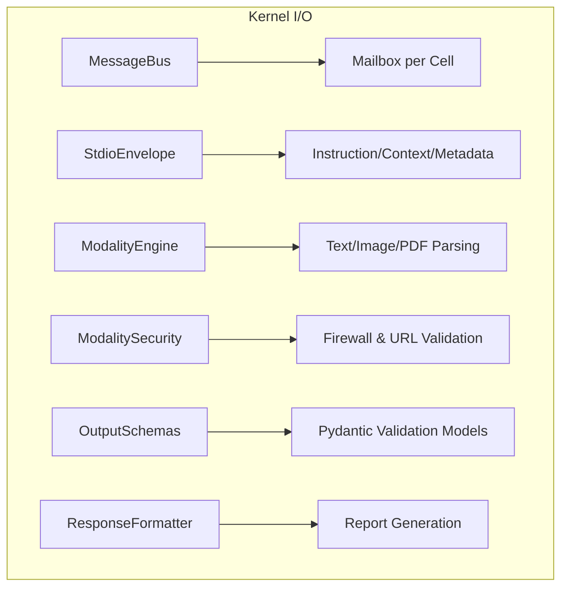

# 🧠 Kernel I/O (The Circulatory System)

The **Kernel I/O** subsystem manages the movement of information across the Kea organism. It provides a unified communication bus for inter-cell messaging and a standardized way to handle multi-modal data signals.

## 📐 Architecture

I/O is built on a **Message-Centric** philosophy. Information is never "lost" in deep recursion; instead, it is packaged into envelopes and circulated via a multi-directional bus.

### Component Overview

| Component | Responsibility | Key File |
| :--- | :--- | :--- |
| **Message Bus** | The "Information Highway". Unified event bus for Upward, Downward, and Lateral communication. | `message_bus.py` |
| **Stdio Envelope** | The "Standard Packet". Every interaction (Input/Output/Internal) is wrapped in this Pydantic envelope. | `stdio_envelope.py` |
| **Output Schemas** | The "Logical Contract". Defines structured Pydantic models for every LLM inference tier. | `output_schemas.py` |
| **Modality Engine** | The "Sensory Parser". Handles transformation and validation of Text, Images, and PDFs. | `modality.py` |
| **Modality Security**| The "Firewall". Inspects signals for magic bytes, URL safety, and size violations. | `modality_security.py` |
| **Response Formatter**| The "Translator". Converts internal state and artifacts into human-readable reports. | `response_formatter.py` |

---

## ✨ Key Features

### 1. Multi-Directional Message Bus (`MessageBus`)
Kea replaces simple function returns with a corporate-inspired messaging bus:
- **Downward (Delegation)**: Parents sending instructions to children.
- **Upward (Escalation)**: Children sending clarifications or alerts to parents.
- **Lateral (Collaboration)**: Peer-to-peer sharing of discoveries.
- **Broadcast**: System-wide announcements (e.g., "Critical hardware pressure").

### 2. High-Fidelity `StdioEnvelope`
All communication in the kernel happens via `StdioEnvelope`. This ensures that every message carries its own **Instruction**, **Context** (memory/artifact links), and **Metadata** (origin, priority, and request tracing).

### 3. Structured Output Enforcement (`OutputSchemas`)
To eliminate "hallucinated structure," the I/O system uses rigid Pydantic schemas for every phase. This includes specific models for:
- **PlannerOutput**: Subtasks and strategies.
- **ReasoningOutput**: Chain-of-thought and specific actions.
- **SynthesisOutput**: Sections, sources, and executive summaries.

### 4. Zero-Trust Modality Security (`ModalitySecurity`)
The I/O system treats all external data (especially URLs and file uploads) as potentially malicious. The `ModalityValidator` performs:
- **Magic Byte Verification**: Ensures files are what they claim to be.
- **URL Safety**: DNS resolution checks and domain blacklisting.
- **Pattern Filtering**: Sanitization of suspicious strings in multi-modal inputs.

---

## 📁 Component Details

### `message_bus.py`
The most critical part of the circulatory system. It implements `Mailbox` (priority-aware per-cell queues) and `TopicSubscription` for real-time notification without tight coupling.

### `stdio_envelope.py`
Defines the standard data contract. If a component wants to "talk" to another, it must produce an envelope. This allows for unified tracing and interception across the entire hierarchy.

### `output_schemas.py`
Central repository for all LLM output definitions. It ensures that when a cell says "Complete," the result perfectly matches the expected Pydantic model for that type of work unit.

### `modality.py` & `modality_security.py`
Handle the complexity of sensory data. `modality.py` defines the base types (Text, Image, PDF), while `modality_security.py` provides the validation logic used before the kernel "perceives" the data.

### `response_formatter.py`
Handles the final assembly of research reports. It processes gathered `Artifacts` and child results into polished Markdown or JSON for the end-user.

---
*I/O in Kea provides the connective tissue that allows a collection of independent cells to function as a single, coordinated corporate mind.*

