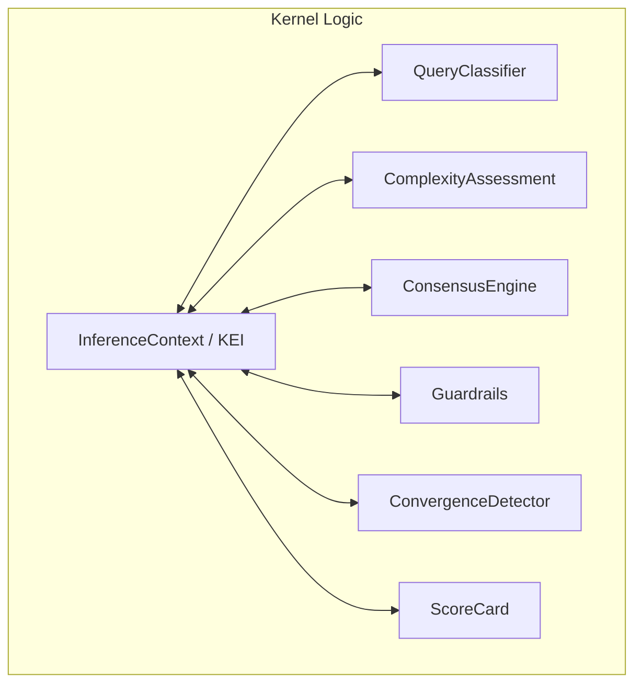

# 🧠 Kernel Logic (The Frontal Lobe)

The **Kernel Logic** subsystem handles the "Higher Reasoning" functions of the Kea system. It is responsible for intent classification, complexity assessment, adversarial consensus, and ensuring all LLM inferences are grounded in relevant domain knowledge.

## 📐 Architecture

Logic is designed as a **Knowledge-Enhanced Reasoning Layer** that sits between the `KernelCell` and the LLM provider. It acts as a filter and regulator for every thought produced by the kernel.

### Component Overview

| Component | Responsibility | Key File |
| :--- | :--- | :--- |
| **Inference Engine** | The "Knowledge Injector". Enhances prompts with role-specific skills/rules and parses structured output. | `inference_context.py` |
| **Query Classifier** | The "Intent Router". Detects intent and routes to Casual responses or Research graphs. | `query_classifier.py` |
| **Complexity Engine** | The "Triage Unit". Analyzes queries to set dynamic limits (max subtasks, depth, etc.). | `complexity.py` |
| **Consensus Engine** | The "Adversarial Judge". Orchestrates Generator/Critic/Judge loops for high confidence. | `consensus.py` |
| **Convergence System** | The "Healing Regulator". Determines when the recursive self-healing loop should stop. | `convergence.py` |
| **Guardrails** | The "Compliance Gate". Routes tool calls through the Swarm Manager for security checks. | `guardrails.py` |
| **Score Card System** | The "Quality Auditor". Multi-dimensional scoring (Accuracy, Rationale) with roll-ups. | `score_card.py` |

---

## ✨ Key Features

### 1. Knowledge-Enhanced Inference (KEI)
Kea does not rely on "raw" LLM knowledge. The `KnowledgeEnhancedInference` engine identifies the `AgentIdentity` and retrieves specific **Skills**, **Rules**, and **Procedures** from the Knowledge Base, injecting this context into the system prompt.

### 2. Multi-Dimensional Complexity Scoring
Replaces static limits with dynamic constraints based on:
- **Entity Count**: Number of distinct topics (e.g., "Apple vs. Google").
- **Depth/Breadth**: How many layers of analysis and tools are required.
- **Composite Score**: A 0.0 to 1.0 rating that scales hardware and token allocation.

### 3. Adversarial Consensus (Generator-Critic-Judge)
For high-stakes reasoning, the `ConsensusEngine` uses a three-role loop:
- **Generator**: Produces the initial hypothesis.
- **Critic**: Actively looks for logical fallacies or data gaps.
- **Judge**: Synthesizes feedback to either accept the result or trigger refinement rounds.

### 4. Recursive Convergence Detection (`ConvergenceDetector`)
Ensures self-healing doesn't loop infinitely. It monitors **Diminishing Returns**, **Error Explosion**, and **Cascade Depth** to stop early if further iterations are unlikely to improve the result.

---

## 📁 Component Details

### `inference_context.py`
Defines the `InferenceContext` and `KnowledgeEnhancedInference`. It is the primary interface for ground LLM calls, handling the retrieval of corporate intelligence before generation.

### `query_classifier.py`
Determines if a query can be handled by a **CasualHandler** (bypassing the expensive graph) or if it requires the full **Research** infrastructure. It uses pattern matching and LLM-based intent detection.

### `complexity.py`
Implements the heuristic sizing of tasks. It maps complexity tiers (Trivial to Extreme) to specific execution parameters like `max_depth` and `max_parallel_tasks`.

### `consensus.py` & `convergence.py`
The "Truth" layer. `consensus.py` handles the social reasoning between agents, while `convergence.py` provides the mathematical stop-conditions for recursive correction.

### `guardrails.py`
The security interface. It decouples the core kernel from compliance logic by calling the `Swarm Manager` service via REST, ensuring tool calls adhere to corporate policies.

### `score_card.py`
The auditing model. It tracks Accuracy, Factuality, Rationale, and Breadth. It allows "Junior" cells to be reviewed by "Senior" quality gates.

---
*Logic in Kea ensures that autonomous action is always backed by evidence, compliance, and adversarial review.*

