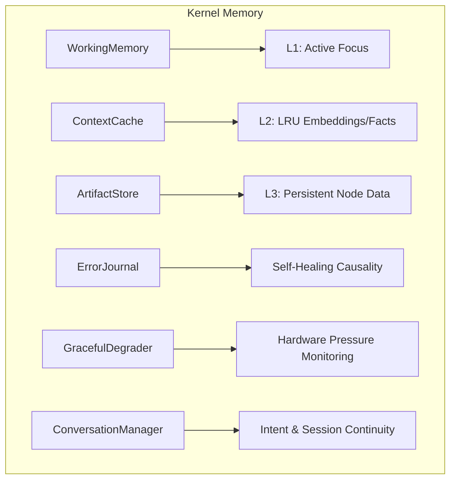

# 🧠 Kernel Memory (The Hippocampus)

The **Kernel Memory** subsystem manages the persistence and retrieval of cognitive state, artifact storage, and biological-inspired short-term focus. It ensures that every `KernelCell` has exactly the context it needs without overwhelming the system.

## 📐 Architecture

Memory is divided into three distinct layers based on persistence and role:

1.  **Working Memory (L1)**: High-speed, structured active context owned by a single `KernelCell`.
2.  **Context Cache (L2)**: Multi-level (Memory/Disk) caching for cross-cell or cross-session data.
3.  **Artifact Store (L3)**: Persistent storage for node outputs and research findings.

### Component Overview

| Component | Responsibility | Key File |
| :--- | :--- | :--- |
| **Working Memory** | Structured "scratchpad". Tracks focus items, hypotheses, decisions, and local tasks. | `working_memory.py` |
| **Conversation Manager**| Session continuity handler. Detects intent (Follow-up, Revise) and manages turn history. | `conversation.py` |
| **Artifact Store** | The "Data Vault". Provides typed access to node outputs using `{{step.artifacts.key}}` syntax. | `artifact_store.py` |
| **Context Cache** | LRU caching system. Manages conversation summaries and facts with multi-level (RAM/Disk) support. | `context_cache.py` |
| **Error Journal** | Recursive fix tracking. Maintains a DAG of error causality and fix attempts. | `error_journal.py` |
| **Graceful Degrader** | Safety mechanism. Throttles parallelism and extends timeouts under hardware pressure. | `degradation.py` |

---

## ✨ Key Features

### 1. Miller-Compliant "Focus" (`WorkingMemory`)
The `WorkingMemory` architecture is inspired by cognitive psychology, limiting active attention to ~7 **Focus Items**. This prevents context-window saturation and ensures the LLM stays targeted on the highest-priority sub-problems.

### 2. Semantic Intent Discovery (`ConversationManager`)
Unlike simple chat history, the `ConversationManager` uses an `IntentDetector` to classify user inputs as **Follow-Up**, **Revision**, or **New Topic**. This allows for "Smart Context Injection" where only relevant prior turns are fed to the model.

### 3. Artifact-Based Sequence Continuity (`ArtifactStore`)
The `ArtifactStore` acts as the connective tissue between thinking nodes. It allows a cell to reference data from any previous step in a DAG, even across different child cells, using a standardized reference protocol.

### 4. Hardware-Aware Execution (`GracefulDegrader`)
The memory subsystem is vertically integrated with hardware monitoring. If system resources (RAM/CPU/VRAM) cross critical thresholds, the `GracefulDegrader` dynamically adjusts:
- **Parallelism**: Drops workers to reduce thread contention.
- **Timeouts**: Multiplies wait times for slow I/O.
- **Refinement**: Disables optional "Polish" cycles to ensure core task completion.

---

## 📁 Component Details

### `working_memory.py`
Defines `FocusItem`, `Hypothesis`, and `Decision` objects. It provides methods to "Support" or "Weaken" hypotheses based on new evidence, turning memory into an active reasoning substrate.

### `conversation.py`
Manages `ConversationSession` objects. It calculates "Session Summaries" and uses a `SmartContextBuilder` to prune history while maintaining topic continuity.

### `artifact_store.py`
Wraps the `TaskContextPool` to provide a developer-friendly API for storing and retrieving node data. It handles the parsing of reference strings used in the `NodeAssembler`.

### `error_journal.py`
The log of failures. It tracks `FixAttempt` objects and prevents "Healing Spirals" by detecting if a fix has already been tried or if it introduced a regression.

### `context_cache.py`
A high-performance caching layer that supports TTL-based expiration and LRU eviction, essential for managing costs on large-scale research long-runs.

---
*Memory in Kea ensures that every thought has context, every failure has history, and the system respects its hardware limits.*

