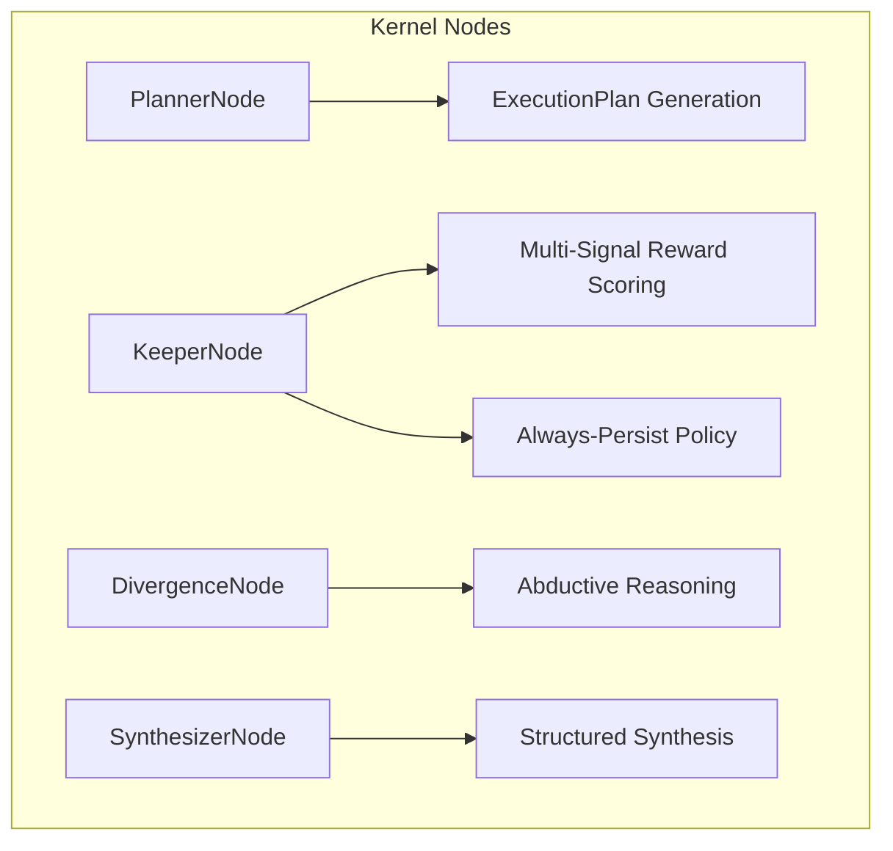

# 🧠 Kernel Nodes (Graph Components)

The **Kernel Nodes** subsystem defines the specialized execution units used within Kea's `LangGraph` research pipelines. Each node acts as a functional block in the state machine, handling a specific phase of the cognitive process.

## 📐 Architecture

Nodes are designed to be **Context-Aware** and **Self-Correcting**. They do not just execute strings; they validate, re-plan, and monitor the health of the research graph in real-time.

### Component Overview

| Node | Responsibility | Key File |
| :--- | :--- | :--- |
| **Planner Node** | The "Draftsman". Decomposes Queries into Micro-tasks and validates tool schemas. | `planner.py` |
| **Keeper Node** | The "Guardian". Monitors drift, manages persistence, and enforces hardware-aware limits. | `keeper.py` |
| **Synthesizer Node** | The "Editor". Aggregates disparate facts and child results into a structured report. | `synthesizer.py` |
| **Divergence Node** | The "Re-aligner". Generates alternative hypotheses to combat LLM confirmation bias. | `divergence.py` |

---

## ✨ Key Features

### 1. Robust Execution Planning (`PlannerNode`)
The `PlannerNode` transforms natural language into a structured `ExecutionPlan`. It maps hallucinated tools to real registry items and ensures all tool arguments are validated against JSON schemas *before* execution begins, preventing "Broken Graph" scenarios.

### 2. Multi-Signal "Confidence" Watchdog (`KeeperNode`)
The `KeeperNode` replaces simple loop counters with sophisticated **Reward Scoring**:
- **Agreement Score**: Uses embeddings to detect consensus across disparate facts.
- **Grounding Ratio**: Tracks how much of the answer is backed by tool-retrieved data vs. base LLM weight.
- **Hardware Throttling**: Automatically lowers the "Refinement" bar if system resources are critical.
- **Always-Persist**: Every fact discovered is instantly streamed to the `Vault Service` for durability.

### 3. Abductive Reasoning Loop (`DivergenceNode`)
To prevent "Echo Chambers" in the reasoning process, the `DivergenceNode` is triggered to look for what *wasn't* considered. It generates counter-hypotheses and identifies potential data gaps that the primary reasoning branch might have ignored.

### 4. Structured Synthesis (`SynthesizerNode`)
The final node uses the `SynthesisOutput` schema to produce a polished result. It distinguishes between **Executive Summaries**, **Deep-Dive Sections**, and **Data Gaps**, ensuring the user knows precisely where the information is weak.

---

## 📁 Component Details

### `planner.py`
The "Brain" of the graph. It specializes in task decomposition, variable extraction, and determining if a query requires **Parallel** or **Sequential** execution architectures.

### `keeper.py`
The "Bodyguard" of the graph. It maintains the stability of the research state, presiding over the decision to `should_continue` or `halt` based on information gain vs. token cost.

### `divergence.py`
The "Devil's Advocate". It uses specialized prompts to force the LLM to think "Outside the Box," identifying hidden biases or alternative explanations for collected facts.

### `synthesizer.py`
The "Writer". It takes the raw `facts` and `hypotheses` stored in state and maps them to a consistent report structure defined in `output_schemas.py`.

---
*Nodes in Kea provide the modular building blocks that allow complex, multi-agent reasoning to be managed as a structured state machine.*

