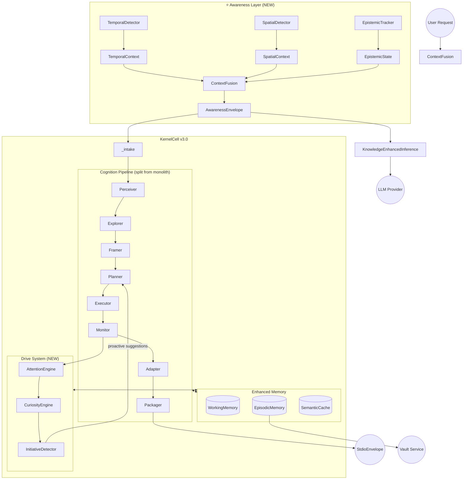

# 🧠 Kea Kernel v3.0 — Redesign Blueprint

> **Status**: Design Phase
> **Author**: Architect Review
> **Date**: 2026-02-18
> **Scope**: Full kernel redesign using existing components + new capabilities

---

## 📋 Table of Contents

1. [Honest Assessment of Current Kernel](#1-honest-assessment)
2. [Redesign Vision: What v3 Looks Like](#2-redesign-vision)
3. [Critical New Capability: Temporal-Spatial Awareness](#3-temporal-spatial)
4. [Other Critical Missing Capabilities](#4-missing-capabilities)
5. [Proposed Architecture Diagram](#5-architecture)
6. [Migration Path from v2 → v3](#6-migration)

---

## 1. Honest Assessment of Current Kernel {#1-honest-assessment}

### ✅ What's Working Well (Keep)

| Component | File | Why It's Good |
|:---|:---|:---|
| **KernelCell recursion** | `core/kernel_cell.py` | Universal processing unit pattern is elegant. Config-driven profiles are the right abstraction. |
| **CognitiveCycle 7-phase** | `core/cognitive_cycle.py` | PERCEIVE→FRAME→PLAN→EXECUTE→MONITOR→ADAPT→PACKAGE is well-structured. Better than flat ReAct. |
| **WorkingMemory** | `memory/working_memory.py` | Miller's Law (7±2), hypothesis tracking, focus decay — biologically sound. |
| **MessageBus** | `io/message_bus.py` | Multi-directional (Up/Down/Lateral/Broadcast) is architecturally correct. |
| **CognitiveProfiles** | `core/cognitive_profiles.py` | Config-driven persona differentiation (Intern→Board) is the right foundation. |
| **ResourceGovernor** | `core/resource_governor.py` | Budget ledger, surplus redistribution, escalation — mature resource control. |
| **TokenBudget** | `core/kernel_cell.py` | Recursion control via budget fractions prevents infinite delegation. |
| **SignalBus + MetaLearner** | `logic/signal_bus.py`, `agents/meta_learner.py` | Decision observability and self-tuning foundation. Early but correct direction. |
| **KnowledgeEnhancedInference** | `logic/inference_context.py` | Every LLM call grounded by identity + knowledge. Eliminates bare LLM calls. |
| **Neural Classification** | `logic/query_classifier.py`, `logic/complexity.py` | Embedding-based with heuristic fallback. Calibrated confidence. |

### ⚠️ What Needs Rethinking

| Problem | Current State | Impact |
|:---|:---|:---|
| **No temporal awareness** | The kernel has `datetime.utcnow()` sprinkled in timestamps but NO concept of *"when"* relative to the task. It doesn't know if a query is about something happening *right now* vs. *last year* vs. *next quarter*. | Research about "Tesla stock" treats a 2024 article and a 2026 article identically. Stale data pollutes responses. |
| **No spatial/locale awareness** | Zero concept of *where* the user is, *what market* they're in, or *which regulatory jurisdiction* applies. | "What's the best bank?" gives US-centric answers to a user in Indonesia. |
| **Monolithic CognitiveCycle** | `cognitive_cycle.py` is **3,088 lines**. It does perception, framing, planning, tool execution, monitoring, adaptation, AND packaging in one file. | Hard to reason about, hard to extend, hard to debug individual phases. |
| **graph.py is 1,810 lines** | The LangGraph state machine mixes routing, planning, researching (970 lines!), keeping, generating, critiquing, judging, and synthesizing. | `researcher_node` alone is 970 lines. A single function shouldn't be an entire subsystem. |
| **Passive curiosity** | `CuriosityEngine` generates questions from facts but is never called proactively. It waits to be invoked. | The kernel never *spontaneously* explores. It only responds. It has no genuine intellectual drive. |
| **Flat context cache** | `memory/context_cache.py` is a simple TTL dict. No semantic proximity awareness. | Related conversations are not connected. The kernel forgets adjacent context. |
| **No epistemic awareness** | The kernel doesn't model *what it knows vs. what it doesn't know* at a granular level. Working memory has hypotheses but no **knowledge graph of confidence boundaries**. | The kernel can't say "I know X with 95% confidence but Y is uncertain" systematically. |
| **Limited error learning** | `error_journal.py` records errors but doesn't *learn* from them across sessions. | The same mistake can be repeated in the next conversation. |

### ❌ What Should Be Removed/Replaced

| Component | Why |
|:---|:---|
| **Hardcoded `COMPLEXITY_EXAMPLES`** in `complexity.py` | These should be in `configs/knowledge/` and fetched dynamically via Vault. The MetaLearner should update them. |
| **`is_ready` returning `False`** in `work_unit.py` | A placeholder that's been there since inception. Either implement dependency resolution or remove the property. |
| **`CasualHandler` trigger/response dict** | This is a parlor trick, not a kernel responsibility. Casual responses should be handled by the Gateway or a specialized lightweight model. |

---

## 2. Redesign Vision: What v3 Looks Like {#2-redesign-vision}

### 🎯 Core Philosophy: The Kernel as a **Situated, Temporally-Aware Reasoner**

Current Kea kernel is a **context-free reasoner** — give it input, it reasons, it outputs. It doesn't know *when* it is, *where* it is, or *what happened 5 minutes ago*.

The v3 kernel becomes a **situated reasoner**:
- **Temporal**: It knows the current time, can reason about time-relative queries, and decays information by recency.
- **Spatial**: It knows the user's locale, regulatory context, and market — adjusting its behavior accordingly.
- **Epistemic**: It has a formal model of what it knows vs. doesn't know.
- **Proactive**: It can initiate exploration, not just respond.

### 🏗️ New Subsystem Map

```
kernel/
├── core/                    # [UNCHANGED] Stem & Midbrain
│   ├── kernel_cell.py       # Universal recursive unit (slimmed)
│   ├── cognitive_profiles.py
│   ├── resource_governor.py
│   ├── work_unit.py
│   └── organization.py
│
├── cognition/               # [NEW] Split from monolithic cognitive_cycle.py
│   ├── perceiver.py         # Phase 1: Parse intent + temporal/spatial signals
│   ├── explorer.py          # Phase 2: Tool discovery + knowledge recon
│   ├── framer.py            # Phase 3: Restatement, assumptions, gaps
│   ├── planner.py           # Phase 4: DAG generation
│   ├── executor.py          # Phase 5: Tool execution + parallel dispatch
│   ├── monitor.py           # Phase 6: Self-assessment + drift detection
│   ├── adapter.py           # Phase 7: Course correction
│   ├── packager.py          # Phase 8: Schema alignment + output
│   └── cycle.py             # Orchestrator that chains phases
│
├── awareness/               # [NEW] ⭐ Temporal-Spatial-Epistemic Layer
│   ├── temporal.py          # Time perception, recency scoring, event timeline
│   ├── spatial.py           # Locale, jurisdiction, market detection
│   ├── epistemic.py         # Confidence boundaries, knowledge gaps, certainty map
│   └── context_fusion.py    # Merges all awareness signals into InferenceContext
│
├── memory/                  # [ENHANCED]
│   ├── working_memory.py    # (existing, enhanced with temporal tags)
│   ├── episodic_memory.py   # [NEW] Cross-session learning with Vault
│   ├── semantic_cache.py    # [NEW] Replaces context_cache with vector-proximity
│   ├── error_journal.py     # (existing, enhanced with pattern learning)
│   └── artifact_store.py
│
├── logic/                   # [ENHANCED]
│   ├── query_classifier.py  # (existing, now fed temporal/spatial context)
│   ├── complexity.py        # (existing, dynamic examples from Vault)
│   ├── inference_context.py # (existing, now includes awareness bundle)
│   ├── consensus.py         # (existing)
│   ├── convergence.py       # (existing)
│   ├── score_card.py        # (existing)
│   └── signal_bus.py        # (existing, new signal types)
│
├── drive/                   # [NEW] Proactive Behavior
│   ├── curiosity.py         # (moved + enhanced) Active exploration drive
│   ├── initiative.py        # [NEW] Detects when to proactively act
│   └── attention.py         # [NEW] What to focus on next (saliency scoring)
│
├── agents/                  # [ENHANCED]
│   ├── generator.py
│   ├── critic.py
│   ├── judge.py
│   ├── code_generator.py
│   └── meta_learner.py      # (enhanced with temporal drift detection)
│
├── actions/                 # [UNCHANGED]
│   ├── tool_bridge.py
│   ├── agent_spawner.py
│   ├── delegation_protocol.py
│   ├── cell_communicator.py
│   └── parallel_executor.py
│
├── flow/                    # [REFACTORED]
│   ├── graph.py             # (slimmed — delegates to cognition/ phases)
│   ├── dag_executor.py
│   ├── pipeline.py
│   ├── router.py
│   └── recovery.py
│
├── io/                      # [UNCHANGED]
│   ├── message_bus.py
│   ├── modality.py
│   ├── stdio_envelope.py
│   └── output_schemas.py
│
├── interfaces/              # [UNCHANGED]
│   ├── tool_registry.py
│   ├── fact_store.py
│   └── supervisor.py
│
├── nodes/                   # [REFACTORED INTO cognition/]
│   └── (deprecated — logic moved to cognition/)
│
└── templates/               # [UNCHANGED]
    └── (golden path blueprints)
```

---

## 3. Critical New Capability: Temporal-Spatial Awareness {#3-temporal-spatial}

This is the **highest-impact** addition. Without it, Kea is fundamentally blind to *when* and *where*.

### 3.1 Temporal Awareness (`awareness/temporal.py`)

#### What It Does

| Capability | Description | Example |
|:---|:---|:---|
| **Query Time-Anchoring** | Detect whether a query is about the past, present, or future. | "How is Tesla doing?" → **PRESENT** (wants current data) |
| **Recency Scoring** | All facts/sources get a `recency_score` (0.0 = ancient, 1.0 = live). | A source from 2024 gets `0.3`, one from yesterday gets `0.95`. |
| **Temporal Decay in Memory** | WorkingMemory items decay faster if they're about time-sensitive topics (stocks, news). | Stock price fact decays in minutes; historical date decays never. |
| **Event Timeline** | Maintains a rolling timeline of significant events in the task domain. | "What changed since the last earnings call?" needs an event anchor. |
| **Freshness Requirements** | Classifies queries into freshness tiers: `LIVE`, `RECENT`, `HISTORICAL`, `TIMELESS`. | "current price" = `LIVE`, "Q4 2025 results" = `RECENT`, "founding date" = `TIMELESS` |
| **Deadline Awareness** | Understands *when* the user needs this answer. Urgent queries get faster, shallower strategies. | User context might indicate EOD deadline → skip deep research, do rapid synthesis. |

#### Conceptual Data Model

```python
class TemporalAnchor(str, Enum):
    LIVE = "live"            # Right now (stock prices, weather, breaking news)
    RECENT = "recent"        # Within days to weeks
    HISTORICAL = "historical"  # Months to years ago
    FUTURE = "future"        # Predictions, forecasts
    TIMELESS = "timeless"    # Facts that don't change (math, geography)

@dataclass
class TemporalContext:
    """Temporal awareness for the current task."""
    
    # When is the task being processed?
    current_time: datetime           # System clock (UTC)
    user_timezone: str               # e.g., "Asia/Jakarta"
    user_local_time: datetime        # Localized time
    
    # What time frame does the query care about?
    query_anchor: TemporalAnchor     # Detected from query text
    reference_dates: list[datetime]  # Explicit dates mentioned in query
    freshness_requirement: str       # "< 1 hour", "< 1 day", "any"
    
    # How stale is our context?
    session_start: datetime          # When this conversation began
    last_tool_call: datetime | None  # When we last fetched external data
    data_staleness_seconds: float    # Seconds since last real-world data fetch
    
    # Temporal reasoning aids
    is_market_hours: bool            # Are financial markets currently open?
    active_events: list[str]         # Known concurrent events (earnings season, election, etc.)
```

#### How It Integrates

1. **Perceiver Phase** calls `TemporalDetector.analyze(query)` → detects anchor, extracts dates
2. **InferenceContext** gets enriched with `temporal_context` → LLM prompt includes "Current time: ..., User needs LIVE data"
3. **Researcher** uses `freshness_requirement` to filter/prioritize tools (prefer real-time APIs over cached data)
4. **WorkingMemory** uses `recency_score` to decay irrelevant facts faster
5. **ScoreCard** penalizes answers that cite stale data for LIVE queries

### 3.2 Spatial/Locale Awareness (`awareness/spatial.py`)

#### What It Does

| Capability | Description | Example |
|:---|:---|:---|
| **User Locale Detection** | Detects user's location, language, and cultural context from request metadata. | User in Jakarta → Southeast Asian financial context |
| **Jurisdiction Awareness** | Identifies applicable regulations, tax regimes, and legal frameworks. | "Is this legal?" → Applies Indonesian law, not US law |
| **Market Context** | Knows which exchanges, currencies, and economic indicators are relevant. | IDX vs. NYSE, IDR vs. USD |
| **Cultural Calibration** | Adjusts communication style, formality, and examples to user's cultural context. | Direct vs. indirect communication norms |
| **Unit Adaptation** | Temperature, distance, currency display preferences. | Celsius vs. Fahrenheit, km vs. miles |

#### Conceptual Data Model

```python
@dataclass
class SpatialContext:
    """Spatial and locale awareness for the current task."""
    
    # User location
    country_code: str = ""          # ISO 3166-1 alpha-2 (e.g., "ID", "US")
    timezone: str = ""              # IANA timezone
    language: str = "en"            # ISO 639-1
    locale: str = "en-US"           # Full locale (for formatting)
    
    # Regulatory / Jurisdictional
    jurisdiction: str = ""          # Legal jurisdiction
    currency: str = "USD"           # Primary currency
    applicable_regulations: list[str] = field(default_factory=list)
    
    # Market context
    local_exchanges: list[str] = field(default_factory=list)
    market_status: str = ""         # "open", "closed", "pre-market"
    
    # Cultural parameters
    formality_level: str = "professional"  # "casual", "professional", "formal"
    measurement_system: str = "metric"     # "metric", "imperial"
    
    # Detection confidence
    detection_method: str = ""      # "explicit", "ip_geolocation", "language_inference", "config"
    confidence: float = 0.5
```

### 3.3 Context Fusion (`awareness/context_fusion.py`)

All awareness signals merge into a **unified awareness envelope** that gets injected into `InferenceContext`:

```python
@dataclass
class AwarenessEnvelope:
    """Fused temporal + spatial + epistemic context."""
    
    temporal: TemporalContext
    spatial: SpatialContext
    epistemic: EpistemicState      # See Section 4.1
    
    def to_prompt_section(self) -> str:
        """Generate awareness section for LLM system prompt."""
        lines = [
            "## Current Awareness",
            f"- **Time**: {self.temporal.user_local_time.strftime('%Y-%m-%d %H:%M')} "
            f"({self.temporal.user_timezone})",
            f"- **Query Timeframe**: {self.temporal.query_anchor.value}",
            f"- **User Location**: {self.spatial.country_code or 'Unknown'}",
            f"- **Currency**: {self.spatial.currency}",
            f"- **Data Freshness**: {self.temporal.freshness_requirement}",
        ]
        if self.temporal.is_market_hours:
            lines.append("- **Market Status**: OPEN — use live data sources")
        if self.epistemic.high_uncertainty_topics:
            lines.append(f"- **⚠️ Uncertain Areas**: {', '.join(self.epistemic.high_uncertainty_topics)}")
        return "\n".join(lines)
```

---

## 4. Other Critical Missing Capabilities {#4-missing-capabilities}

Beyond temporal-spatial, here are the **essential additions** ranked by impact:

### 4.1 🧭 Epistemic Awareness (What I Know vs. Don't Know)

**Current gap**: The kernel tracks `confidence` scores on individual facts but has no *global* model of its knowledge boundaries.

```python
@dataclass
class EpistemicState:
    """Models the kernel's knowledge boundaries."""
    
    # Per-topic confidence map
    topic_confidence: dict[str, float] = field(default_factory=dict)
    # e.g., {"TSLA financials": 0.9, "TSLA supply chain": 0.3}
    
    # Explicit unknowns
    identified_gaps: list[str] = field(default_factory=list)
    # e.g., ["Q1 2026 earnings not yet released", "No data on private subsidiary"]
    
    # Sources of uncertainty
    high_uncertainty_topics: list[str] = field(default_factory=list)
    
    # What would change the answer?
    sensitivity_factors: list[str] = field(default_factory=list)
    # e.g., ["If Fed raises rates, analysis changes significantly"]
    
    def should_caveat(self, topic: str) -> bool:
        """Should the kernel add uncertainty caveats for this topic?"""
        return self.topic_confidence.get(topic, 0.5) < 0.7
```

**Why it matters**: Without this, Kea presents uncertain answers with the same authority as well-grounded ones. Users can't calibrate trust. The kernel can't decide when to do more research vs. when to stop.

### 4.2 📖 Episodic Memory (Cross-Session Learning)

**Current gap**: Each session starts from scratch. The kernel "forgets" everything between conversations.

```python
class EpisodicMemory:
    """Long-term learning from past sessions via Vault."""
    
    async def recall_similar_tasks(self, query: str, k: int = 3) -> list[Episode]:
        """Find past tasks similar to the current query."""
        # Uses Vault's vector search to find similar past conversations
        
    async def recall_user_preferences(self, user_id: str) -> UserPreferences:
        """What formatting, depth, and style does this user prefer?"""
        
    async def recall_past_mistakes(self, domain: str) -> list[ErrorPattern]:
        """What went wrong last time in this domain?"""
        
    async def commit_episode(self, episode: Episode) -> None:
        """Store this session's learnings in the Vault."""
```

**Why it matters**: A senior knowledge worker *remembers* what worked and what didn't. Kea currently has the memory of a goldfish between sessions.

### 4.3 🎯 Proactive Attention & Initiative

**Current gap**: Kea is 100% reactive. It only acts when prompted. The `CuriosityEngine` exists but is never called proactively.

```python
class AttentionEngine:
    """Decides what to focus on next."""
    
    def score_saliency(self, items: list[FocusItem]) -> list[tuple[FocusItem, float]]:
        """Score items by how much attention they deserve."""
        # Factors: recency, relevance to current task, novelty, uncertainty
        
    def detect_initiative_opportunities(self, context: InferenceContext) -> list[Initiative]:
        """Detect when the kernel should proactively suggest actions."""
        # e.g., "I notice you're researching TSLA — should I also check competitor moves?"
        # e.g., "Your data is 3 hours old — want me to refresh?"
```

**Why it matters**: The difference between an intern (waits to be told) and a VP (proactively identifies opportunities). This is what makes Kea feel *intelligent* rather than *obedient*.

### 4.4 🔄 Adaptive Learning Loop (MetaLearner v2)

**Current gap**: `MetaLearner` collects stats but doesn't *act* on them. It generates reports but never updates anything.

The v3 MetaLearner should:

| Action | Description |
|:---|:---|
| **Auto-update centroids** | When heuristic fallback rate exceeds threshold, automatically add successful examples to the semantic centroid pool. |
| **Pattern banking** | Successful tool-call sequences get stored as "golden patterns" for similar future queries. |
| **Confidence calibration** | Track predicted confidence vs. actual outcome. Automatically adjust calibration curves. |
| **Domain specialization** | After N successful tasks in a domain, the kernel's profile for that domain becomes more "senior" (higher autonomy, less delegation). |

### 4.5 🛡️ Cognitive Integrity Layer

**Current gap**: The kernel can be manipulated by adversarial inputs. There's a `guardrails.py` (2KB — almost empty) but no systematic defense.

```python
class CognitiveIntegrity:
    """Defenses against reasoning corruption."""
    
    def detect_prompt_injection(self, input: str) -> InjectionResult:
        """Detect attempts to hijack or redirect the kernel's reasoning."""
        
    def detect_goal_drift(self, original_task: str, current_focus: str) -> float:
        """Measure how far the kernel has drifted from its original task."""
        
    def detect_circular_reasoning(self, reasoning_chain: list[str]) -> bool:
        """Detect when the kernel is going in circles."""
        
    def detect_hallucination_signals(self, claim: str, sources: list[str]) -> float:
        """Score how likely a claim is to be hallucinated (no source backing)."""
```

### 4.6 📊 Multi-Modal Reasoning Enhancement

**Current gap**: `io/modality.py` handles multi-modal *input* (28KB) but the kernel doesn't *reason differently* based on modality. An image input gets OCR'd and then treated as text.

v3 should recognize that:
- **Image queries** need visual reasoning chains (spatial relationships, color analysis)
- **Data table queries** need computational reasoning (aggregation, trend detection)
- **Code queries** need structural reasoning (AST analysis, type inference)
- **Mixed queries** need cross-modal synthesis

### 4.7 💬 Conversation Memory & Turn Awareness

**Current gap**: Each turn is processed somewhat independently. The kernel doesn't deeply model the *arc* of a multi-turn conversation.

```python
class ConversationArc:
    """Models the trajectory of a multi-turn conversation."""
    
    turns: list[TurnSummary]
    current_topic: str
    topic_shifts: list[TopicShift]
    established_context: dict[str, Any]  # Things we've agreed on
    unresolved_threads: list[str]         # Questions still open from earlier turns
    user_satisfaction_trajectory: list[float]  # Are we trending up or down?
```

---

## 5. Proposed Architecture Diagram {#5-architecture}



---

## 6. Migration Path from v2 → v3 {#6-migration}

### Phase 1: Awareness Layer (Highest Impact, Lowest Risk) - **COMPLETED**
1. [x] Create `kernel/awareness/temporal.py` — time detection and recency scoring
2. [x] Create `kernel/awareness/spatial.py` — locale and jurisdiction detection
3. [x] Create `kernel/awareness/context_fusion.py` — merge into `InferenceContext`
4. [x] Wire into existing `_intake()` in `KernelCell` — add awareness to every processing cycle
5. [x] Update prompt templates to include awareness section

### Phase 2: Cognition Decomposition (High Impact, Medium Risk) - **COMPLETED**
1. [x] Extract each phase from `cognitive_cycle.py` (3,088 lines) into `cognition/` modules
2. [x] Each module < 400 lines, single responsibility
3. [x] `cognition/cycle.py` becomes a thin orchestrator that chains phases
4. [x] Preserve all existing behavior — this is a **structural** refactor, not a logic change

### Phase 3: Memory Enhancement (Medium Impact, Low Risk) - **COMPLETED**
1. [x] Create `memory/episodic_memory.py` — connect to Vault for cross-session recall
2. [x] Create `memory/semantic_cache.py` — replace TTL dict with vector-proximity cache
3. [ ] Enhance `error_journal.py` with cross-session pattern detection (Defer)

### Phase 4: Epistemic Layer (Medium Impact, Medium Risk) - **COMPLETED**
1. [x] Create `awareness/epistemic.py` — confidence boundary tracking
2. [x] Wire into `score_card.py` — uncertainty caveats in output
3. [x] Enhance `Framer` phase to identify knowledge gaps explicitly

### Phase 5: Drive System (High Impact, High Risk) - **COMPLETED**
1. [x] Move and enhance `curiosity.py` → `drive/curiosity.py`
2. [x] Create `drive/attention.py` — saliency scoring
3. [x] Create `drive/initiative.py` — proactive action detection
4. [x] Wire into CognitiveCycle's MONITOR/ADAPT phases

### Phase 6: Graph Refactoring (Medium Impact, Medium Risk) - **COMPLETED**
1. [x] Slim `graph.py` by delegating node logic to `cognition/swarm_executor.py`
2. [x] Refactor `researcher_node` to use `SwarmExecutor` class
3. [x] Preserve LangGraph state machine structure

### Phase 7: Cognitive Integrity (Low Priority, Important) - **COMPLETED**
1. [x] Expand `logic/guardrails.py` into a full integrity layer
2. [x] Add prompt injection detection (KernelCell intake)
3. [x] Circular reasoning detection in MONITOR phase

---

## Appendix A: Impact Assessment

| Capability | User-Facing Impact | Architectural Impact | Effort |
|:---|:---|:---|:---|
| ⭐ Temporal Awareness | **Critical** — makes every time-sensitive answer accurate | Medium — new module, integration points | Medium |
| ⭐ Spatial Awareness | **High** — makes responses contextually relevant globally | Medium — new module, config-driven | Low-Medium |
| Epistemic Awareness | **High** — users can trust the confidence signals | Medium — new module, scoring integration | Medium |
| Cognition Decomposition | **None** (internal) | **High** — enables all future improvements | Medium-High |
| Episodic Memory | **High** — system gets smarter over time | Low — leverages existing Vault | Medium |
| Proactive Drive | **Very High** — transforms from tool to collaborator | Medium — new behavioral layer | High |
| Cognitive Integrity | **Critical for production** — security/reliability | Low-Medium | Medium |
| Graph Refactoring | **None** (internal) | **High** — enables maintainability | Medium |

## Appendix B: What NOT to Change

These are architecturally sound and should remain:

1. **Brain vs. Body separation** — `kernel/` → pure logic, `services/` → I/O
2. **Config-driven profiles** — `kernel.yaml` drives behavior
3. **Protocol-oriented interfaces** — `interfaces/` as contracts
4. **MessageBus multi-directional comms** — Up/Down/Lateral is correct
5. **KnowledgeEnhancedInference** — grounded LLM calls are non-negotiable
6. **TokenBudget recursion control** — prevents infinite delegation
7. **ResourceGovernor** — budget ledger and escalation are mature
8. **StdioEnvelope** — universal I/O packet format

---

*This document is a living blueprint. Each phase should be reviewed and approved before implementation.*
