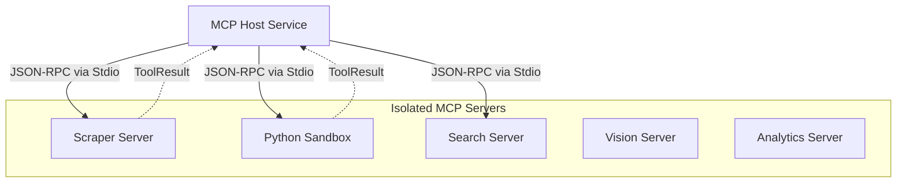

# 🔌 MCP Servers ("The Hands")

This directory contains the **Model Context Protocol (MCP)** compliant microservices. These are the "Hands" of the AI system, providing the capabilities required to interact with the external world, execute code, and perform complex data analysis.

---

## 🏗️ Architecture Overview

Kea implements a **Hub-and-Spoke** architecture where the **MCP Host** acts as the universal client and process manager for a fleet of specialized tool servers.



1.  **Fault Isolation**: Each server runs in a separate OS process. A crash in the `scraper` does not affect the `python` sandbox.
2.  **Stateless Execution**: Servers are largely stateless, receiving all necessary context in the JSON-RPC request.
3.  **Unified Interface**: All 17+ servers follow the same MCP handshake and tool discovery protocol.

---

## 🧩 Server Catalog & Reference

We categorize servers by their cognitive domain.

### 1. Core Execution & Retrieval
| Server | Directory | Key Tools | Description |
|:-------|:----------|:----------|:------------|
| **Scraper** | `scraper_server/` | `fetch_url`, `pdf_extract` | Stealthy browsing and document extraction. |
| **Search** | `search_server/` | `web_search`, `news_search` | Global information discovery via Tavily/Brave. |
| **Python** | `python_server/` | `execute_code`, `sql_query` | Sandboxed computation and DB interaction. |
| **Vision** | `vision_server/` | `read_image`, `analyze_chart` | Multimodal analysis of screenshots and plots. |

### 2. Analytics & Data Science
| Server | Directory | Key Tools | Description |
|:-------|:----------|:----------|:------------|
| **Analytics** | `analytics_server/` | `calculate_stats`, `run_eda` | Descriptive and inferential statistics. |
| **ML** | `ml_server/` | `train_model`, `predict` | Scikit-learn based trend prediction. |
| **FinData** | `data_sources_server/`| `get_stock_price` | Real-time financial market data APIs. |
| **Vis** | `visualization_server/`| `create_line_chart` | Generates interactive Plotly/MPL artifacts. |

### 3. Knowledge & Reasoning
| Server | Directory | Key Tools | Description |
|:-------|:----------|:----------|:------------|
| **Academic** | `academic_server/` | `search_papers` | ArXiv and Semantic Scholar integration. |
| **Regulatory**| `regulatory_server/` | `search_laws` | Access to government and legal databases. |
| **Qualitative**| `qualitative_server/` | `analyze_sentiment` | NLP-based thematic and emotional analysis. |
| **Discovery** | `tool_discovery_server/`| `list_tools` | Self-indexing and tool health monitoring. |

---

## 🔬 Deep Dive: The MCP Handshake

The communication between the **MCP Host** and its **Servers** follows the JSON-RPC 2.0 standard.

### 1. The Startup Sequence
1.  **Spawn**: Host spawns the server process (e.g., `uv run python -m mcp_servers.scraper_server.server`).
2.  **Initialize**: Host sends `initialize` request with client capabilities.
3.  **Capabilities**: Server responds with its name, version, and supported features (e.g., `listChanged`, `subscribe`).
4.  **Discovery**: Host calls `tools/list` to retrieve the JSON schemas for every tool the server provides.

### 2. JIT Dependency Resolution
Kea's MCP servers are designed to be "Zero-Config." They define their own dependencies in their `main.py` entrypoint. The **JIT Loader** in the shared library parses these requirements and ensures they are installed in the ephemeral `uv` environment before the server enters the ready state.

---

## 🛠️ Development Reference

### Adding a New Tool
To extend the capabilities of an existing server:

1.  **Define**: Add a function in the server's `tools.py` or `server.py`.
2.  **Decorate**: Use the `@mcp.tool()` decorator to expose it.
3.  **Document**: Provide a clear docstring and type hints; these are used to generate the JSON Schema for the LLM.

```python
@mcp.tool()
async def analyze_sentiment(text: str) -> str:
    """
    Analyze the emotional tone of a text block.
    
    Args:
        text: The raw string to analyze.
    """
    # Logic goes here...
    return "Positive"
```

### Standard Response Format
All tools must return an `MCPResult` (or `ToolResult`), which consists of:
- `content`: A list of `TextContent` or `ImageContent` objects.
- `isError`: A boolean flag indicating functional failure.
