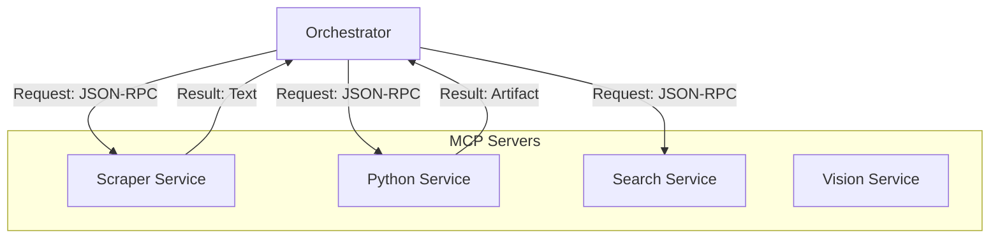

# MCP Servers ("The Hands")

This directory contains the **Model Context Protocol (MCP)** compliant microservices. These are the "Hands" of the AI system, allowing it to interact with the world (Web, Files, Code).

Each server runs in isolation (separate process or container) to ensure:
*   **Security**: Tools cannot crash the Brain.
*   **Scalability**: CPU-heavy tools (Analytics) don't block I/O tools (Scraper).
*   **Modularity**: Hot-swap Python server without restarting the Vision server.

---

## 🏗️ Architecture Overview

Kea implements a **Hub-and-Spoke** architecture where the Orchestrator acts as the universal client.



---

## 🧩 Server Catalog

We categorize servers by function. Each server exposes specific **Tools**.

### 1. Core Servers
Essential capabilities for the basic research loop.

| Server | Directory | Description | Key Tools |
|:-------|:----------|:------------|:----------|
| **Scraper** | `scraper_server/` | Headless browser & HTTP client. | `fetch_url`, `pdf_extract` |
| **Search** | `search_server/` | API wrapper for Google/DDG/Tavily. | `web_search`, `news_search` |
| **Python** | `python_server/` | Sandboxed Python execution environment. | `execute_code`, `sql_query` |
| **Vision** | `vision_server/` | OCR and Chart analysis. | `read_image`, `analyze_chart` |

### 2. Data & Analytics
Quantitative analysis engines.

| Server | Directory | Description | Key Tools |
|:-------|:----------|:------------|:----------|
| **Data Sources**| `data_sources_server/`| Financial APIs (Yahoo, AlphaVantage). | `get_stock_price`, `get_financials` |
| **Analytics** | `analytics_server/` | Statistical models (Regression, Correlation). | `calculate_stats`, `run_regression` |
| **ML** | `ml_server/` | Scikit-Learn inference. | `predict_trend`, `cluster_data` |
| **Vis** | `visualization_server/`| Generates Plotly/Matplotlib charts. | `create_line_chart` |

### 3. Domain Servers
Specialized knowledge retrieval.

| Server | Directory | Description | Key Tools |
|:-------|:----------|:------------|:----------|
| **Academic** | `academic_server/` | Sematic Scholar/ArXiv adapter. | `search_papers` |
| **Regulatory** | `regulatory_server/` | Gov/Legal database adapter. | `search_laws` |
| **DOC** | `document_server/` | Heavy PDF/Word processing. | `parse_document` |
| **Qualitative** | `qualitative_server/` | Sentiment & Thematic analysis. | `analyze_sentiment` |

### 4. Utility Servers
System maintenance and safety.

| Server | Directory | Description | Key Tools |
|:-------|:----------|:------------|:----------|
| **Browser** | `browser_agent_server/`| Multi-step browser automation. | `navigate`, `click`, `type` |
| **Crawler** | `crawler_server/` | Recursive site mapper. | `crawl_domain` |
| **Security** | `security_server/` | URL scanner & virus check. | `scan_url` |
| **Discovery** | `tool_discovery_server/`| Dynamic registry. | `list_tools` |

---

## 🔬 Deep Dive: The Protocol

The Model Context Protocol (MCP) uses **JSON-RPC 2.0**.

### 1. Tool Definition (Schema)
Every tool self-documents its inputs using JSON Schema.
```json
{
  "name": "fetch_url",
  "description": "Fetch content from a URL",
  "inputSchema": {
    "type": "object",
    "properties": {
      "url": {"type": "string"},
      "headless": {"type": "boolean"}
    },
    "required": ["url"]
  }
}
```

### 2. Lifespan
1.  **Orchestrator Start**: Reads `configs/mcp_servers.yaml`.
2.  **Server Launch**: Spawns processes (e.g., `uv run mcp_servers.scraper_server.server`).
3.  **Handshake**: Client sends `initialize`, Server responds with `capabilities`.
4.  **Ready**: Client sends `tools/list` to populate its registry.

---

## 🚀 Development

### Adding a New Tool
To add a tool to an existing server (e.g., Scraper):

1.  Open `mcp_servers/scraper_server/tools.py`.
2.  Define your function.
3.  Decorate it with `@mcp.tool()`.

```python
@mcp.tool()
async def my_new_tool(arg1: str) -> str:
    """Description for the LLM."""
    return f"Processed {arg1}"
```
