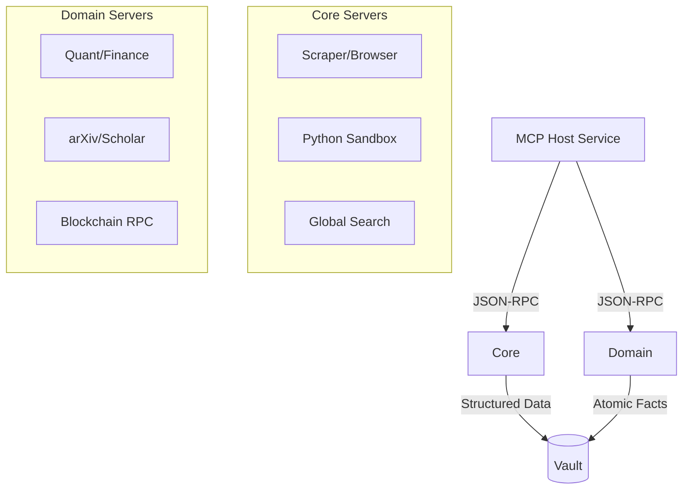

# 🔌 MCP Servers ("The Hands")

The `mcp_servers/` directory contains the **Model Context Protocol (MCP)** compliant microservices. These are the **Hands** of the Kea system, fulfilling the tool requests generated by the **Kea Kernel**.

## ✨ Features

- **Massive Tool Library**: 68+ specialized servers covering Finance, Web3, Academic Research, GIS, and Data Science.
- **Hub-and-Spoke Architecture**: Centrally managed by the `MCP Host`, with each server running in an isolated, low-privilege process.
- **JIT Dependency Resolution**: Servers use `uv` and `FastMCP` to dynamically resolve and install their own dependencies at runtime.
- **n8n-Style Data Chaining**: Tools are designed to produce structured outputs that can be piped into subsequent tools without LLM intervention.
- **Stealth Browsing & Extraction**: High-fidelity scraping via Playwright with built-in anti-bot evasion and automatic markdown conversion.
- **Zero-Trust Tooling**: Every tool execution is logged, audited, and resource-gated by the Swarm Manager.

## ✅ Verification

To verify that all MCP servers are correctly installed and can register their tools, run the connectivity test suite:

```bash
uv run pytest tests/mcp/test_server_connectivity.py -v -s
```

This command will:
1.  **Discover** all servers in this directory.
2.  **Spawn** each server using `uv` (installing dependencies JIT).
3.  **Verify** that tools can be listed via the MCP protocol.


---

## 📐 Architecture

Project treats tools as isolated micro-agents rather than simple function calls.

### 🗼 The Tool Ecosystem



---

## 📁 Codebase Structure

Each server (e.g., `yfinance_server/`) typically follows this structure:

- **`server.py`**: The main entrypoint using `FastMCP` to register tools.
- **`tools/`**: Modularized tool implementations (Market, Financials, etc.).
- **`Dockerfile`**: (Optional) For running the server in a containerized sandbox.
- **`README.md`**: Domain-specific documentation and tool references.

---

## 🧠 Deep Dive

### 1. JIT "Zero-Config" Spawning
Unlike traditional tool systems that require complex environment setups, Project servers are self-contained. When the MCP Host needs the `yfinance_server`, it uses the `shared/tools/jit_loader` to parse the `dependencies` list in `server.py` and spawns a `uv` process that ensures the exact versions of `pandas`, `yfinance`, and `matplotlib` are present.

### 2. High-Fidelity Scraping (`playwright_server`)
The `playwright_server` is one of the most complex "Hands." It exposes 20+ tools for navigation, input, and extraction. It supports "Session Persistence," allowing an agent to log into a portal in one turn and continue browsing in the next without losing state.

### 3. Financial Intelligence Suite
Project includes a multi-layered financial stack:
- **`yfinance` / `yahooquery`**: Fundamental data and history.
- **`finta` / `pandas_ta`**: Technical indicators (RSI, MACD, etc.).
- **`mibian`**: Black-Scholes and options Greeks.
- **`sec_edgar`**: Direct access to corporate filings for regulatory research.

---

## 📚 Reference

### Server Categories

| Category | Primary Servers | Capabilities |
|:---------|:----------------|:-------------|
| **Core** | `search`, `scraper`, `python` | Web search, stealth browsing, code execution. |
| **Quant** | `ccxt`, `yfinance`, `finta` | Crypto, stocks, technical analysis. |
| **Academic**| `academic`, `document` | arXiv, Semantic Scholar, PDF parsing. |
| **Analysis**| `pandas`, `sklearn`, `statsmodels`, `deep_learning`| ML, DL, statistical modeling, data cleaning. |
| **Web3** | `web3`, `security` | Smart contracts, on-chain data, safety. |

### Tool Development Pattern

```python
# In server.py
@mcp.tool()
async def my_new_tool(query: str) -> str:
    """
    Clear docstring for the LLM to understand utility.
    
    [RAG Context]
    Hidden context for the retriever to find this tool.
    "keyword1", "keyword2", "synonym"
    """
    # implementation logic (delegated to tools/my_feature.py)
    return await my_feature.logic(query)
```

---

## 🛡️ MCP Server Standards

To ensure compatibility and stability across the ecosystem, all new servers must adhere to the following standards:

### 1. File Structure
```text
server_name/
├── pyproject.toml       # Managed by uv, defines dependencies
├── README.md            # Tool documentation
├── server.py            # Entry point, FastMCP initialization
└── tools/               # Tool implementations
    ├── __init__.py      # Exposes tools
    ├── core.py          # Shared logic/utilities
    └── feature_xxx.py   # Specialized tool functions
```

### 2. Implementation Rules

#### 2.1 StdIO & Logging (CRITICAL)
- **Standard Output (`stdout`)**: STRICTLY RESERVED for JSON-RPC communication.
  - ❌ `print("debug log")` -> Breaks the protocol.
  - ❌ `logging.info(...)` (default config) -> Breaks the protocol.
- **Standard Error (`stderr`)**: Use for logs, warnings, and errors.
  - ✅ `logging.error("API failed")` -> Visible in MCP Inspector / Logs.
  - ✅ `sys.stderr.write("Starting server...")` -> Safe.
- **Standard Input (`stdin`)**: Read-only for JSON-RPC messages. Do not block on `input()`.

#### 2.2 Logging Configuration
You **MUST** use the provided `setup_logging` utility to ensure logs are routed correctly and chatty libraries (httpx, asyncio) are silenced.

```python
# In server.py
from shared.logging import setup_logging
setup_logging()  # <--- CALL THIS IMMEDIATELY

mcp = FastMCP("my_server")
```

#### 2.3 Dependency Management
- **Explicit Declaration**: Use the `dependencies` argument in `FastMCP`.
  ```python
  mcp = FastMCP("my_server", dependencies=["pandas", "numpy"])
  ```
- **Versioning**: Pin versions if known incompatibilities exist.

#### 2.4 The "JIT Import Hack" (CRITICAL)
To allow the server to find its local `tools/` module when run via `uv`, you **MUST** include this snippet before importing tools:

```python
import sys
from pathlib import Path
# Fix for importing 'tools' module from root when running in JIT mode
sys.path.append(str(Path(__file__).parent))

from tools import my_feature  # Now works!
```

#### 2.5 Naming Conventions
- **Tool Name**: `verb_object` (snake_case).
  - ✅ `get_price`, `calculate_rsi`
  - ❌ `PriceGetter`, `rsi`
- **Docstring Summary**: `VERB Object.` (Uppercase Verb).
  - ✅ `FETCHES current price.`
  - ✅ `CALCULATES RSI.`
  - ❌ `Get price.`

#### 2.6 Error Handling
- **Graceful Failures**: Never let an unhandled exception crash the server.
- **Informative Errors**: Return stringified errors to the LLM.
  ```python
  try:
      return do_risky_thing()
  except Exception as e:
      return f"Error: Failed to process data ({str(e)})"
  ```

#### 2.7 Testing Standards (MANDATORY)
Every new MCP server **MUST** include a dedicated test file to simulate real-world usage conditions.
- **Location**: `tests/mcp/test_<server_name>.py`
- **Purpose**: Verify that the server's tools function correctly with real inputs and external APIs (if applicable).
- **Format**: Standard `pytest` compatible test file.
- **Requirement**: The test must cover the server's core functionality and be strictly separate from the server code itself.

### 3. Tool Design Philosophy
- **"Super Tools"**: Prefer comprehensive tools (e.g., `analyze_stock_full`) over granular ones (`get_price`, `get_volue`).
- **Bulk Operations**: Always implement bulk retrieval (e.g., `get_prices(symbols: List[str])`) to minimize round-trips.
- **Self-Contained**: Tools should manage their own state or be stateless.
- **RAG-Optimized Docstrings**:
  - **Location**: Must be placed in `server.py` on the `@mcp.tool()` decorated functions.
  - **Format**:
    ```python
    @mcp.tool()
    async def my_tool(arg: str) -> str:
        """FETCHES current price. [ACTION]
        
        [RAG Context]
        Returns realtime snapshot. Key fields: price, volume, high, low.
        Use for single-point checks.
        """
    ```
  - **Tags**: 
    - **Summary Line**: Must start with a capitalized verb (FETCHES, CALCULATES, RUNS, ANALYZES) and end with `[ACTION]`.
    - **Context Block**: `[RAG Context]` is MANDATORY.
  - **Content Rules**: 
    - **Length**: ~200 characters max.
    - **Keywords**: Include synonyms (e.g. "stock" for "ticker", "profit" for "income").
    - **No Empty Blocks**: Unlike some legacy servers, new servers MUST populate this block.
- **Auto-Detection**:
  - The `mcp_servers` package uses dynamic discovery.
  - Ensure your server has a `server.py` file in its root directory to be automatically loaded.

---

## 🤖 Agent Protocol: Creating New Servers

When creating a new MCP server for a Python library (e.g., `{library_name}`), use the following protocol to ensure high-quality, high-utility integration.

### Phase 1: Research & Discovery
1.  **Documentation Deep Dive**: Read the official `{library_name}` docs. Understand its core objects, key methods, and unique capabilities.
2.  **Feature Mapping**: Identify distinct features (e.g., "Data Retrieval", "Analysis", "Plotting").
3.  **Tool Brainstorming**: List potential tools. Aim for 50-200 tools if the library is extensive.

### Phase 2: Implementation Plan
Create a plan that prioritizes:
1.  **Bulk Data Retrieval**: Can we get 100 items in one call?
2.  **"Super Functions"**: Can we combine `fetch`, `clean`, and `analyze` into one tool?
3.  **Multitalent Tools**: A single entry point for complex operations (e.g., `universal_converter`).

### Phase 3: Development
1.  **Scaffold**: Create the directory structure and `pyproject.toml`.
2.  **Core Logic**: Implement `tools/core.py` for shared resources (API clients, formatting).
3.  **Tool Implementation**: Group tools logically into files (e.g., `tools/market.py`, `tools/technical.py`).
4.  **Logging**: Integrate `structlog` for observability.
5.  **No Dummy Data**: All tools must interact with real library functions. Requires valid inputs/API keys if applicable.

### Phase 4: Verification
1.  **Dependency Check**: Run `uv sync`.
2.  **Connectivity Test**: Run `pytest tests/mcp/test_server_connectivity.py` to ensure the server works within the Project ecosystem.
3.  **Real-World Simulation**: Create and run `pytest tests/mcp/test_<server_name>.py` to validate functionality under real conditions.

---

### 📝 Prompt Template for Agents

Use this prompt to instruct an agent to build a new server:

> **Objective**: Create an MCP Server for the `{Target Library}` Python library.
>
> **Requirements**:
> 1.  **Research**: Find and read all online documentation for `{Target Library}`. Understand every feature.
> 2.  **Plan**: Design a suite of tools (aim for maximum coverage, 50-200+ tools).
>     - **Prioritize Bulk**: Tools must handle lists of inputs (batch processing).
>     - **Create Super-Tools**: Combine atomic functions into high-value workflows (e.g., "Full Report").
> 3.  **Implement**:
>     - Use the standard `mcp_servers/` directory structure.
>     - Use `FastMCP` and `uv` for dependencies.
>     - Use `structlog` for logging.
>     - **NO DUMMY DATA**: Real library calls only.
> 4.  **Refine**:
>     - Update `mcp_servers/README.md` with the new server details.
>     - Ensure code is robust (try/except blocks).
> 5.  **Verify**:
>     - Create a real-world test in `tests/mcp/test_{server_name}.py`.
