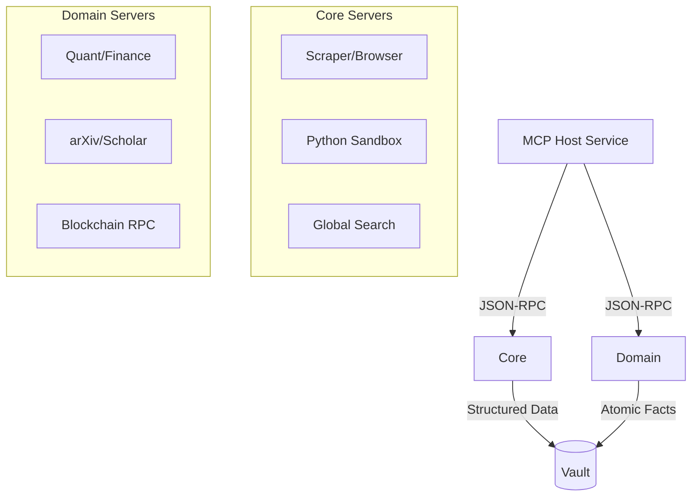

# 🔌 MCP Servers ("The Hands")

The `mcp_servers/` directory contains the **Model Context Protocol (MCP)** compliant microservices. These are the "Hands" of the Kea system, providing the specialized capabilities required to interact with the external world, execute code, and perform deep domain-specific analysis.

## ✨ Features

- **Massive Tool Library**: 68+ specialized servers covering Finance, Web3, Academic Research, GIS, and Data Science.
- **Hub-and-Spoke Architecture**: Centrally managed by the `MCP Host`, with each server running in an isolated, low-privilege process.
- **JIT Dependency Resolution**: Servers use `uv` and `FastMCP` to dynamically resolve and install their own dependencies at runtime.
- **n8n-Style Data Chaining**: Tools are designed to produce structured outputs that can be piped into subsequent tools without LLM intervention.
- **Stealth Browsing & Extraction**: High-fidelity scraping via Playwright with built-in anti-bot evasion and automatic markdown conversion.
- **Zero-Trust Tooling**: Every tool execution is logged, audited, and resource-gated by the Swarm Manager.

---

## 📐 Architecture

Kea treats tools as isolated micro-agents rather than simple function calls.

### 🗼 The Tool Ecosystem



---

## 📁 Codebase Structure

Each server (e.g., `yfinance_server/`) typically follows this structure:

- **`server.py`**: The main entrypoint using `FastMCP` to register tools.
- **`tools/`**: Modularized tool implementations (Market, Financials, etc.).
- **`Dockerfile`**: (Optional) For running the server in a containerized sandbox.
- **`README.md`**: Domain-specific documentation and tool references.

---

## 🧠 Deep Dive

### 1. JIT "Zero-Config" Spawning
Unlike traditional tool systems that require complex environment setups, Kea servers are self-contained. When the MCP Host needs the `yfinance_server`, it uses the `shared/tools/jit_loader` to parse the `dependencies` list in `server.py` and spawns a `uv` process that ensures the exact versions of `pandas`, `yfinance`, and `matplotlib` are present.

### 2. High-Fidelity Scraping (`playwright_server`)
The `playwright_server` is one of the most complex "Hands." It exposes 20+ tools for navigation, input, and extraction. It supports "Session Persistence," allowing an agent to log into a portal in one turn and continue browsing in the next without losing state.

### 3. Financial Intelligence Suite
Kea includes a multi-layered financial stack:
- **`yfinance` / `yahooquery`**: Fundamental data and history.
- **`finta` / `pandas_ta`**: Technical indicators (RSI, MACD, etc.).
- **`mibian`**: Black-Scholes and options Greeks.
- **`sec_edgar`**: Direct access to corporate filings for regulatory research.

---

## 📚 Reference

### Server Categories

| Category | Primary Servers | Capabilities |
|:---------|:----------------|:-------------|
| **Core** | `search`, `scraper`, `python` | Web search, stealth browsing, code execution. |
| **Quant** | `ccxt`, `yfinance`, `finta` | Crypto, stocks, technical analysis. |
| **Academic**| `academic`, `document` | arXiv, Semantic Scholar, PDF parsing. |
| **Analysis**| `pandas`, `sklearn`, `statsmodels`| ML, statistical modeling, data cleaning. |
| **Web3** | `web3`, `security` | Smart contracts, on-chain data, safety. |

### Tool Development Pattern

```python
@mcp.tool()
async def my_new_tool(query: str) -> str:
    """
    Clear docstring for the LLM to understand utility.
    """
    # implementation logic
    return "Result"
```
