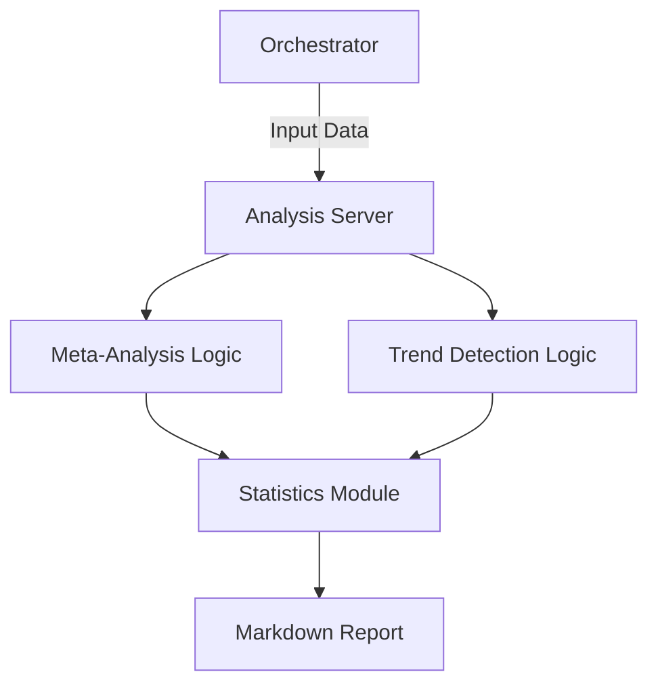

# 📊 Analysis MCP Server

The **Analysis Server** is a specialized MCP component for statistical investigation and data synthesis. It provides tools for comparing data from multiple sources and identifying patterns in sequential or time-series datasets.

## 🏗️ Architecture

The server implements a deterministic statistical engine using the Python standard library, providing high-precision analysis without the overhead of heavy ML frameworks.



## ✨ Features

### 📋 Meta-Analysis
- **Consensus Building**: Identifies recommended "Source of Truth" values using median-based consensus.
- **Variance Analysis**: Compares data points across multiple sources to detect discrepancies.
- **Aggregation**: Computes Mean, Median, Std Dev, and Variance for noisy datasets.
- **Source Comparison**: Grades source reliability based on deviation from the mean.

### 📈 Trend Detection
- **Directional Analysis**: Automatically determines if a metric is increasing or decreasing.
- **Percentage Change**: Computes start-to-end and half-over-half growth rates.
- **Anomaly Detection**: Uses Z-Score calculation to identify data points that deviate significantly (2+ Std Dev) from the mean.
- **Time-Series Support**: Handles both dated entries and raw numeric sequences.

## 🔌 Tools

| Tool | Purpose | Key Arguments |
|:-----|:--------|:--------------|
| `meta_analysis` | Compare data across sources. | `data_points` (list), `analysis_type` |
| `trend_detection` | Identify patterns and anomalies. | `data` (list), `metric_name`, `detect_anomalies` |

## 🚀 Usage

```python
# Trend Detection example
result = await client.call_tool("trend_detection", {
    "data": [{"date": "2024-01-01", "value": 100}, {"date": "2024-01-02", "value": 110}],
    "metric_name": "Revenue"
})
```
