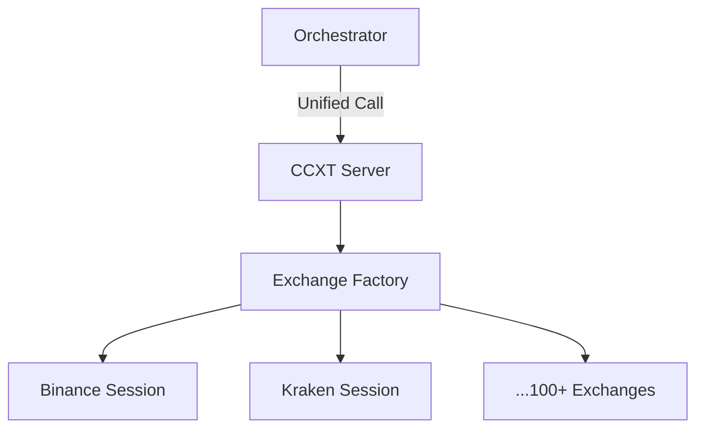

# ₿ CCXT MCP Server (Crypto)

The **CCXT Server** provides a unified, standardized interface for interacting with over 100+ cryptocurrency exchanges (Binance, Kraken, Coinbase, etc.). It abstracts away the complexities of disparate exchange APIs into a consistent set of MCP tools for research, trading, and market analysis.

## 🏗️ Architecture

The server leverages the `ccxt` library and implements a "Session per Exchange" model managed by the `ExchangeManager`.



## ✨ Features

### 🌍 Unified Market Data
- **Public Fetching**: Unified tools for `get_ticker`, `get_ohlcv` (candles), and `get_order_book`.
- **Global Aggregation**: Tools like `get_global_price` and `get_arbitrage_spread` allow for cross-exchange market monitoring.

### 📂 Advanced Market Intelligence
- **Derivatives Support**: Fetching Funding Rates and Open Interest for futures markets.
- **Historical Data**: Pagination-aware tools for downloading large (10k+) historical candle datasets.
- **Market Sentiment**: Tracking long/short ratios and recent liquidations.

### 🔐 Secure Private Management
- **Balance & Positions**: Unified interface for tracking account balances and future positions.
- **Order Management**: Create (Buy/Sell) and Cancel orders across any exchange (requires API Key/Secret).
- **Ledger Tracking**: Fetching deposit/withdrawal history and deposit addresses.

### ⚡ Shortcut Tools
Provides optimized, single-argument shortcuts for top exchanges:
- `get_binance_ticker`, `get_okx_funding`, `download_kraken_history`, `buy_on_coinbase`, etc.

## 📁 Component Structure

- `public.py`: Public market data (Price, Books, Candles).
- `aggregator.py`: Multi-exchange logic (Arbitrage, Global Price).
- `derivatives.py`: Futures and perpetuals specific data.
- `trading.py`: Execution logic for buying and selling.
- `private.py`: Account-level data (Positions, Orders).
- `exchange_manager.py`: Lifecycle management for exchange sessions.

## 🔌 Tool Categories

| Category | Tools | Access |
|:---------|:------|:-------|
| **Public** | `get_ticker`, `get_ohlcv`, `get_trades`, `get_status` | Public |
| **Macro** | `get_global_price`, `get_arbitrage_spread`, `get_global_funding_spread` | Public |
| **Derivatives**| `get_funding_rate`, `get_open_interest`, `get_liquidations` | Public |
| **Private** | `get_balance`, `get_positions`, `get_open_orders`, `get_my_trades` | Auth |
| **Trading** | `create_order`, `cancel_order` | Auth |

## 🚀 Usage

```python
# Macro arbitrage check
result = await client.call_tool("get_arbitrage_spread", {"symbol": "BTC/USDT"})
```
