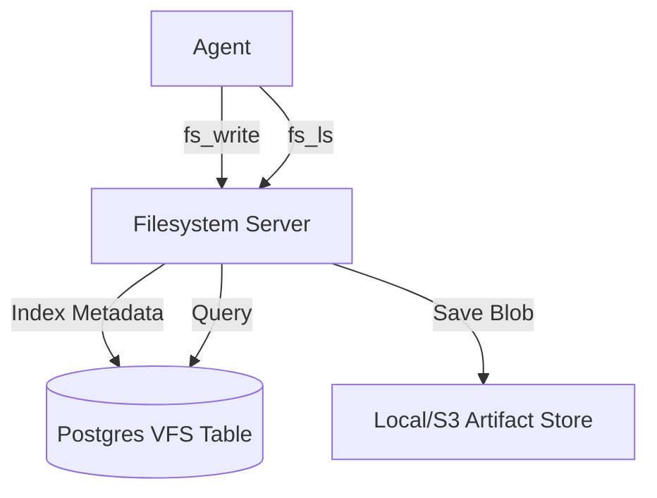

# 📂 Filesystem Server ("The Operations Team")

The **Filesystem Server** is the **Operations Department** of the Kea v4.0 system. It manages the "Virtual Filesystem" (VFS), providing a familiar unix-like interface (`ls`, `mkdir`, `write`) for agents to organize their work.

Crucially, this is NOT just a wrapper around `os.path`. It is a **Database-Backed Virtual Layer** that maps logical paths (e.g., `/project_alpha/financials.csv`) to physical artifacts on the **Artifact Bus** (The Vault).

## ✨ Features

- **Virtual File System (VFS)**: Maintains a directory structure in PostgreSQL, allowing agents to "browse" and "organize" files without needing direct OS access.
- **Artifact Bus Integration**: When a file is "written", the physical content is secured in the Vault's storage layer (S3/Local), while the metadata is indexed in the VFS.
- **Idempotency**: `fs_mkdir` and `fs_write` are designed to be safe for robotic execution (no crashing on "folder exists").
- **Metadata Tagging**: Supports attaching descriptions and tags to files, aiding in semantic retrieval later.

## 🏗️ Architecture



## 🔌 Tool Categories

All tools are prefixed with `fs_` to distinguish them from local OS operations.

### Core Operations
- `fs_ls`: List files and folders. Returns JSON structure.
- `fs_mkdir`: Create a directory hierarchy.
- `fs_write`: Save text content to a file. Handles physical storage + VFS indexing.
- `fs_read`: Retrieve file content by logical path.
- `fs_init`: Initialize the database schema (Admin tool).

## 🚀 Usage

```python
# Create a folder for the current task
await client.call_tool("fs_mkdir", {"path": "/research/tesla_vpp"})

# Save a report
await client.call_tool("fs_write", {
    "path": "/research/tesla_vpp/summary.txt",
    "content": "Tesla's VPP strategy focuses on..."
})
```

## 🛠️ Configuration
- **Dependencies**: `asyncpg`.
- **Environment**: Requires `DATABASE_URL` for VFS persistence.
