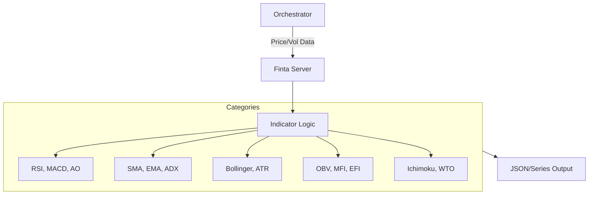

# 📈 Finta MCP Server

The **Finta Server** provides a high-performance, standardized interface for technical analysis. It implements over 50+ financial indicators (EMA, RSI, MACD, etc.) designed for quantitative trading and algorithmic research.

## 🏗️ Architecture

The server utilizes the `finta` library and provides both "Bulk" tools for full-suite analysis and "Shortcut" tools for atomic calculations.



## ✨ Features

### 📦 Bulk Analysis
- **Universal Suites**: Calculate entire categories of indicators (e.g., all Momentum or all Volatility) in a single call.
- **Get All Indicators**: Computes 80+ indicators across all categories for a given price series.

### 🔍 Specialized Indicator Categories
- **Momentum**: RSI, MACD, Stochastic, TSI, Awesome Oscillator, Williams %R, and more.
- **Trend**: SMA, EMA, DEMA, TEMA, Hull MA, Zero-Lag EMA, Super Trend.
- **Volatility**: Bollinger Bands, Keltner/Donchian Channels, ATR, Mass Index.
- **Volume**: On-Balance Volume, Money Flow Index, Chaikin Oscillator, Force Index.
- **Exotics & Levels**: Wave Trend (WTO), Ichimoku Cloud, Pivot Points, Fibonacci Levels.

### 🛠️ Universal Loader
- The `calculate_indicator` tool allows dynamic invocation of any indicator by name with custom parameters.

## 🔌 Tool Categories

| Category | Description | Count |
|:---------|:------------|:-----:|
| **Momentum** | Speed and strength of price movement. | 15 |
| **Trend** | Directional bias and overrides. | 13 |
| **Volatility**| Range and expansion/contraction. | 10 |
| **Volume** | Capital flow and pressure. | 10 |
| **Exotics** | Advanced and hybrid indicators. | 10 |

## 🚀 Usage

```python
# Calculate RSI example
result = await client.call_tool("calculate_rsi", {
    "data": [{"open": 100, "high": 110, "low": 90, "close": 105, "volume": 1000}, ...],
    "params": {"period": 14}
})
```
