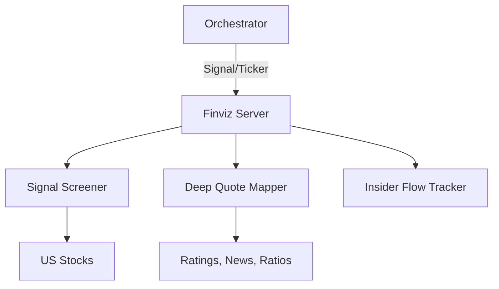

# 📊 Finviz MCP Server

The **Finviz Server** provides real-time market sentiment, stock screening, and financial data by interacting with the Finviz platform. It is designed for discovering market opportunities through visual signals, insider trading logs, and fundamental metrics.

## 🏗️ Architecture

The server implements a scraping and extraction layer to map Finviz signals and tables into structured MCP responses.



## ✨ Features

### 🏹 Dynamic Stock Screening
- **27+ Signal Tools**: Direct access to Finviz screener signals like `screen_top_gainers`, `screen_new_high`, `screen_oversold`, and `screen_unusual_volume`.
- **Strategy Presets**: Pre-configured screens for specific trading styles (e.g., `screen_strat_growth_val`).

### 📑 Deep Quote Analysis
- **Company Context**: Fetch detailed descriptions and sector/industry mappings.
- **Analyst Sentiment**: Real-time tracking of upgrades, downgrades, and price targets.
- **Fundamentals**: Access to core ratios (P/E, Forward P/E, EPS, Debt/Eq) in a structured format.
- **Insider Intelligence**: Specific tools for tracking "Latest Buys/Sales" and "Top Owner Transcations".

### 🗺️ Market Mapping (Groups)
- **Sector/Industry/Country Views**: Performance, Valuation, and Overview tables for entire market segments.
- **Global Context**: Performance tables for Forex and Cryptocurrency markets.

### 🥗 Financials & Visuals
- **Statement Snapshots**: Income, Balance Sheet, and Cash Flow tables (Finviz format).
- **Chart Pointers**: Direct URL generation for Finviz interactive charts.

## 🔌 Tool Categories

| Category | Count | Key Tools |
|:---------|:------|:----------|
| **Screener** | 27+ | `screen_top_gainers`, `screen_most_active`, `screen_top_losers` |
| **Quotes** | 5 | `get_stock_ratings`, `get_stock_fundament`, `get_stock_insider` |
| **Insider** | 6 | `get_latest_buys`, `get_top_week_sales` |
| **Groups** | 9 | `get_sector_valuation`, `get_industry_performance` |
| **Financials**| 3 | `get_finviz_statement`, `get_chart_url` |

## 🚀 Usage

```python
# Screen for oversold stocks
result = await client.call_tool("screen_oversold", {"limit": 10})
```
