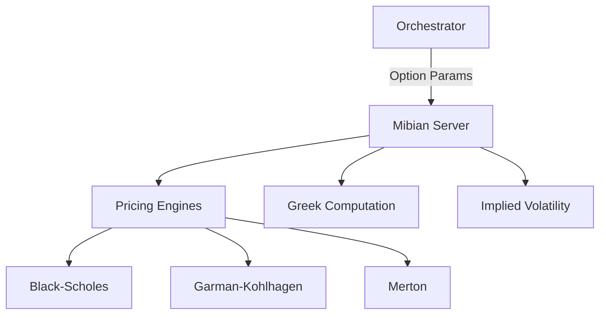

# 📉 Mibian MCP Server (Options)

The **Mibian Server** is a specialized engine for options pricing, Greeks calculation, and risk simulation. It provides a standardized interface for common mathematical models used in derivatives trading (Black-Scholes, Garman-Kohlhagen, Merton).

## 🏗️ Architecture

The server leverages the `mibian` library to perform high-precision derivative calculations on both atomic levels (single Greeks) and bulk levels (entire chains).



## ✨ Features

### 🎓 Advanced Pricing Models
- **Standard (Black-Scholes)**: The industry standard for European options on non-dividend paying stocks.
- **Forex (Garman-Kohlhagen)**: Optimized for currency options using both domestic and foreign interest rates.
- **Dividend (Merton)**: Extended BS model that accounts for continuous dividend yields.

### 📐 Comprehensive Greeks
- **The Core Five**: Delta, Gamma, Theta, Vega, Rho (Call/Put specific).
- **Advanced Greeks**: Vanna (Delta-Vega), Vomma (Vega-Vol), Charm (Delta-Time), Speed (Gamma-Price).

### 🔍 Risk & Volatility Analysis
- **Implied Volatility (IV)**: Back-calculate the market's volatility expectation from an option price.
- **ITM Probability**: Tools to calculate the probability of an option finishing In-The-Money (Dual Delta).
- **Put-Call Parity**: Verification tools for identifying arbitrage opportunities in priced options.

### 🚀 Simulation & Bulk
- **Greek Scenarios**: Simulate how Greeks will change across a range of underlying price steps.
- **Chain Pricing**: Price an entire nested list (chain) of options in a single call.
- **Strategy Pricing**: Calculate the theoretical value of complex multi-leg strategies (Straddles, Spreads).

## 🔌 Tool Categories

| Category | Tools | Application |
|:---------|:------|:------------|
| **Pricing** | `calculate_bs_price`, `calculate_me_price` | Theoretical Value |
| **Greeks** | `calculate_bs_delta`, `calculate_vanna` | Sensitivity & Risk |
| **Volatility**| `calculate_implied_volatility` | Market Expectation |
| **Simulation**| `simulate_greek_scenario` | What-If Analysis |
| **Exotics** | `calculate_binary_price`, `calculate_barrier_price` | Complex Derivatives |

## 🚀 Usage

```python
# Calculate BS Greeks
result = await client.call_tool("calculate_bs_delta", {
    "underlying": 150.0,
    "strike": 155.0,
    "interest": 0.05,
    "days": 30,
    "volatility": 0.25
})
```
