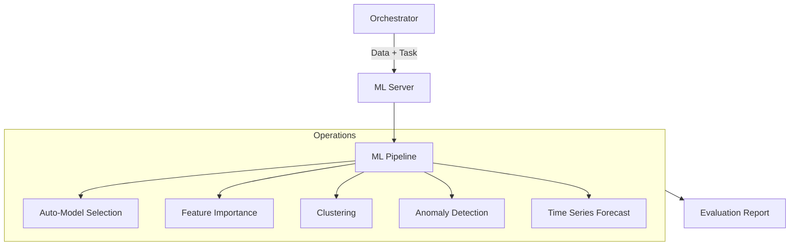

# 🤖 Machine Learning MCP Server

The **ML Server** provides a high-level interface for machine learning operations, including automated model selection (AutoML), feature importance analysis, unsupervised clustering, and anomaly detection. It abstracts the complexity of `scikit-learn` and `pandas` into simple, research-ready tools.

## 🏗️ Architecture

The server implements a task-based execution model where data is ingested from remote URLs or inline payloads, processed through optimized ML pipelines, and returned as structured markdown reports.



## ✨ Features

### 🚀 AutoML (Supervised)
- **Model Selection**: Automatically compares Logistic/Linear Regression, Ridge, Random Forest, and Gradient Boosting.
- **Auto-Task Detection**: Intelligently switches between Classification and Regression based on target distributions.
- **Evaluation**: Provides 5-fold cross-validation scores and hold-out test set performance.

### 📊 Exploratory Operations
- **Feature Importance**: Uses Tree-based (Random Forest) importance to rank the most predictive variables in a dataset.
- **Clustering**: Groups similar data points using K-Means or DBSCAN with automatic silhouette score evaluation.
- **Anomaly Detection**: Identifies outliers using Isolation Forest or Z-Score analysis, providing specific examples of "anomalous" records.

### 📈 Time Series
- **Forecasting**: Provides simple trend-based forecasting and statistical summaries (Mean, Std, Trend direction) for sequential data.

## 🔌 Tools

| Tool | Purpose | Task Type |
|:-----|:--------|:----------|
| `auto_ml` | Find the best model for a dataset. | Supervised |
| `feature_importance` | Rank features by predictive power. | Diagnostics |
| `clustering` | Group data points into clusters. | Unsupervised |
| `anomaly_detection` | Detect outliers and anomalies. | Unsupervised |
| `time_series_forecast` | Predict future values in a sequence. | Forecasting |

## 🚀 Usage

```python
# Run AutoML on a CSV file
result = await client.call_tool("auto_ml", {
    "data_url": "https://example.com/data.csv",
    "target_column": "target",
    "task_type": "classification"
})
```
