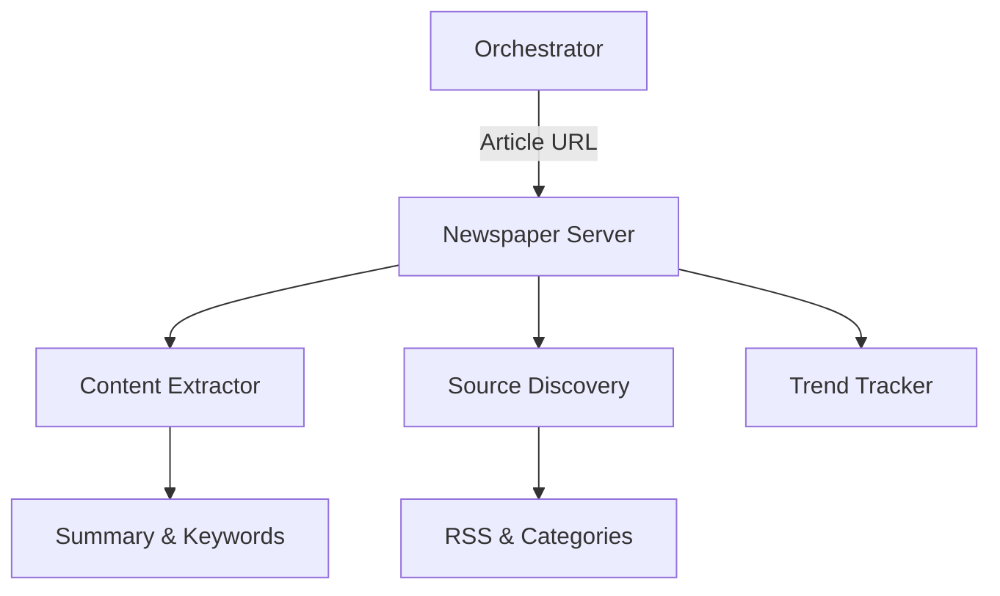

# 📰 Newspaper MCP Server

The **Newspaper Server** (codenamed "Paper-boy") is a powerful news extraction and NLP engine. It allows for high-speed scraping of articles, automated source discovery, and natural language processing of news content.

## 🏗️ Architecture

The server wraps the `newspaper3k` library, providing a robust extraction layer that handles boilerplate removal and content synthesis.



## ✨ Features

### 📄 Article Intelligence
- **Full Text Extraction**: Clean, boilerplate-free body text from almost any news site.
- **Metadata Recovery**: Automatic detection of authors, publication dates, and primary "top" images.
- **Integrated NLP**: Generates concise summaries and extracts key descriptive keywords using native model-based analysis.

### 🔍 Source Discovery
- **Deep Scanning**: Recursively identifies news categories, RSS feeds, and article lists from a base domain (e.g., `cnn.com`).
- **Source Analysis**: Higher-level tools like `analyze_news_source` scan a source and automatically extract/analyze the top N articles.

### ⚡ Performance
- **Bulk Extraction**: Threaded downloading of multiple URLs to maximize throughput for large-scale news monitoring.
- **Hot Trends**: Direct access to Google Trending terms and lists of popular/reliable news sources.

## 🔌 Tool Categories

| Category | Tools | Output |
|:---------|:------|:-------|
| **Article** | `get_article_text`, `get_article_nlp` | Text, Summary |
| **Discovery** | `build_source`, `get_source_feeds` | URls, Feeds |
| **Bulk** | `analyze_news_source`, `bulk_article_extraction` | Batch Data |
| **Trends** | `get_google_trending_terms` | Topics |

## 🚀 Usage

```python
# Extract and summarize a news article
result = await client.call_tool("get_article_nlp", {
    "url": "https://techcrunch.com/2026/01/25/kea-ai-releases..."
})
```
