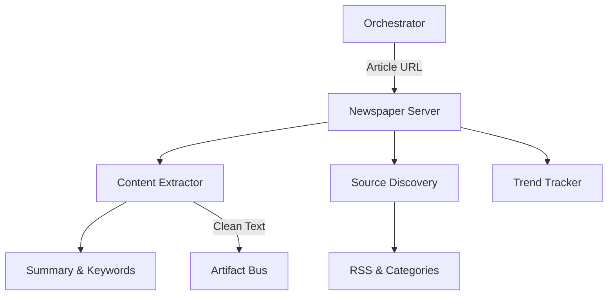

# 📰 Newspaper Server ("The Communications Dept")

The **Newspaper Server** is the **News & Communications Department** of the Kea v0.4.0 system. It specializes in high-speed news ingestion, source discovery, and NLP-based content analysis. "Paper-boy" can read thousands of articles in seconds, stripping away ads and boilerplate to deliver clean, actionable text to the Research Engine.

## ✨ Features

- **Full Text Extraction**: Clean, boilerplate-free body text from almost any news site.
- **Metadata Recovery**: Automatic detection of authors, publication dates, and primary "top" images.
- **Integrated NLP**: Generates concise summaries and extracts key descriptive keywords using native model-based analysis (no LLM required).
- **Deep Scanning**: Recursively identifies news categories, RSS feeds, and article lists from a base domain (e.g., `cnn.com`).
- **Bulk Extraction**: Threaded downloading of multiple URLs to maximize throughput for large-scale news monitoring.
- **Hot Trends**: Direct access to Google Trending terms and lists of popular/reliable news sources.

## 🏗️ Architecture

The server wraps the `newspaper3k` library, providing a robust extraction layer that handles boilerplate removal and content synthesis.



## 🔌 Tool Categories

### 1. Article Intelligence
- `get_article_text`: Raw text extraction.
- `get_article_nlp`: Full analysis including Summary, Keywords, and Sentiment.
- `get_article_metadata`: Authors, Dates, Images.

### 2. Source Discovery
- `build_source`: Scans a domain (e.g., `bloomberg.com`) to find all category links and feeds.
- `get_source_feeds`: Extracts RSS/Atom feed URLs.
- `get_source_categories`: Maps the site's topic hierarchy.

### 3. Bulk & Trends
- `analyze_news_source`: High-level "Super Tool" that scans a source and automatically extracts/analyzes the top N articles.
- `bulk_article_extraction`: Parallel download of a list of URLs.
- `get_google_trending_terms`: Real-time topic discovery.

## 🚀 Usage

```python
# Extract and summarize a news article
result = await client.call_tool("get_article_nlp", {
    "url": "https://techcrunch.com/2026/01/25/kea-ai-releases..."
})
```

## 🛠️ Configuration
- **Dependencies**: `newspaper3k`, `lxml_html_clean`, `nltk`.
- **Performance**: High concurrency supported via `Threading`.
