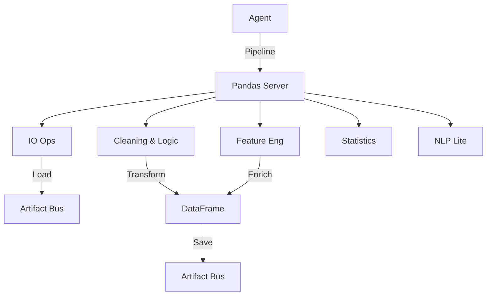

# 🐼 Pandas Server ("The Data Science Dept")

The **Pandas Server** is the **Data Science Department** of the Kea v0.4.0 system. It provides a comprehensive suite of 50+ tools for dataframe manipulation, statistical analysis, feature engineering, and data cleaning. It operates on "Physical Artifacts" (CSVs, Parquet, JSON) stored in the Vault, enabling complex transformations without moving data across the network.

## ✨ Features

- **End-to-End ETL**: Capable of reading raw data, cleaning it, engineering features, and saving the result in a single pipeline.
- **Data Quality Guardrails**: specialized tools (`validate_schema`, `check_constraints`) to ensure data integrity before analysis.
- **Statistical Rigor**: Built-in support for Z-Scores, Outlier Detection via IQR, and Correlation Matrices.
- **NLP Lite**: In-process text tokenization and N-gram generation for rapid text analysis.
- **Chain Execution**: The `execute_chain` tool allows the Orchestrator to define a multi-step pipeline (Load -> Clean -> Filter -> Save) that executes in a single RPC call, minimizing latency.

## 🏗️ Architecture

The server is organized into 15 functional modules, covering the entire Data Science lifecycle.



## 🔌 Tool Categories

### 1. IO & Inspection
- `read_dataset`, `convert_dataset`: Universal loader.
- `head`, `tail`, `describe`, `value_counts`: Quick EDA.

### 2. Core Manipulation
- `filter_data`: SQL-like querying (`age > 25`).
- `sort_data`, `drop_duplicates`, `sample_data`.
- `fill_na`: Imputation strategies (Mean, Median, Ffill).

### 3. Transformation & Reshaping
- `group_by`: Aggregations (`sum`, `mean`, `max`).
- `merge_datasets`: SQL-style joins.
- `pivot_table`, `melt_data`: Reshaping wide/long.

### 4. Time Series
- `resample_data`: Change frequency (e.g., Tick -> Minute).
- `rolling_window`: Moving averages and sums.
- `shift_diff`: Calculate lag or difference.

### 5. Statistics & ML
- `calculate_zscore`: Standardize data.
- `drop_outliers`: Remove noise.
- `one_hot_encode`: Prepare categorical data for ML.
- `bin_data`: Discretize continuous variables.

### 6. Feature Engineering
- `create_interactions`: Multiply features (`price * volume`).
- `polynomial_features`: Create higher-order terms (`x^2`).

### 7. NLP Lite
- `tokenize_text`, `word_count`, `generate_ngrams`.

### 8. Chain Executor (Super Tool)
- `execute_chain`: The most powerful tool. Takes a JSON list of steps (e.g., `[{"tool": "filter_data", "args": {...}}, {"tool": "group_by", "args": {...}}]`) and executes them sequentially in memory, saving only the final result.

## 🚀 Usage

```python
# 1. Clean Data
await client.call_tool("fill_na", {
    "file_path": "/vault/data.csv",
    "value": 0,
    "output_path": "/vault/clean.csv"
})

# 2. Execute Complex Pipeline
await client.call_tool("execute_chain", {
    "initial_file_path": "/vault/clean.csv",
    "steps": [
        {"tool": "filter_data", "args": {"query": "price > 100"}},
        {"tool": "group_by", "args": {"by": "sector", "agg": {"price": "mean"}}}
    ],
    "final_output_path": "/vault/analysis.csv"
})
```

## 🛠️ Configuration
- **Dependencies**: `pandas`, `numpy`, `scipy`.
- **Memory**: Operations are in-memory; for datasets larger than RAM, use `duckdb_server`.
