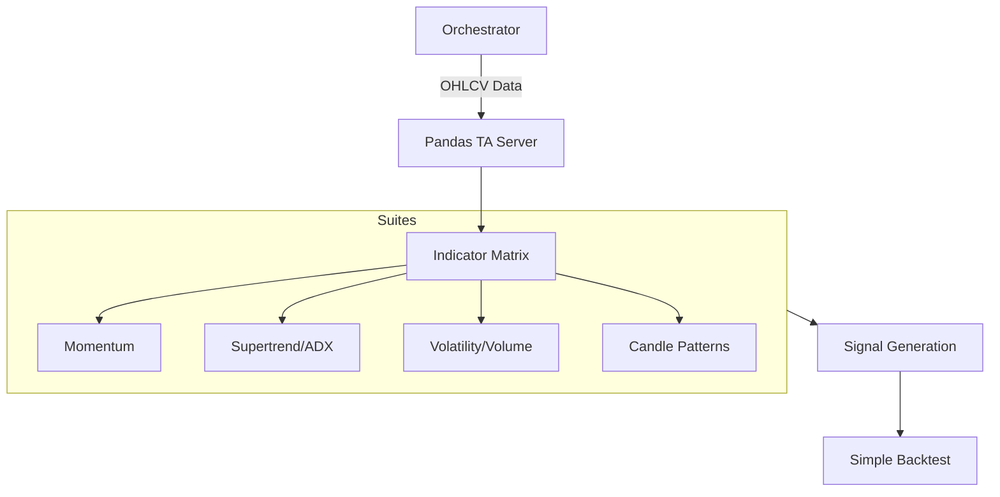

# 🐼 Pandas TA MCP Server

The **Pandas TA Server** is a comprehensive financial analysis engine that provides over 100+ technical indicators and advanced signal logic. Built on the `pandas-ta` library, it is the primary workhorse for quantitative strategy development and historical analysis in Kea.

## 🏗️ Architecture

The server processes dataframe-like payloads through technical analysis strategies, returning results as enriched time-series data or logic-based signals.



## ✨ Features

### 📦 Massive Indicator Suites
- **Bulk Calculation**: Unified tools to calculate 100+ indicators at once or specific "Suites" (Momentum, Trend, Volatility, Volume, Cycles).
- **Candle Patterns**: Detects 60+ distinct candlestick patterns (Doji, Hammer, Engulfing, etc.) in a single call.
- **Statistical Engine**: Built-in support for Z-Scores, Skewness, Kurtosity, and rolling statistics.

### 🧠 Logic & Signals
- **Condition Querying**: The `generate_signals` tool allows for natural-logic queries on datasets (e.g., `"RSI_14 < 30 AND CLOSE > SMA_200"`).
- **ML Dataset Construction**: Specialized tool to prepare datasets for ML training by generating optimal lags and technical features.

### 📊 Alpha & Performance
- **Alpha Factors**: Access to advanced indicators like Jurik RSX, Elder's Thermometer, and the Ulcer Index.
- **Performance Metrics**: Direct calculation of Log Returns, Percent Returns, and Drawdown profiles.
- **Backtesting**: `simple_backtest` allows for running Entry/Exit logic across historical data to verify strategy viability.

## 🔌 Tool Categories

| Category | Count | Example Tools |
|:---------|:-----:|:--------------|
| **Suites** | 7 | `get_all_indicators`, `get_candle_patterns_suite` |
| **Momentum** | 12 | `calculate_stochrsi`, `calculate_ttm_squeeze` |
| **Trend** | 11 | `calculate_supertrend`, `calculate_ichimoku` |
| **Vol/Vol** | 10 | `calculate_bbands`, `calculate_vwap` |
| **Performance**| 4 | `calculate_drawdown`, `simple_backtest` |

## 🚀 Usage

```python
# Generate signals based on a strategy
result = await client.call_tool("generate_signals", {
    "data": [...],
    "condition": "RSI_14 < 30"
})
```
