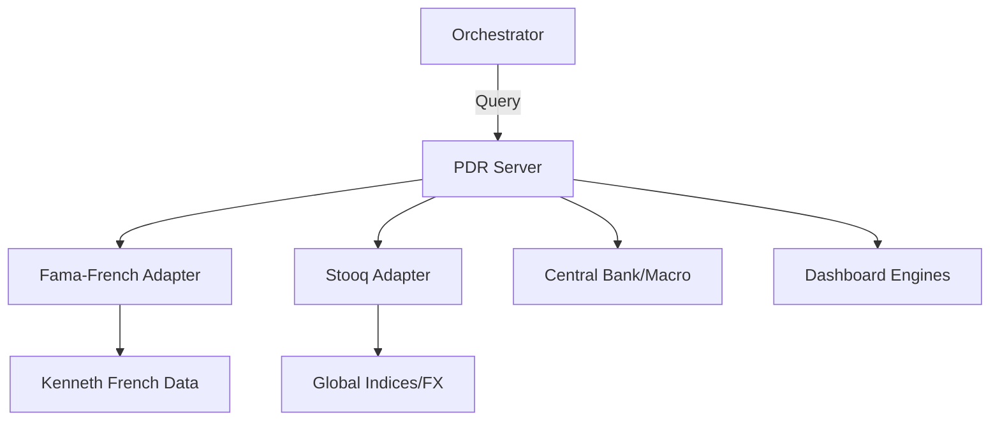

# 🏦 PDR MCP Server (Macro & Academic)

The **PDR Server** (Pandas Datareader) is the gateway to academic financial data, global macroeconomic indices, and institutional data sources. It is primarily used for factor-based research, industry health monitoring, and tracking central bank metrics.

## 🏗️ Architecture

The server abstracts multiple "Data Adapters" into a unified MCP interface, handling source-specific protocols (JSON, XML, CSV) under the hood.



## ✨ Features

### 🎓 Academic Research (Fama-French)
- **40+ Classic Datasets**: Instant access to the 3-Factor, 5-Factor, and Momentum models, along with Portfolios formed on Size, Value, and Industry.
- **Historical Depth**: Deep historical data dating back to the 1920s for long-term factor analysis.

### 🌐 Global Macro & Indices
- **Global Markets**: Integration with Stooq for global indices (Nikkei, DAX, etc.), ETFs, and major currency pairs.
- **Institutional Context**: Tracking Moscow Exchange (MOEX) and the Thrift Savings Plan (TSP) Fund data.
- **Central Banking**: Access to Bank of Canada (BoC) rates and foreign exchange metrics.

### 📊 Research Dashboards
- **Factor Dashboards**: Pre-aggregated views of US and Global factors for immediate "Heatmap" style analysis.
- **Industry Health**: Monitoring the vitality of 49 distinct industry sectors.
- **Liquidity Tracking**: Specialized dashboards for monitoring market liquidity factors.

## 🔌 Tool Categories

| Category | Key Tools | Data Scope |
|:---------|:----------|:-----------|
| **Academic** | `get_fama_french_5_factor`, `get_hml_portfolios` | 40+ Datasets |
| **Macro** | `get_stooq_data`, `get_bank_of_canada_data` | Indices, FX, Rates |
| **Dashboard** | `get_factor_dashboard`, `get_industry_health` | Synthesized Views |
| **Discovery** | `get_nasdaq_symbol_list` | 10k+ Symbols |

## 🚀 Usage

```python
# Get the classic Fama-French 3-Factor model data
result = await client.call_tool("get_fama_french_3_factor", {
    "start_date": "2020-01-01"
})
```
