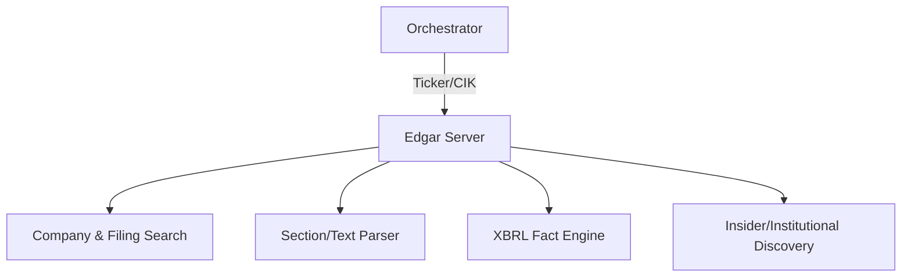

# 📑 Python-Edgar MCP Server

The **Python-Edgar Server** provides deep, object-oriented access to SEC filing data and XBRL financial facts. It is designed for forensic accounting, fundamental financial analysis, and tracking institutional (13F) ownership.

## 🏗️ Architecture

The server translates raw SEC EDGAR data into structured entities, allowing for high-precision extraction of text sections and numeric XBRL tags.



## ✨ Features

### 🔍 SEC Filing Discovery
- **Company Profiles**: Instant lookup of CIKS, recent filings, and core company metadata.
- **Smart Search**: Filter filings by Ticker, Form Type (10-K, 10-Q, 8-K, 4, 13F), and date range.

### 📖 Content Extraction
- **Markdown Parsing**: Converts complex SEC HTML filings into clean, readable Markdown for LLM ingestion.
- **Section Isolation**: Targeted extraction of specific report items (e.g., "Item 1A: Risk Factors" or "Item 7: MD&A").

### 🔢 XBRL Financial Facts
- **Statement Snapshots**: Automated extraction of Income Statements, Balance Sheets, and Cash Flow statements.
- **Deep Tag Analysis**: Query specific XBRL tags (e.g., `NetIncomeLoss`) across historical periods to build trend datasets.
- **Key Metrics**: Pre-aggregated dashboards for fundamental financial health.

### 🕵️ Intelligence & Ownership
- **Institutional Holdings**: Trace fund ownership and 13F portfolios (e.g., "What does Berkshire Hathaway own?").
- **Insider Activity**: Monitoring Form 4 filings for executive buys/sales.

## 🔌 Tool Categories

| Category | Tools | Application |
|:---------|:------|:------------|
| **Discovery** | `analyze_company_profile`, `find_filings` | Search |
| **Parsing** | `get_filing_text`, `get_filing_section_content` | Reading |
| **Financials**| `get_financial_statements`, `get_xbrl_tag_values`| Quant |
| **Ownership** | `get_insider_trades`, `get_fund_portfolio` | Intelligence |

## 🚀 Usage

```python
# Get the "Risk Factors" section from a 10-K
result = await client.call_tool("get_filing_section_content", {
    "ticker": "AAPL",
    "form": "10-K",
    "item": "1A"
})
```
