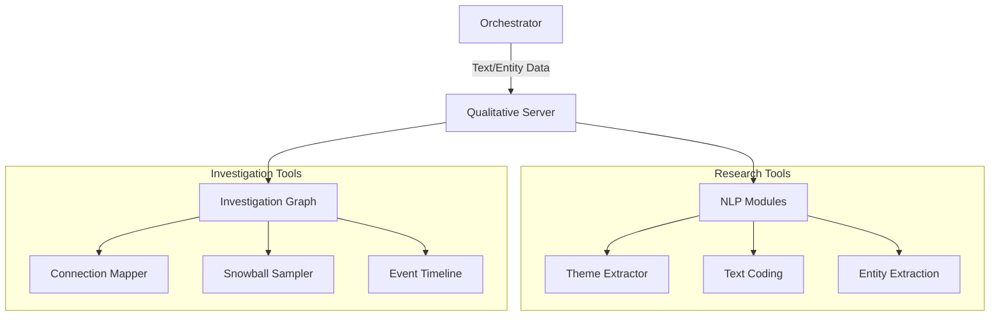

# 🕵️ Qualitative Analysis MCP Server

The **Qualitative Server** is a specialized research engine for non-numeric data analysis, investigation, and detective-style forensics. It provides tools for finding themes in text, mapping complex human relationships, and verifying claims through source triangulation.

## 🏗️ Architecture

The server implements a stateful knowledge graph for investigations, combined with stateless NLP modules for text processing.



## ✨ Features

### 🧩 Qualitative Research
- **Text Coding**: Manual or automated assignment of "codes" (tags) to text segments to categorize data.
- **Theme Extraction**: Analyzes multiple text sources to identify emerging bigram themes and key concepts.
- **Sentiment & Tone**: High-granularity analysis of emotional tone at the document or sentence level.

### 🕸️ Investigation & Mapping
- **Entity Extraction**: Automated recovery of People, Organizations, Locations, Money, and Dates from raw text.
- **Connection Mapper**: Detective-style mapping of relationships based on co-occurrence and context.
- **Investigation Graph**: Persistent (in-memory) storage of entities and their recursive relationships for complex case-building.

### 📅 Sequence & Verification
- **Event Timelines**: Chronological construction of event sequences with focus-entity filtering.
- **Snowball Sampling**: Chain-referral methodology to discover new entities based on existing relationship paths.
- **Fact Triangulation**: A verification engine that checks if a claim is supported by a required quorum of independent sources.

## 🔌 Tool Categories

| Category | Tools | Application |
|:---------|:------|:------------|
| **Forensics** | `entity_extractor`, `connection_mapper` | Identity |
| **Synthesis** | `text_coding`, `theme_extractor` | Analysis |
| **Logic** | `triangulation_check`, `event_timeline` | Truth |
| **Graph** | `investigation_graph_add`, `snowball_sampling` | Network |

## 🚀 Usage

```python
# Check if a fact is verified across 3 sources
result = await client.call_tool("triangulation_check", {
    "claim": "Entity A was present at Location B",
    "sources": [{"text": "Source 1..."}, {"text": "Source 2..."}, ...],
    "min_sources": 3
})
```
