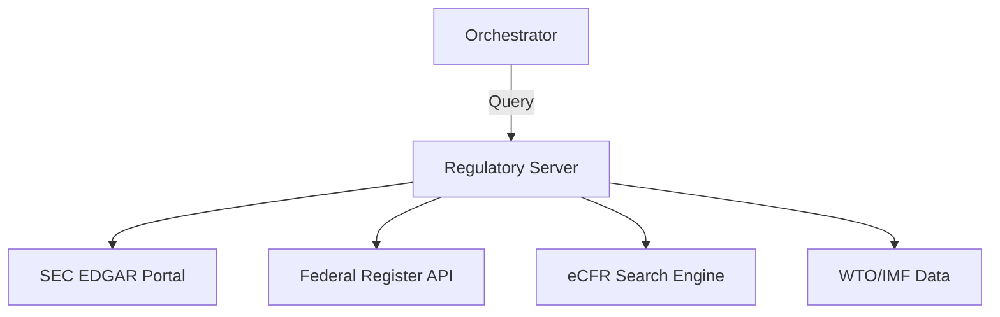

# ⚖️ Regulatory Data MCP Server

The **Regulatory Server** provides a unified gateway to government filings, legal codes, and international trade statistics. It is designed for compliance monitoring, legislative tracking, and macroeconomic research across US and global regulatory bodies.

## 🏗️ Architecture

The server acts as a proxy to multiple government APIs (SEC, eCFR, Federal Register), normalizing disparate data formats into a consistent research interface.



## ✨ Features

### 🏢 Corporate Compliance (SEC EDGAR)
- **Advanced Filing Search**: Find company filings (10-K, 10-Q, 8-K, DEF 14A) by CIK or Company Name.
- **ATOM Feed Integration**: Real-time monitoring of the SEC's filing stream for immediate detection of corporate events.

### 📜 Legislative Tracking
- **Code of Federal Regulations (eCFR)**: Search all 50 titles of the US administrative law.
- **Federal Register**: Daily tracking of new Rules, Proposed Rules, and formal Notices from government agencies.

### 🌍 Global Macro Metrics
- **WTO Trade Intelligence**: Statistics on trade growth, tariffs, and international disputes.
- **IMF Economic Data**: Historical and forecasted GDP, Inflation, and Debt metrics across 190+ countries.

## 🔌 Tool Categories

| Category | Tools | Scope |
|:---------|:------|:------|
| **Corporate** | `edgar_search`, `edgar_filing_content` | US Public Co. |
| **Government**| `ecfr_search`, `federal_register_search` | US Admin Law |
| **Global** | `wto_data`, `imf_data` | World Trade/Econ |

## 🚀 Usage

```python
# Search for new Environmental Rules in the Federal Register
result = await client.call_tool("federal_register_search", {
    "query": "carbon emission",
    "document_type": "rule"
})
```
