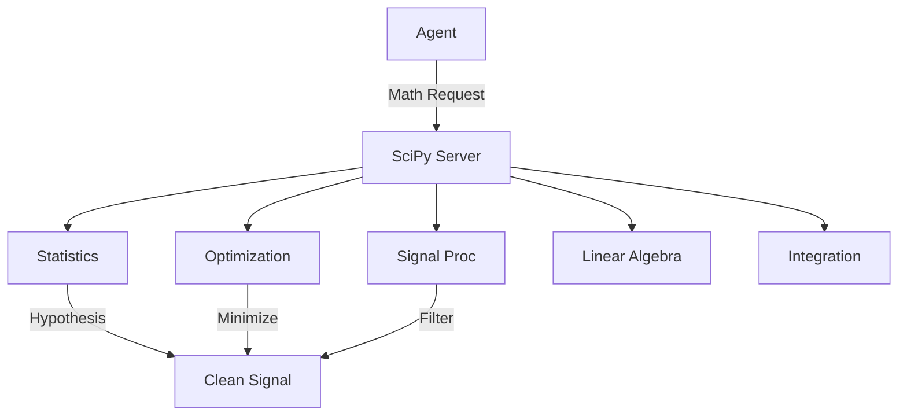

# 🧪 SciPy Server ("The Research Lab")

The **SciPy Server** is the **Advanced Analytics & Research Laboratory** of the Kea v4.0 system. It provides high-performance scientific computing capabilities, enabling agents to perform optimization, signal processing, linear algebra, and complex statistical testing. It acts as the mathematical backbone for quantitative research and engineering tasks.

## ✨ Features

- **Statistical Testing**: Comprehensive suite for hypothesis testing (T-Test, ANOVA, Kruskal-Wallis, Mann-Whitney U), essential for validating research findings.
- **Optimization Engine**: Solvers for scalar and multivariate optimization, root finding, and curve fitting (e.g., fitting a growth model to financial data).
- **Signal Processing**: Tools for spectral analysis (FFT), peak finding, and noise filtering (Savitzky-Golay, Wiener filters).
- **Linear Algebra**: Matrix decompositions (SVD, Eigen, Cholesky) and linear equation solvers.
- **Integration & ODEs**: Numerical integration and Ordinary Differential Equation solvers (`solve_ivp`) for dynamic system modeling.

## 🏗️ Architecture

The server exposes 11 specialized modules wrapping `scipy`'s core subpackages.



## 🔌 Tool Categories

### 1. Statistics (Hypothesis Testing)
- `ttest_ind`, `ttest_rel`: T-tests for independent/related samples.
- `anova_oneway`: Analysis of variance.
- `ks_test`: Kolmogorov-Smirnov test for normality.
- `pearson_corr`, `spearman_corr`: Correlation coefficients.

### 2. Optimization
- `minimize_scalar`: Find minimum of single-variable function.
- `minimize_bfgs`: Quasi-Newton method for multivariate optimization.
- `curve_fit`: Non-linear least squares to fit a function `f` to data `xdata`, `ydata`.

### 3. Signal Processing
- `fft`: Fast Fourier Transform.
- `find_peaks`: Identify local maxima.
- `savgol_filter`: Smooth noisy data while preserving peak shape.

### 4. Integration
- `integrate_quad`: General purpose integration.
- `solve_ivp`: Solve initial value problems for systems of ODEs.

### 5. Super Tools
- `analyze_distribution`: High-level tool that fits multiple distributions (Norm, Gamma, Beta) to data and selects the best fit.
- `signal_dashboard`: Computes FFT, Peaks, and Statistics in one shot.
- `compare_samples`: Runs a battery of tests (T-Test, KS, Levene) to compare two populations.

## 🚀 Usage

```python
# 1. Fit a Growth Model to Sales Data
result = await client.call_tool("curve_fit", {
    "func_str": "lambda t, a, b, c: a * np.exp(b * t) + c",
    "x_data": [0, 1, 2, 3, 4],
    "y_data": [10, 15, 25, 40, 80]
})
# Returns optimal a, b, c parameters
```

## 🛠️ Configuration
- **Dependencies**: `scipy`, `numpy`, `pandas`.
- **Performance**: Most operations utilize vectorized C-backends via SciPy/NumPy.
