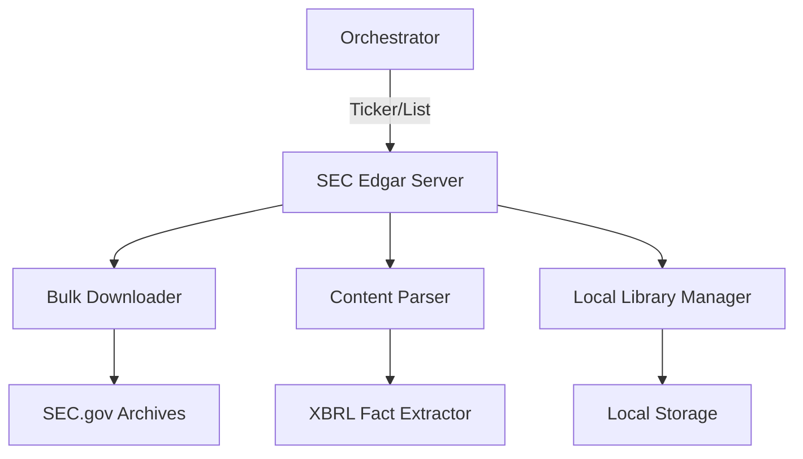

# 📦 SEC EDGAR Downloader Server

The **SEC EDGAR Downloader** is a high-throughput, bulk-retrieval engine for SEC filings. Unlike metadata-focused servers, this component is designed for downloading, locally indexing, and parsing the full content of millions of US financial reports.

## 🏗️ Architecture

The server implements a tiered downloading strategy with local file-system management and structured parsing extensions.



## ✨ Features

### ⚡ Batch Retrieval
- **Ticker Suites**: Dedicated tool to download a company's complete "filing suite" (10-Ks, 10-Qs, and 8-Ks) in one command.
- **Bulk List Support**: Parallel downloading of specific filing types for a list of multiple tickers.

### 📂 Full Filing coverage
- **Equities**: 10-K, 10-Q, 8-K, and foreign 20-F/6-K reports.
- **Holdings**: Institutional 13F (HR/NT), Form 4 (Insider Transactions), and 13G/D (Beneficial Ownership).
- **Registration**: IPO filings (S-1), Shelfs (S-3), Mergers (S-4), and Prospectuses (424B4).
- **Funds**: NPORT and NCEN fund reporting.

### 🧠 Content Intelligence
- **XBRL Extraction**: Automated extraction of financial metrics from XBRL instance folders.
- **Item Isolation**: Directed extraction of specific filing sections (Items).
- **Linguistic Analysis**: Calculation of reading complexity and sentiment metrics for Alpha generation research.

### 📁 Library Management
- **Inventory Scanning**: Tools to index and search the local library of downloaded filings.
- **Local Grep**: High-speed content searching across thousands of downloaded reports without network overhead.

## 🔌 Tool Categories

| Category | Count | Primary Objective |
|:---------|:-----:|:------------------|
| **Bulk** | 2 | Massive Dataset Acquisition |
| **Filings** | 20+ | Form-Specific Retrieval |
| **Management**| 5 | FS Indexing & Viewing |
| **Parsing** | 5 | Structured Fact Extraction |
| **Alpha** | 4 | Sentiment & Text Analytics |

## 🚀 Usage

```python
# Download latest 5 years of 10-Ks for AAPL
result = await client.call_tool("download_10k", {
    "ticker": "AAPL",
    "amount": 5
})
```
