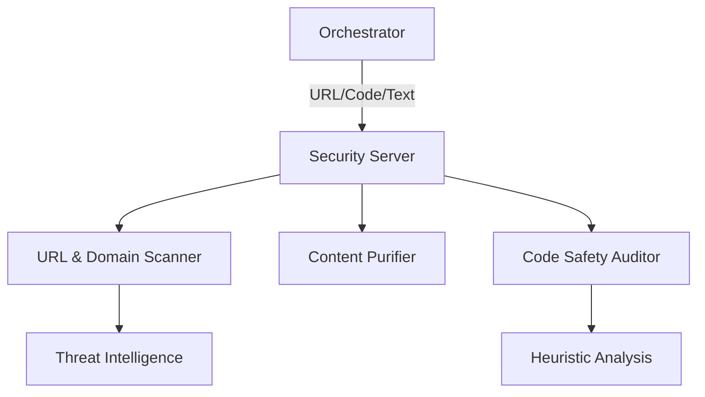

# 🛡️ Security MCP Server

The **Security Server** provides a critical safety layer for the Project environment. It implements tools for URL scanning, content sanitization, domain reputation monitoring, and code safety auditing to protect the system from malicious actors and insecure research results.

## 🏗️ Architecture

The server combines rule-based pattern matching with live reputation checks to provide real-time security verdicts.



## ✨ Features

### 🌐 Web & Network Protection
- **URL Scanner**: Deep analysis of URLs for protocol safety (HTTPS), blocklisted domains, and suspicious download patterns.
- **Domain Reputation**: Trust scoring for domains across Government, Academic, and Commercial registries.
- **Safe Download**: Tiered file download protection that verifies MIME types and file sizes before data transfer.

### 🧹 Content Purification
- **Content Sanitizer**: Strips malicious patterns (e.g., `<script>`, `eval()`, `javascript:`) and data URIs from raw text or HTML.
- **Selective HTML**: Optional support for allowing "Safe" HTML while purging high-risk elements like `iframes` and `forms`.

### 🔍 System & Code Auditing
- **Code Safety Check**: Heuristic analysis of Python and JavaScript code for dangerous operations (`exec`, `os.system`, `subprocess`, `rm -rf`).
- **File Integrity**: MD5, SHA1, and SHA256 hashing to verify file authenticity and check against known threat signatures.

## 🔌 Tool Categories

| Category | Tools | Target |
|:---------|:------|:-------|
| **Scanning** | `url_scanner`, `domain_reputation` | Network Safety |
| **Cleaning** | `content_sanitizer` | Data Ingestion |
| **Auditing** | `code_safety_check`, `file_hash_check` | Logic Integrity |
| **Transfer** | `safe_download` | IO Guardrails |

## 🚀 Usage

```python
# Check a URL before visiting
result = await client.call_tool("url_scanner", {
    "url": "https://suspicious-target.com/payload.exe",
    "deep_scan": True
})
```
