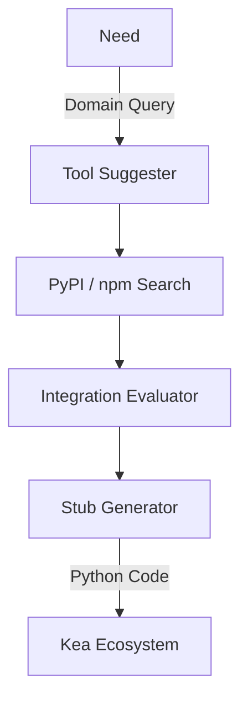

# 🛠️ Tool Discovery Agent Server

The **Tool Discovery Agent** is the meta-layer of the Kea ecosystem. It provides tools for searching, evaluating, and auto-integrating new software packages (PyPI, npm), enabling the system to recursively expand its own capabilities.

## 🏗️ Architecture

The server implements a "Capability Expansion Pipeline" that moves from raw research to verified MCP server stubs.



## ✨ Features

### 📦 Ecosystem Research
- **Omni-Search**: Unified search across PyPI (Python) and npm (Node.js) with hardware-optimized result limits.
- **Deep Intelligence**: Automatic retrieval of package versions, authors, licenses, and dependency graphs.
- **Documentation Reader**: Summarizes READMEs and API references to verify functional suitability.

### ⚖️ Integration Evaluation
- **Suitability Scoring**: Evaluates packages on 5 dimensions: Maturity, Documentation, License, Weight, and MCP pattern compatibility.
- **Compatibility Checker**: Validates if a package can be installed on the current system without version or dependency conflicts.

### ⚙️ Automation & Registry
- **Stub Generator**: Automatically generates the boilerplate Python code for a new MCP server wrapping a discovered package.
- **Tool Registry**: Persistent tracking of packages through "Discovered", "Pending", and "Installed" states.
- **Domain Advisor**: Context-aware suggestions of high-value tools for specific research domains (Finance, Legal, Medicine, Social Science).

## 🔌 Tool Categories

| Category | Tools | Stage |
|:---------|:------|:------|
| **Discovery** | `search_pypi`, `search_npm`, `suggest_tools` | Research |
| **Intelligence**| `package_info`, `read_package_docs` | Deep Dive |
| **Validation** | `evaluate_package`, `check_compatibility` | Quality |
| **Execution** | `generate_mcp_stub`, `tool_registry_add` | Expansion |

## 🚀 Usage

```python
# Generate an MCP stub for a discovered package
result = await client.call_tool("generate_mcp_stub", {
    "package_name": "pandas-ta",
    "functions": ["calculate_rsi", "calculate_macd"]
})
```
