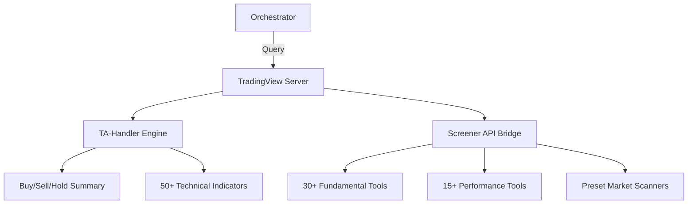

# 👁️ TradingView MCP Server

The **TradingView Server** (codenamed "The Eye") provides a high-performance interface for technical analysis, fundamental data, and multi-market screening. It allows for the retrieval of technical summaries, granular indicators, and fundamental metrics across 50,000+ symbols.

## 🏗️ Architecture

The server implements a bridge to the TradingView Screener and TA-Handler protocols, allowing for both atomic retrieval and bulk market scanning.



## ✨ Features

### 📐 Technical Intelligence
- **Composite Summaries**: Get consolidated "Buy/Sell/Hold" signals from the TradingView TA-Handler.
- **Indicator Suite**: Direct access to 50+ technical indicators including RSI, MACD, Stochastics, Ichimoku, and multiple EMA/SMA intervals.
- **Pivot Points**: Support for "Classic" and "Fibonacci" pivot levels (S1-S3, R1-R3).

### 🏦 Fundamental Analysis
- **Margins & ROE**: Direct retrieval of Gross/Operating/Net margins, ROE, ROA, and ROIC.
- **Valuation Ratios**: P/E (TTM), P/S, P/B, P/CF, and Enterprise Value/EBITDA.
- **Balance Sheet**: Total Debt, Assets, Liabilities, and Current/Quick ratios via `get_tv_{field}` tools.

### 🏹 Market Scanning & Performance
- **Live Scanners**: Pre-configured tools for `top_gainers`, `top_losers`, `most_active`, `oversold`, and `overbought` across US, Indonesia, Crypto, and Forex markets.
- **Performance Profiles**: Track returns across 1W, 1M, 3M, 6M, YTD, 1Y, and 5Y timeframes.
- **Volume Metrics**: Monitoring Relative Volume, Average Volume (10d, 30d, 90d), and Volatility.

## 🔌 Tool Categories

| Category | Tools | Count |
|:---------|:------|:-----:|
| **Technical** | `get_ta_summary`, `get_indicator_rsi`, etc. | 50+ |
| **Fundamental**| `get_tv_price_earnings`, `get_tv_gross_margin` | 30+ |
| **Performance**| `get_perf_ytd`, `get_volatility_month` | 15+ |
| **Screener** | `scan_america_top_gainers`, `get_bulk_data` | 10+ |

## 🚀 Usage

```python
# Get a consensus TA summary for NVIDIA
result = await client.call_tool("get_ta_summary", {
    "symbol": "NVDA",
    "interval": "1d"
})
```
