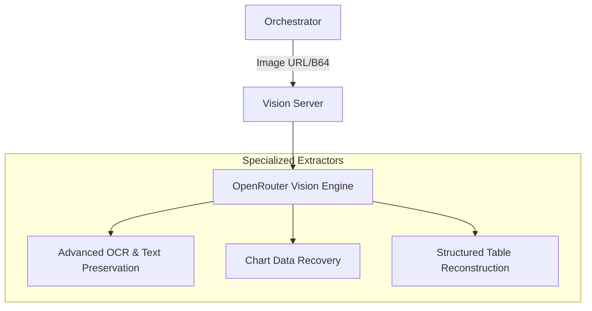

# 👁️‍🗨️ Vision MCP Server

The **Vision Server** provides high-fidelity visual research capabilities using state-of-the-art vision Models. It is designed to bridge the gap between static imagery (screenshots, documents, charts) and structured data that can be used for deep analysis.

## 🏗️ Architecture

The server acts as a specialized orchestrator for vision-capable LLMs (via OpenRouter), providing optimized prompts for specific extraction tasks.



## ✨ Features

### 📄 Screenshot Data Extraction
- **Text Preservation**: High-accuracy OCR that preserves the spatial structure and context of the original screen content.
- **Table Reconstruction**: Automatically detects tables in images and converts them into standard Markdown or JSON formats for downstream processing.
- **Structured Mapping**: Identifies key-value pairs and entity relationships from complex dashboard screenshots.

### 📈 Chart & Graph Reading
- **Data Recovery**: Extracts raw data points (values and axis coordinates) from line, bar, pie, and scatter charts.
- **Trend Identification**: Summarizes the mathematical trends and patterns observed in visual data.
- **Insight Generation**: Provides high-level synthesis of what the chart represents in the context of the user's research.

## 🔌 Tool Categories

| Tool | Application | Data Format |
|:-----|:------------|:------------|
| `screenshot_extract` | Dashboards, Documents, UI | Text, Tables, JSON |
| `chart_reader` | Financial Graphs, Maps, Stats | Markdown Table, Trends |

## 🚀 Usage

```python
# Analyze a market chart screenshot
result = await client.call_tool("chart_reader", {
    "image_url": "https://example.com/charts/btc_price_action.png",
    "chart_type": "line"
})
```
