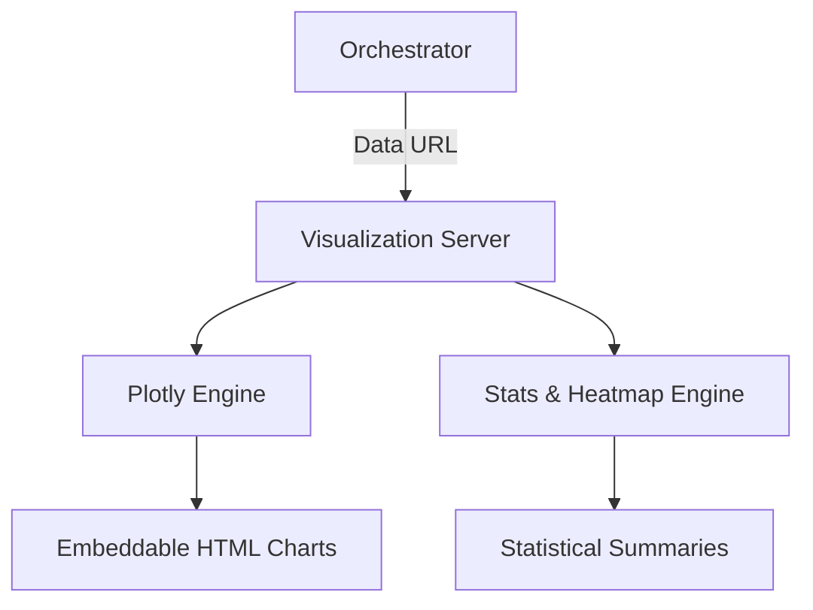

# 📊 Visualization MCP Server

The **Visualization Server** provides a suite of tools for generating interactive and statistical charts. It allows for the transformation of raw quantitative data into visual insights using the Plotly and Seaborn ecosystems.

## 🏗️ Architecture

The server implements a rendering engine that converts price and statistical datasets into interactive HTML components and ASCII summary reports.



## ✨ Features

### 📈 Interactive Charting (Plotly)
- **High-Fidelity Types**: Support for Line, Bar, Scatter, Histogram, Box, Pie, and Heatmap charts.
- **Dynamic Grouping**: Automatically handles `color_column` grouping and multi-axis alignment for complex comparisons.
- **Embeddable Results**: Returns full Plotly HTML strings that can be rendered directly in web contexts or shared via links.

### 🔬 Statistical Visuals
- **Correlation Heatmaps**: Generates color-coded (via ASCII/Table) correlation matrices to identify relationships between dozens of variables.
- **Distribution Profiles**: Comprehensive histogram analysis with integrated Skewness, Kurtosis, and Median-Mean spacing metrics.
- **Pairplots**: Statistical matrices showing the relationships between all pairs of numeric columns in a dataset.

## 🔌 Tool Categories

| Category | Tools | Application |
|:---------|:------|:------------|
| **Interactive** | `plotly_chart` | UI-ready Visualization |
| **Relational** | `correlation_heatmap`, `pairplot` | Feature Engineering |
| **Statistical** | `distribution_plot` | Outlier/Density Analysis |

## 🚀 Usage

```python
# Create an interactive scatter plot
result = await client.call_tool("plotly_chart", {
    "data_url": "https://example.com/data.csv",
    "chart_type": "scatter",
    "x_column": "volume",
    "y_column": "price",
    "color_column": "sector"
})
```
