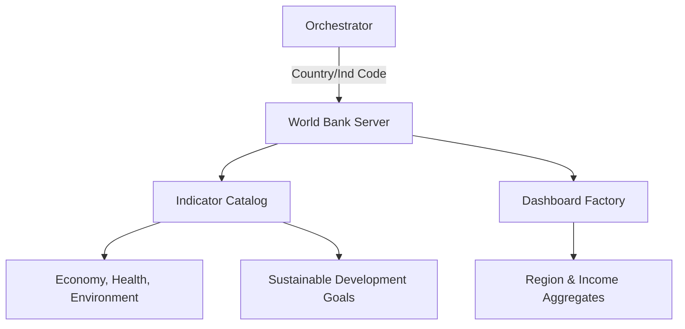

# 🌐 World Bank MCP Server

The **World Bank Server** (wbgapi) provides programmatic access to the World Bank's massive Databases of global development indicators. It is the primary tool in Kea for tracking long-term macroeconomic trends, Sustainable Development Goals (SDGs), and international debt statistics.

## 🏗️ Architecture

The server implements a deep-discovery engine that unrolls thousands of indicators into categorized tools and research dashboards.



## ✨ Features

### 📈 Universal Indicator Access
- **40+ Pre-Configured Tools**: Instant access to major metrics like `get_gdp`, `get_inflation`, `get_unemployment`, and `get_population`.
- **Atomic Discovery**: Dedicated tools to search 16,000+ indicators by keyword or browse them by thematic topics.

### 🏛️ Economy & Geography
- **Deep Country Data**: Retrieval of metadata, region mappings, and income groupings for 217+ economies.
- **Aggregate Intelligence**: Ability to fetch data for entire regions (Sub-Saharan Africa, Euro area) or income levels (High, Low, Middle income) in a single call.

### 📊 Research Dashboards
- **Strategic Aggregations**: Pre-built dashboards for Growth, Poverty, Climate, Gender, Education, Food Security, and Energy.
- **SDG Tracker**: Direct mapping of the UN's Sustainable Development Goals to specific indicator sequences.
- **Historical Depth**: Tools optimized for fetching 50+ years of historical data to analyze secular trends.

### 📑 Specialized Databases
- **IDS (Int. Debt Statistics)**: Specialized mining of the World Bank's external debt database.
- **WGI (Governance)**: Access to worldwide governance indicators (Political Stability, Corruption, Rule of Law).

## 🔌 Tool Categories

| Category | Tools | Count |
|:---------|:------|:-----:|
| **Indicators** | `get_gdp`, `get_inflation`, etc. | 40+ |
| **Dashboards** | `get_climate_dashboard`, `get_sdg_data` | 15+ |
| **Economy** | `search_economies`, `get_region_data` | 10+ |
| **Deep Dive** | `get_debt_stats`, `get_governance_data` | 5+ |

## 🚀 Usage

```python
# Compare GDP growth across major regions
result = await client.call_tool("get_region_data", {
    "indicator_code": "NY.GDP.MKTP.KD.ZG"
})
```
